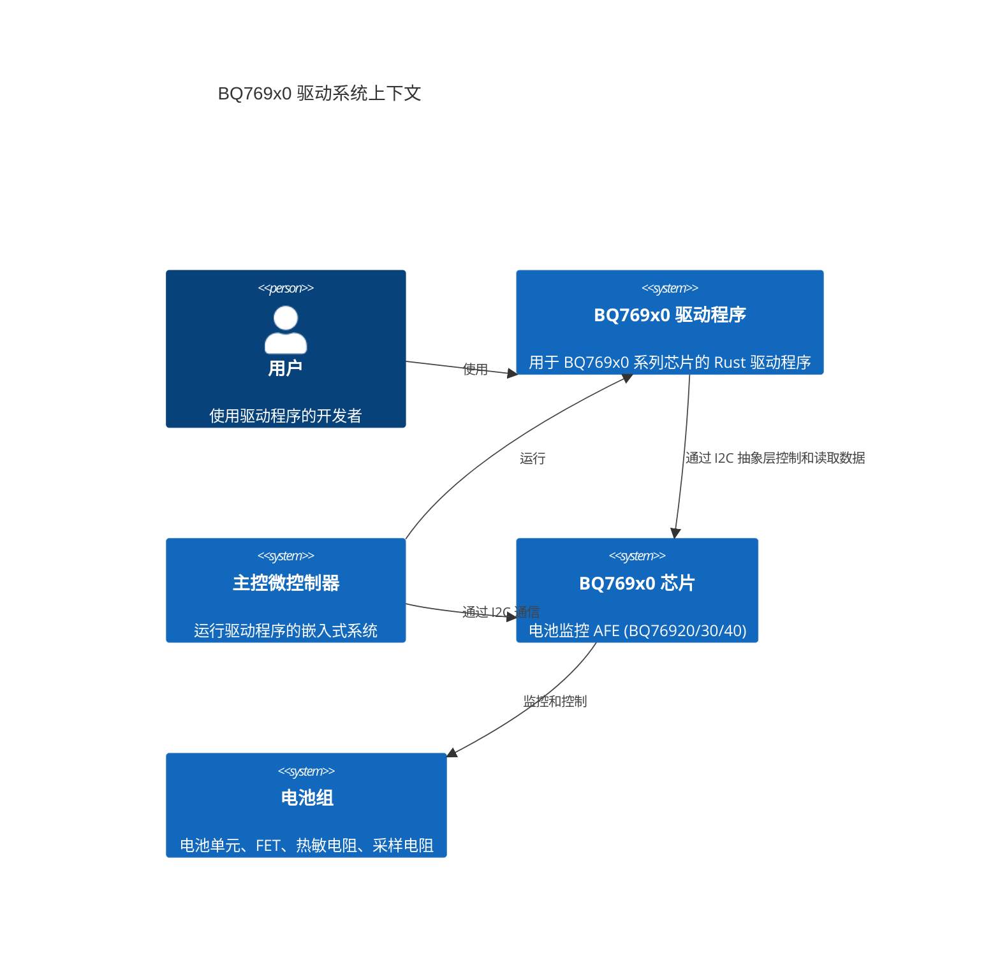
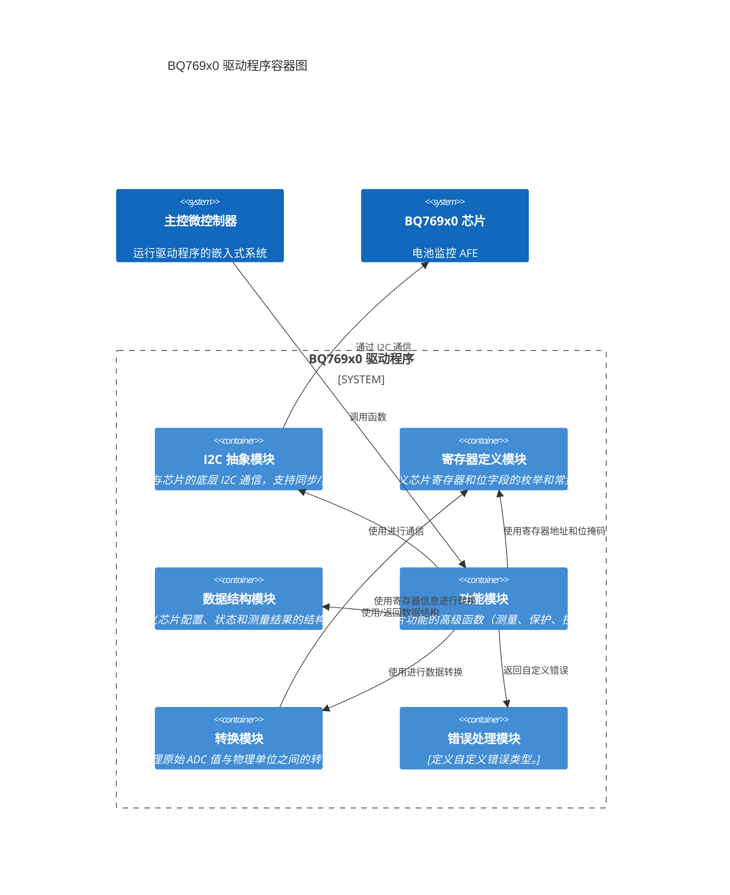

# BQ769x0 驱动程序实现计划

## 项目目标

基于 [`bq76920.pdf`](bq76920.pdf) 数据手册，使用 Rust 为 BQ76920、BQ76930 和 BQ76940 系列芯片实现一个符合 `no_std` 环境和 `embedded-hal` 规范的驱动程序。驱动程序应支持同步和异步操作，实现数据手册中的所有主要功能，并在内部完成原始 ADC 数据到物理单位的转换。代码风格应与现有的 `gx21m15` 驱动保持一致。

## 实现计划

1.  **项目结构与依赖管理**:
    *   在 [`Cargo.toml`](Cargo.toml) 中配置必要的依赖，包括 `embedded-hal` 及其异步版本，以及 `maybe-async-cfg` 用于同步/异步支持。
    *   考虑如何通过 Cargo feature 或泛型来支持 BQ76920、BQ76930 和 BQ76940 芯片的差异性（例如，不同数量的电池单元、不同的寄存器可用性）。一种可能的方法是定义一个泛型结构体，并通过 trait bounds 或 feature flags 来处理不同芯片的特性。

2.  **寄存器定义**:
    *   根据 [`bq76920.pdf`](bq76920.pdf) 的“Register Maps”章节 (第 29 页)，定义一个 Rust 枚举 (`enum`) 来表示所有相关的寄存器地址。
    *   为每个寄存器中的位字段定义常量或结构体，以便于访问和修改寄存器中的特定设置（例如，[`SYS_STAT`](bq76920.pdf:2595) 寄存器中的故障标志位，[`SYS_CTRL1`](bq76920.pdf:2607) 中的使能位等）。

3.  **数据结构**:
    *   定义结构体来存储从芯片读取的各种测量数据，例如 `CellVoltages` (包含所有电池单元的电压)、`Temperatures` (包含内部和外部温度)、`Current` (包含库仑计数器读取的电流)。
    *   定义结构体来表示芯片的配置设置，例如保护阈值、延迟等。

4.  **I2C 通信抽象**:
    *   实现一个核心结构体（例如 `Bq769x0<I2C>`），包含 I2C 设备地址和 `embedded-hal` I2C trait 的实现。
    *   使用 `maybe-async-cfg` 宏来为核心结构体的方法生成同步和异步两个版本的实现，以支持不同的应用场景。
    *   实现通用的 I2C 读取和写入方法，处理寄存器地址的发送和数据的接收/发送。

5.  **测量功能实现**:
    *   实现读取电池单元电压、总电池组电压、内部温度、外部温度和库仑计数器值的方法。
    *   根据 [`bq76920.pdf`](bq76920.pdf) 的“14-Bit ADC FOR CELL VOLTAGE AND TEMPERATURE MEASUREMENT” (第 10 页) 和 “16-Bit CC FOR PACK CURRENT MEASUREMENT” (第 11 页) 章节提供的公式，在驱动程序内部将原始 ADC 值转换为物理单位（V、°C、A）。需要考虑 ADC GAIN 和 OFFSET 寄存器的值。

6.  **硬件保护配置与状态**:
    *   实现方法来配置 OV、UV、OCD、SCD 的阈值和延迟，根据 [`bq76920.pdf`](bq76920.pdf) 的“INTEGRATED HARDWARE PROTECTIONS”章节 (第 12 页) 和 PROTECT 寄存器 (第 32-34 页) 进行设置。
    *   实现方法来读取 [`SYS_STAT`](bq76920.pdf:2595) 寄存器 (第 30 页)，获取当前的保护状态和故障标志。
    *   实现方法来清除 [`SYS_STAT`](bq76920.pdf:2595) 寄存器中的故障标志。

7.  **充放电控制**:
    *   实现方法来控制 [`SYS_CTRL2`](bq76920.pdf:2825) 寄存器 (第 32 页) 中的 `CHG_ON` 和 `DSG_ON` 位，从而控制充放电 FET。

8.  **电池均衡**:
    *   实现方法来控制 [`CELLBAL1`](bq76920.pdf:2768)、[`CELLBAL2`](bq76920.pdf:2777) 和 [`CELLBAL3`](bq76920.pdf:2785) 寄存器 (第 31 页) 中的位，以启用或禁用特定电池单元的均衡。需要注意数据手册中关于同时均衡相邻电池的警告。

9.  **电源模式管理**:
    *   实现方法来根据 [`bq76920.pdf`](bq76920.pdf) 的“Device Functional Modes”章节 (第 27 页) 的描述，通过特定的 I2C 写入序列将芯片从 NORMAL 模式切换到 SHIP 模式，以及通过 TS1 引脚的信号从 SHIP 模式唤醒到 NORMAL 模式（驱动程序主要负责发送进入 SHIP 模式的命令，唤醒通常由外部硬件触发）。

10. **ALERT 引脚处理**:
    *   实现方法来读取 [`SYS_STAT`](bq76920.pdf:2595) 寄存器 (第 30 页) 中的 `OVRD_ALERT` 位，检测外部对 ALERT 引脚的控制。

11. **错误处理**:
    *   定义一个自定义的错误枚举，包含 I2C 通信错误、数据转换错误、无效参数错误以及芯片返回的特定错误状态。

12. **测试**:
    *   编写单元测试来验证各个功能模块的正确性，特别是数据转换和寄存器配置。
    *   考虑编写集成测试，模拟与芯片的 I2C 通信，验证整个驱动程序的流程。

## Mermaid 图示

### BQ769x0 驱动系统上下文



### BQ769x0 驱动程序容器图



### 功能模块组件图

```mermaid
C4Component
    title 功能模块组件图

    Container_Boundary(features_boundary, "功能模块") {
        Component(measurements_comp, "测量组件", "读取和转换电池电压、总电压、温度和电流。")
        Component(protections_comp, "保护组件", "配置 OV/UV/OCD/SCD 阈值和延迟，读取状态。")
        Component(fet_control_comp, "FET 控制组件", "控制 CHG 和 DSG 引脚。")
        Component(balancing_comp, "电池均衡组件", "启用/禁用电池均衡。")
        Component(power_mode_comp, "电源模式组件", "管理 NORMAL 和 SHIP 模式。")
        Component(alert_comp, "ALERT 处理组件", "读取 ALERT 状态。")
    }

    Container(i2c_abstraction, "I2C 抽象模块")
    Container(register_definitions, "寄存器定义模块")
    Container(data_structures, "数据结构模块")
    Container(conversion_module, "转换模块")
    Container(error_handling, "错误处理模块")

    Rel(measurements_comp, i2c_abstraction, "使用")
    Rel(measurements_comp, register_definitions, "使用")
    Rel(measurements_comp, data_structures, "使用/返回")
    Rel(measurements_comp, conversion_module, "使用")
    Rel(measurements_comp, error_handling, "返回")

    Rel(protections_comp, i2c_abstraction, "使用")
    Rel(protections_comp, register_definitions, "使用")
    Rel(protections_comp, data_structures, "使用/返回")
    Rel(protections_comp, error_handling, "返回")

    Rel(fet_control_comp, i2c_abstraction, "使用")
    Rel(fet_control_comp, register_definitions, "使用")
    Rel(fet_control_comp, error_handling, "返回")

    Rel(balancing_comp, i2c_abstraction, "使用")
    Rel(balancing_comp, register_definitions, "使用")
    Rel(balancing_comp, error_handling, "返回")

    Rel(power_mode_comp, i2c_abstraction, "使用")
    Rel(power_mode_comp, register_definitions, "使用")
    Rel(power_mode_comp, error_handling, "返回")

    Rel(alert_comp, i2c_abstraction, "使用")
    Rel(alert_comp, register_definitions, "使用")
    Rel(alert_comp, error_handling, "返回")