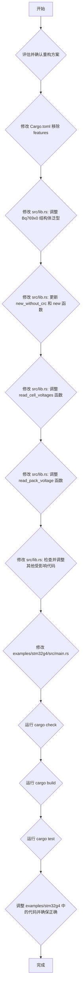

# BQ769x0 驱动重构计划

### 目标

根据电池节数判断芯片型号，移除 `Cargo.toml` 中不必要的 `bq76920`、`bq76930` 和 `bq76940` features。
重构 `Bq769x0` 结构体，增加泛型 `N` 表示电池节数，并调整相关函数以使用此泛型。
更新 `examples/stm32g4` 中的代码以适应新的泛型结构。
通过 `cargo check`、`cargo build` 和 `cargo test` 确保代码正确性。

### 评估结果

将 `N` 放在 `Bq769x0` 结构体上（即 `pub struct Bq769x0<I2C, M: CrcMode, const N: usize>`）是更优的选择。
虽然在创建 `Bq769x0` 实例时需要显式指定 `N`，但这是 Rust `const` 泛型的固有特性，且能更好地体现芯片型号与电池节数之间的强关联性。

### 详细重构计划



**步骤分解：**

1. **评估并确认重构方案**
    * 已完成，并倾向于将 `N` 放在 `Bq769x0` 结构体上。

2. **修改 `Cargo.toml` 移除 features**
    * 移除 `[features]` 部分的 `bq76920 = []`、`bq76930 = []` 和 `bq76940 = []`。
    * 修改 `default = ["bq76920"]` 为 `default = []` 或移除 `default` feature。

3. **修改 `src/lib.rs`: 调整 `Bq769x0` 结构体泛型**
    * 将 `Bq769x0` 结构体定义修改为：

        ```rust
        pub struct Bq769x0<I2C, M: CrcMode, const N: usize>
        where
            I2C: I2c,
        {
            address: u8,
            i2c: I2C,
            _crc_mode: core::marker::PhantomData<M>,
        }
        ```

4. **修改 `src/lib.rs`: 更新 `new_without_crc` 和 `new` 函数**
    * 修改 `new_without_crc` 函数签名：

        ```rust
        pub fn new_without_crc<const N: usize>(i2c: I2C, address: u8) -> Bq769x0<I2C, Disabled, N> {
            Bq769x0 {
                address,
                i2c,
                _crc_mode: core::marker::PhantomData,
            }
        }
        ```

    * 修改 `new` 函数签名：

        ```rust
        pub fn new<const N: usize>(i2c: I2C, address: u8) -> Bq769x0<I2C, Enabled, N> {
            Bq769x0 {
                address,
                i2c,
                _crc_mode: core::marker::PhantomData,
            }
        }
        ```

5. **修改 `src/lib.rs`: 调整 `read_cell_voltages` 函数**
    * 移除 `read_cell_voltages` 函数自身的 `const N: usize` 泛型参数。
    * 函数签名将变为：

        ```rust
        pub async fn read_cell_voltages(&mut self) -> Result<CellVoltages<N>, Error<E>>
        where
            Self: RegisterAccess<E>,
        {
            // ...
        }
        ```

    * `CellVoltages<N>` 将直接使用 `Bq769x0` 结构体上的 `N`。

6. **修改 `src/lib.rs`: 调整 `read_pack_voltage` 函数**
    * 在 `read_pack_voltage` 函数中，使用 `N` 来代替硬编码的 `num_cells_f32`。

        ```rust
        let num_cells_f32 = N as f32;
        ```

7. **修改 `src/lib.rs`: 检查并调整其他受影响代码**
    * 检查 `CellVoltages` 结构体定义，确保它接受 `const N: usize` 泛型。
    * 检查所有使用 `Bq769x0` 的地方，确保它们都正确地使用了新的泛型参数。
    * 检查 `data_types.rs` 中是否有与电池节数相关的常量或结构体需要调整。

8. **修改 `examples/stm32g4/src/main.rs`**
    * 更新 `Bq769x0` 实例的创建方式，例如：

        ```rust
        let mut bq = Bq769x0::<_, _, 5>::new_without_crc(i2c, address);
        ```

    * 更新 `read_cell_voltages` 的调用方式，移除 `N` 泛型参数。

9. **运行 `cargo check`**
    * 检查语法和类型错误。

10. **运行 `cargo build`**
    * 编译项目。

11. **运行 `cargo test`**
    * 运行单元测试和集成测试。

12. **调整 `examples/stm32g4` 中的代码并确保正确**
    * 这可能涉及到修改 `examples/stm32g4/Cargo.toml` 和 `examples/stm32g4/src/main.rs`，以适应 `bq769x0-async-rs` 库的泛型变化。
