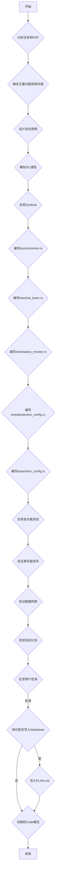

# BQ769x0 驱动程序测试计划

## 任务目标

为 BQ769x0 驱动程序创建测试用例，严格参考 `bq76920.pdf` 数据手册。

- 只能完全编辑 `tests/` 目录下的文件。
- 只能有限编辑 `src/lib.rs`（不得调整代码结构，不得修改或删除 struct、impl、trait 的定义，你只被允许增加新函数、修改现有函数体，一切可能超过授权范围的修改将都需要征得用户临时授权）。
- 严格按照提供的代码示例风格编写。
- 测试的源代码文件不应超过 500 行，需要注意分类存放。
- **重要：测试用例只需要测试驱动程序的同步部分，并使用同步方法编写。**

## 测试目标

1. 验证 `Bq769x0` 结构体的初始化，包括不同电池节数（N）的泛型实例化。
2. 验证 `RegisterAccess` trait 的基本读写功能，包括带 CRC 和不带 CRC 模式。
3. 验证所有主要寄存器的读写操作及其数据转换的准确性，覆盖 `bq76920.pdf` 中“8.5 Register Maps”部分列出的所有可读写寄存器。
4. 验证状态寄存器的读取和位字段解析（`SYS_STAT`）。
5. 验证 ADC 测量值的读取和转换（包括电池电压、封装电流和温度）。
6. 验证保护配置寄存器（`PROTECT1`、`PROTECT2`、`PROTECT3`、`OV_TRIP`、`UV_TRIP`）的设置。
7. 验证 FET 控制（`CHG_ON`、`DSG_ON`）和船运模式（`enter_ship_mode`）功能。
8. 验证电池平衡（`CELLBAL1`、`CELLBAL2`、`CELLBAL3`）功能，覆盖不同型号支持的电池节数。

## 测试环境模拟

由于是单元测试，我们将使用 `embedded_hal_mock` 库中的 `I2cMock` 来模拟 I2C 通信，并使用 `I2cTransaction` 定义预期的操作。

## 测试用例分类和文件结构

**重要提示：** 根据用户反馈，现有的 `tests/basic.rs` 文件结构不正确，因为它错误地使用了异步代码。因此，在实施阶段，我们将删除 `tests/basic.rs`，并按照以下分类创建新的测试文件。

为了避免测试文件过长，我们将根据功能模块将测试用例分类到不同的文件中。

- `tests/common.rs`: 存放 `I2cMock` 实现、通用辅助函数和宏。
- `tests/init_basic.rs`: 驱动程序初始化和基本寄存器读写测试。
- `tests/status_monitor.rs`: 状态和监测功能测试（包括 ADC 测量）。
- `tests/protection_config.rs`: 保护配置寄存器测试。
- `tests/other_config.rs`: 其他配置寄存器和船运模式测试。

### 1. 驱动程序初始化和基本功能测试 (`tests/init_basic.rs`)

- **测试 `new_without_crc` 和 `new` 函数：** 验证 `Bq769x0` 实例是否正确创建，并存储了 I2C 地址和 I2C 外设，以及 CRC 模式的正确性。
- **测试 `init` 函数：**
  - 验证 `init` 函数是否正确写入了 `SYS_CTRL1` 寄存器（例如 `ADC_EN` 和 `TEMP_SEL` 的默认设置）。
  - 验证 `init` 函数是否正确写入了 `SYS_CTRL2` 寄存器（例如 `CC_EN` 和 `CC_ONESHOT` 的默认设置）。
  - 验证 `init` 函数是否正确写入了保护寄存器（`PROTECT1`、`PROTECT2`、`PROTECT3`、`OV_TRIP`、`UV_TRIP`）的默认值。
  - 验证 `init` 函数是否正确写入了 `CC_CFG` 寄存器（设置为 `0x19`）。
  - 验证 `init` 函数是否尝试清除 `SYS_STAT` 寄存器中的所有故障标志。
- **测试 `read_register`：** 验证单个寄存器的读取。
- **测试 `write_register`：** 验证单个寄存器的写入。
- **测试 `read_registers`：** 验证多个寄存器的读取。
- **测试 `write_registers`：** 验证多个寄存器的写入。
- **错误处理测试：** 验证无效长度的 `read_registers` 和 `write_registers` 是否返回 `Error::InvalidData`。
- **CRC 模式测试（如果启用 CRC 功能）：** 验证 `read_register` 和 `read_registers` 在 CRC 校验失败时是否返回 `Error::Crc`。

### 2. 状态和监测功能测试 (`tests/status_monitor.rs`)

- **`read_all_measurements` (27/26h, 29/28h, 2B/2Ah, 2D/2Ch):**
  - 测试读取所有 ADC 测量值并验证其正确转换。
- **测试读取 ADC 增益和偏移寄存器：** 验证能否正确读取 `ADCGAIN1` (0x50)、`ADCOFFSET` (0x51) 和 `ADCGAIN2` (0x59) 寄存器中的值。
- **`read_cell_voltages`：**
  - 为 BQ76920 (N=5)、BQ76930 (N=10) 和 BQ76940 (N=15) 分别测试读取电池电压，验证数量和转换的准确性。
- **`read_pack_voltage`：**
  - 测试读取电池组总电压并验证转换的准确性。
- **`read_temperatures`：**
  - 测试读取 TS1、TS2 (BQ76930/BQ76940)、TS3 (BQ76940) 温度，并验证 `TEMP_SEL` 位对温度源的影响。
- **`read_current`：**
  - 测试读取库仑计数器电流并验证转换的准确性。
- **`read_status`：**
  - 测试读取 `SYS_STAT` 寄存器并验证位字段的正确解析。
- **`clear_status_flags`：**
  - 测试清除 `SYS_STAT` 寄存器中的特定标志位。

### 3. 保护配置测试 (`tests/protection_config.rs`)

- **`configure_protect1` (0x06):**
  - 测试 `RSNS` 位和 `SCD_DELAY`、`SCD_THRESH` 的配置。
- **`configure_protect2` (0x07):**
  - 测试 `OCD_DELAY`、`OCD_THRESH` 的配置。
- **`configure_protect3` (0x08):**
  - 测试 `UV_DELAY`、`OV_DELAY` 的配置。
- **`OV_TRIP` (0x09):**
  - `set_ov_trip`：测试设置过压跳闸阈值并验证写入的原始字节。
  - `read_ov_trip`：测试读取过压跳闸阈值并验证转换后的电压值。
- **`UV_TRIP` (0x0A):**
  - `set_uv_trip`：测试设置欠压跳闸阈值并验证写入的原始字节。
  - `read_uv_trip`：测试读取欠压跳闸阈值并验证转换后的电压值。

### 4. 其他配置测试 (`tests/other_config.rs`)

- **`CC_CFG` (0x0B):**
  - 测试 `CC_CFG` 寄存器的读写，验证其是否能正确设置为 `0x19`。
- **`enter_ship_mode` (0x40):**
  - 测试调用此函数是否正确写入了船运模式寄存器（`SYS_CTRL1` 的 `SHUT_A` 和 `SHUT_B` 位）。
- **`enable_charging` / `disable_charging` / `enable_discharging`：**
  - 测试这些函数是否正确设置 `SYS_CTRL2` 寄存器中的 `CHG_ON` 和 `DSG_ON` 位。
- **`is_alert_overridden`：**
  - 测试读取 `SYS_STAT` 寄存器中的 `OVRD_ALERT` 位。
- **`set_cell_balancing`：**
  - 为 BQ76920 (N=5) 测试 `CELLBAL1`。
  - 为 BQ76930 (N=10) 测试 `CELLBAL1` 和 `CELLBAL2`。
  - 为 BQ76940 (N=15) 测试 `CELLBAL1`、`CELLBAL2` 和 `CELLBAL3`。

## Mermaid 图表

## 测试用例实现流程

1. **创建 `I2cMock` 结构体 (`tests/common.rs`)：**
    - 引入 `use embedded_hal_mock::eh1::i2c::{Mock as I2cMock, Transaction as I2cTransaction};`
    - 使用 `I2cMock::new(&[...])` 来创建模拟实例，其中 `...` 是 `I2cTransaction` 类型的预期操作序列。
    - `I2cTransaction::write(address, data)` 用于模拟写入操作。
    - `I2cTransaction::read(address, data)` 用于模拟读取操作。
    - `I2cTransaction::write_read(address, write_data, read_data)` 用于模拟写入后读取操作。

2. **为每个寄存器和功能编写测试函数：**
    - 使用 `#[test]` 宏来运行同步测试。
    - 在每个测试函数中，创建 `I2cMock` 实例并预设其行为。
    - 创建 `Bq769x0` 实例，注意泛型参数 `N` 的设置，例如 `Bq769x0::<_, _, 5>::new_without_crc(...)` 用于 BQ76920，`Bq769x0::<_, _, 10>::new_without_crc(...)` 用于 BQ76930，`Bq769x0::<_, _, 15>::new_without_crc(...)` 用于 BQ76940。
    - 调用被测试的驱动程序函数。
    - 对于浮点数结果，使用带有容差的比较方法（例如，`assert_float_absolute_eq!` 或 `assert_float_relative_eq!`，如果可用，或手动实现近似比较），以验证驱动程序返回的值是否在可接受的误差范围内。
    - 对于非浮点数结果，使用 `assert_eq!` 宏验证 `I2cMock` 记录的写入操作是否符合预期，以及驱动程序返回的值是否正确。
    - 对于需要 CRC 校验的测试，确保 `I2cMock` 返回正确的 CRC 字节，或在 CRC 错误时返回 `Error::Crc`。

3. **运行 `cargo test`：** 在每次完成一个文件或一组功能的测试用例编写后，立即运行 `cargo test` 命令，以验证代码的正确性并及时发现问题。

## 对 `src/lib.rs` 的有限编辑

根据任务要求，我只能在 `src/lib.rs` 中增加新函数、修改现有函数体，不得调整代码结构。

- **`init` 函数：** 已经存在，我将确保其初始化逻辑与数据手册中的推荐序列一致，并清除所有可清除的故障标志。
- **`read_charger_status` 和 `read_prochot_status`：** 已经存在，我将确保它们正确解析所有相关的位字段。
- **`read_all_measurements`：** 已经存在，我将确保它正确解析所有相关的测量值。
- **`CC_CFG` 寄存器：** 确保其读写正确。
- **`ADCGAIN1`、`ADCOFFSET`、`ADCGAIN2` 寄存器：** 确保其读写正确。

我将确保所有新增或修改的函数都符合 Rust 的最佳实践和现有代码风格。
