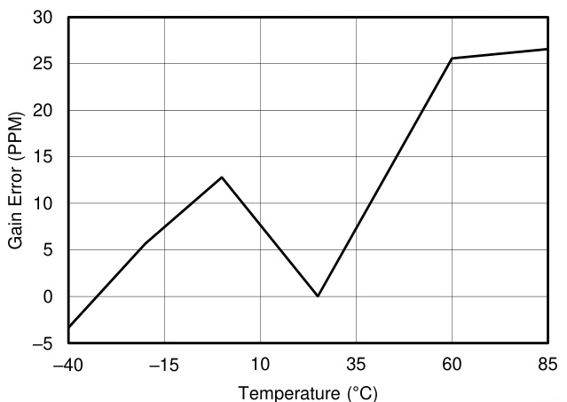
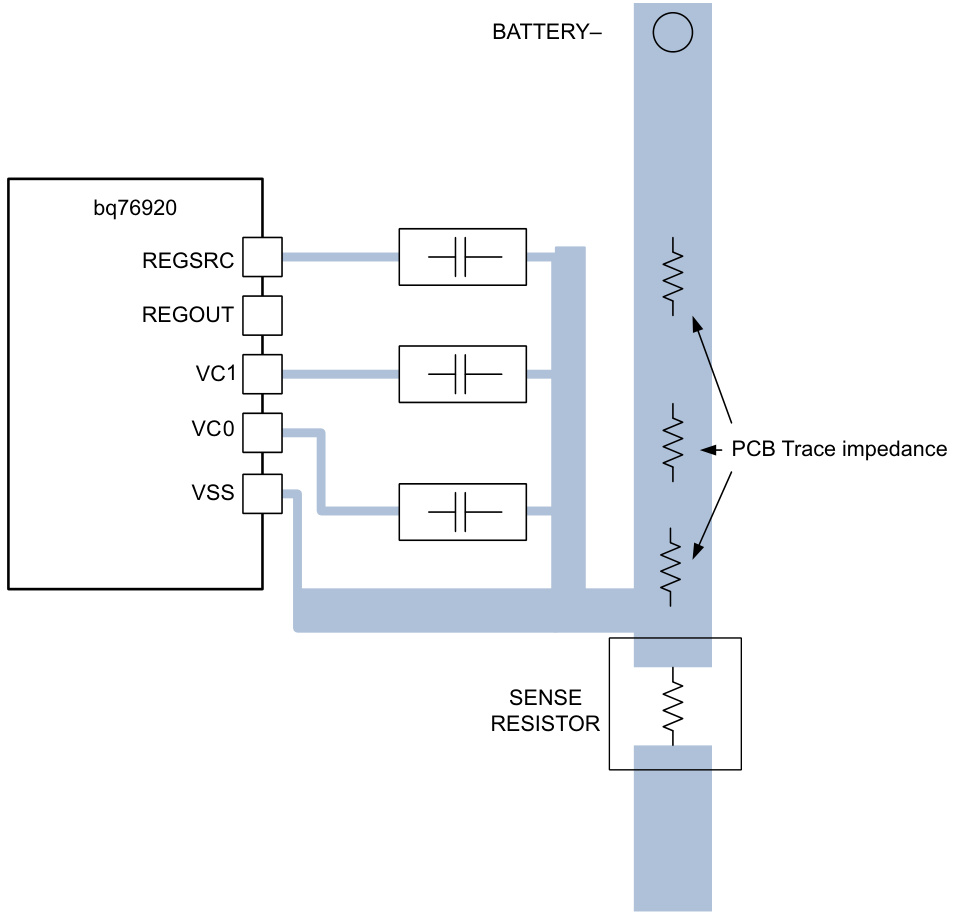
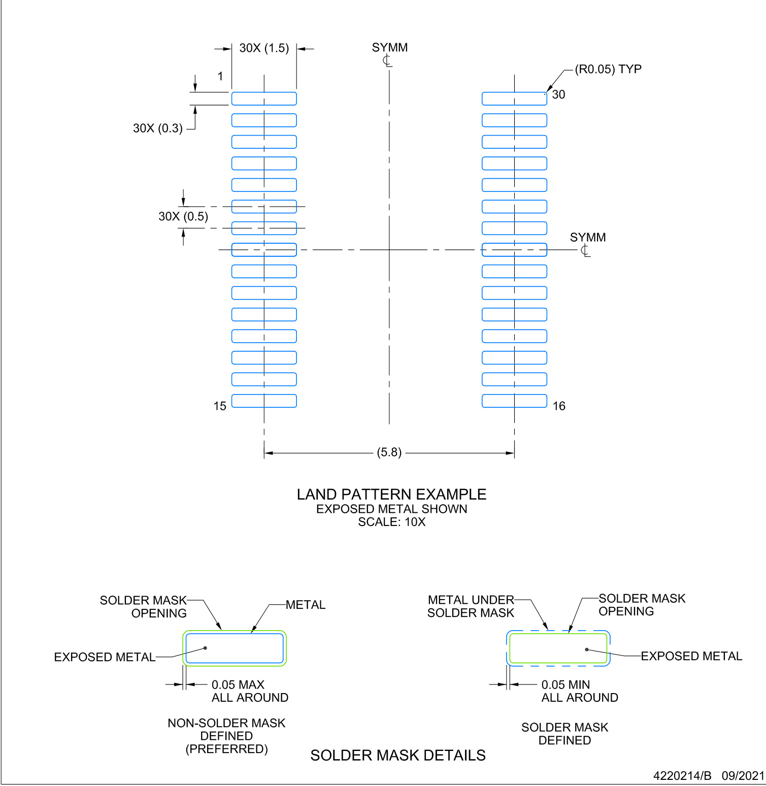

# BQ769x0 3-Series to 15-Series Cell Battery Monitor Family for Li-Ion and Phosphate Applications

# 1 Features

AFE monitoring features

Pure digital interface   
Internal ADC measures cell voltage, die   
temperature, and external thermistor   
A separate, internal ADC measures pack   
current (coulomb counter)   
Directly supports up to three thermistors   
(103AT)

Hardware protection features

Overcurrent in Discharge (OCD) Short Circuit in Discharge (SCD) Overvoltage (OV)   
Undervoltage (UV)   
Secondary protector fault detection

Additional features

Integrated cell balancing FETs Charge, discharge low-side NCH FET drivers Alert interrupt to host microcontroller 2.5-V or 3.3-V output voltage regulator No EEPROM programming necessary High supply voltage absolute maximum (up to 108 V) Simple $1 ^ { 2 } { \mathsf { C } }$ compatible interface (CRC option) – Random cell connection tolerant

# 2 Applications

Light electric vehicles (LEV): eBikes, eScooters,   
pedelec, and pedal-assist bicycles   
Power tools and garden tools   
Battery backup units (BBUS), energy storage   
systems (ESS), and uninterruptible power supply   
(UPS) systems   
Other industrial battery packs $( \geq 1 0 \mathsf { S } )$ )

# 3 Description

The $8 \mathsf { Q } 7 6 \mathsf { 9 } \times 0$ family of robust analog front-end (AFE) devices serves as part of a complete pack monitoring and protection solution for next-generation, high-power systems, such as light electric vehicles, power tools, and uninterruptible power supplies. The BQ769x0 is designed with low power in mind: Subblocks within the IC may be enabled or disabled to control the overall chip current consumption, and a SHIP mode provides a simple way to put the pack into an ultra-low power state.

The BQ76920 device supports up to 5-series cells or typical 18-V packs, the BQ76930 handles up to 10-series cells or typical $3 6 - V$ packs, and the BQ76940 works for up to 15-series cells or typical 48-V packs. A variety of battery chemistries may be managed with these AFEs, including Li-ion, Li-iron phosphate, and more. Through $1 ^ { 2 } \mathsf { C }$ , a host controller can use the BQ769x0 to implement many battery pack management functions, such as monitoring (cell voltages, pack current, pack temperatures), protection (controlling charge/discharge FETs), and balancing. Integrated A/D converters enable a purely digital readout of critical system parameters, with calibration handled in TI’s manufacturing process.

Device Information   

<html><body><table><tr><td>PART NUMBER1</td><td>PACKAGE</td><td>BODY SIZE (NOM)</td></tr><tr><td>BQ76920</td><td>TSSOP (20)</td><td>6.50 mm × 4.40 mm</td></tr><tr><td>BQ76930</td><td>TSSOP (30)</td><td>7.80 mm × 4.40 mm</td></tr><tr><td>BQ76940</td><td>TSSOP (44)</td><td>11.00 mm × 4.40 mm</td></tr></table></body></html>

# Table of Contents

1 Features. 1   
2 Applications.. 1   
3 Description.. 1   
4 Revision History. 2   
5 Device Comparison Table. .3   
6 Pin Configuration and Functions. .3   
6.1 Versions.. 3   
6.2 BQ76920 Pin Diagram. 4   
6.3 BQ76930 Pin Diagram... 5   
6.4 BQ76940 Pin Diagram.... 6   
7 Specifications. 8   
7.1 Absolute Maximum Ratings... 8   
7.2 ESD Ratings.. 8   
7.3 Recommended Operating Conditions... 9   
7.4 Thermal Information. .10   
7.5 Electrical Characteristics. .10   
7.6 Timing Requirements. .14   
7.7 Typical Characteristics.. .15   
8 Detailed Description.... ..16   
8.1 Overview.... .16   
8.2 Functional Block Diagram. 16   
8.3 Feature Description. .17   
8.4 Device Functional Modes.. .27   
8.5 Register Maps.... .29   
9 Application and Implementation. 38   
9.1 Application Information.. 38   
9.2 Typical Applications 41   
10 Power Supply Recommendations. .46   
11 Layout... .47   
11.1 Layout Guidelines.... 47   
11.2 Layout Example.. 47   
12 Device and Documentation Support.. .49   
12.1 Third-Party Products Disclaimer.. 49   
12.2 Documentation Support.. . 49   
12.3 Related Links.. . 49   
12.4 Receiving Notification of Documentation Updates..49   
12.5 Trademarks. .49   
13 Mechanical, Packaging, and Orderable   
Information. 49

# 4 Revision History

NOTE: Page numbers for previous revisions may differ from page numbers in the current version.

# anges from Revision H (March 2019) to Revision I (March 2022) Page

Changed the formatting throughout   
Added VCn rows in Absolute Maximum Ratings table.. 8   
Changed tablenote for POR and referenced entries.. 10   
Changed the scale in the VCx and OV Protection plots . 15   
Updated 16-Bit Pack Voltage .21   
Changed "OV Trip" to "UV Trip" in the description of undervoltage protection.. 21   
Changed the LSB bit count from 2 to 4 for the OV_TRIP register. 30   
Updated Application Information . .38   
Added Device Timing . .38   
Added Random Cell Connection 38   
Added Power Pin Diodes . .38   
Added Alert Pin ... .38   
Added Sense Inputs . 38   
Added TSn Pins .38   
Updated Unused Pins .39   
Updated Step-by-Step Design Procedure 45

# Changes from Revision G (April 2016) to Revision H (March 2019) Page

Changed Applications   
Changed the Description   
Added High-Side FET Driving . .23 Added the link to the BQ769x0 Boot Switch Alternatives Application Report .27 Added the link to the BQ769x0 Family Top Design Considerations Application Report .. .38 Added Figure 9-4 to provide an example of a high-side FET configuration.. ..41 Added BQ769x0 Family Top Design Considerations Application Report link.. 46

# 5 Device Comparison Table

<html><body><table><tr><td>TUBE</td><td>TAPE & REEL</td><td>CELLS</td><td>I²C ADDRESS (7- Bit)</td><td>LDO (V)</td><td>CRC</td><td>PACKAGE</td></tr><tr><td>BQ7692000PW</td><td>BQ7692000PWR</td><td rowspan="6">3-5 6-10</td><td rowspan="4">0x08</td><td rowspan="2">2.5</td><td>No</td><td rowspan="4">20-TSSOP (PW)</td></tr><tr><td>BQ7692001PW(1)</td><td>BQ7692001PWR(1)</td><td>Yes</td></tr><tr><td>BQ7692002PW(1)</td><td>BQ7692002PWR(1)</td><td>3.3</td><td>No</td></tr><tr><td>BQ7692003PW</td><td>BQ7692003PWR</td><td></td><td>Yes</td></tr><tr><td>BQ7692006PW</td><td>BQ7692006PWR</td><td rowspan="6">0x18 0x08</td><td rowspan="6"></td><td>No</td></tr><tr><td>BQ7693000DBT</td><td>BQ7693000DBTR</td><td>2.5</td><td>No</td></tr><tr><td>BQ7693001DBT</td><td>BQ7693001DBTR</td><td></td><td>Yes</td></tr><tr><td>BQ7693002DBT</td><td>BQ7693002DBTR</td><td></td><td>No</td></tr><tr><td>BQ7693003DBT</td><td>BQ7693003DBTR</td><td>3.3</td><td>30-TSSOP (DBT) Yes</td></tr><tr><td>BQ7693006DBT</td><td>BQ7693006DBTR</td><td></td><td>No</td></tr><tr><td>BQ7693007DBT</td><td>BQ7693007DBTR</td><td rowspan="4"></td><td rowspan="4">0x18 0x08</td><td rowspan="2">2.5</td><td>Yes</td><td rowspan="4"></td></tr><tr><td>BQ7694000DBT</td><td>BQ7694000DBTR</td><td>No</td></tr><tr><td>BQ7694001DBT</td><td>BQ7694001DBTR</td><td></td><td>Yes</td></tr><tr><td>BQ7694002DBT</td><td>BQ7694002DBTR</td><td>No</td><td>44-TSSOP (DBT)</td></tr><tr><td>BQ7694003DBT</td><td>BQ7694003DBTR</td><td rowspan="2">9-15</td><td rowspan="2">0x18</td><td rowspan="3">3.3</td><td>Yes</td><td rowspan="2"></td></tr><tr><td>BQ7694006DBT</td><td>BQ7694006DBTR</td><td>No</td></tr></table></body></html>

(1) Product Preview only

Texas Instruments preconfigures the $8 \mathsf { Q } 7 6 \mathsf { 9 } \times 0$ devices for a specific $1 ^ { 2 } { \mathsf { C } }$ address, LDO voltage, and more.   
These settings are permanently stored in EEPROM and cannot be further modified.

Contact Texas Instruments for other options not listed above, as well as any options noted as “Product Preview only.”

# 6 Pin Configuration and Functions 6.1 Versions

DSG 1 20 ALERT DSG 1 30 ALERT DSG 1 44 ALERTCHG 2 19 SRN CHG 2 29 SRN CHG 2 43 SRNVSS 3 18 SRP VSS 3 28 SRP VSS 3 42 SRPSDA 4 17 VC0 SDA 4 27 VC0 SDA 4 41 VC0SCL 5 16 VC1 SCL 5 26 VC1 SCL 5 40 VC120-TSSOPTS1 6 15 VC2 TS1 6 25 VC2 TS1 6 39 VC2CAP1 7 14 VC3 CAP1 7 24 VC3 CAP1 7 38 VC3  
REGOUT 8 13 VC4 REGOUT 8 30-TSSOP 23 VC4 REGOUT 8 37 VC4  
REGSRC 9 12 VC5 REGSRC 9 22 VC5 REGSRC 9 36 VC5BAT 10 11 NC VC5x 10 21 VC5B VC5x 10 35 VC5BNC 11 20 VC6 NC 11 34 VC6NC 12 19 VC7 NC 12 44-TSSOP 33 VC7TS2 13 18 VC8 TS2 13 32 VC8CAP2 14 17 VC9 CAP2 14 31 VC9BAT 15 16 VC10 VC10x 15 30 VC10NC 16 29 VC10BNC 17 28 VC11TS3 18 27 VC12CAP3 19 26 VC13BAT 20 25 VC14NC 21 24 VC15NC 22 23 NC  
• 6.5 mm x 4.4 mm x 1.2 mm  
BQ76930: 6–10 Series Cells (30-TSSOP)7.8 mm x 4.4 mm x 1.2 mm  
BQ76940: 9–15 Series Cells (44-TSSOP)$1 1 . 3 \mathsf { m m } \times 4 . 4 \mathsf { m m } \times 1 . 2 \mathsf { m m }$

# 6.2 BQ76920 Pin Diagram

Table 6-1. BQ76920 Pin Functions   

<html><body><table><tr><td>PIN</td><td>NAME</td><td>TYPE</td><td>DESCRIPTION</td></tr><tr><td>1</td><td>DSG</td><td>0</td><td>Discharge FET driver</td></tr><tr><td>2</td><td>CHG</td><td>0</td><td>Charge FET driver</td></tr><tr><td>3</td><td>VSS</td><td>1</td><td>Chip VSS</td></tr><tr><td>4</td><td>SDA</td><td>/0</td><td>|²C communication to the host controller</td></tr><tr><td>5</td><td>SCL</td><td>一</td><td>I²C communication to the host controller</td></tr><tr><td>6</td><td>TS1</td><td>一</td><td>Thermistor #1 positive terminal(1)</td></tr><tr><td>7</td><td>CAP1</td><td>0</td><td>Capacitor to VSS</td></tr><tr><td>8</td><td>REGOUT</td><td>P</td><td>Output LDO</td></tr><tr><td>9</td><td>REGSRC</td><td>一</td><td>Input source for output LDO</td></tr><tr><td>10</td><td>BAT</td><td>P</td><td>Battery (top-most) terminal</td></tr><tr><td>11</td><td>NC</td><td>二</td><td>No connect</td></tr><tr><td>12</td><td>VC5</td><td>一</td><td>Sense voltage for 5th cell positive terminal</td></tr><tr><td>13</td><td>VC4</td><td>一</td><td>Sense voltage for 4th cell positive terminal</td></tr><tr><td>14</td><td>VC3</td><td>一</td><td>Sense voltage for 3rd cell positive terminal</td></tr><tr><td>15</td><td>VC2</td><td>一</td><td>Sense voltage for 2nd cell positive terminal</td></tr><tr><td>16</td><td>VC1</td><td>一</td><td>Sense voltage for 1st cell positive terminal</td></tr><tr><td>17</td><td>VCO</td><td>一</td><td>Sense voltage for 1st cell negative terminal</td></tr><tr><td>18</td><td>SRP</td><td>一</td><td>Negative current sense (nearest VSS)</td></tr><tr><td>19</td><td>SRN</td><td>一</td><td>Positive current sense</td></tr><tr><td>20</td><td>ALERT</td><td>/0</td><td>Alert output and override input</td></tr></table></body></html>

(1) If not used, pull down to VSS with a $1 0 – 1 2$ nominal resistor.

# 6.3 BQ76930 Pin Diagram

Table 6-2. BQ76930 Pin Functions   

<html><body><table><tr><td>PIN</td><td>NAME</td><td>TYPE</td><td>DESCRIPTION</td></tr><tr><td>1</td><td>DSG</td><td>0</td><td>Discharge FET driver</td></tr><tr><td>2</td><td>CHG</td><td>0</td><td>Charge FET driver</td></tr><tr><td>3</td><td>VSS</td><td>二</td><td>Chip VSS</td></tr><tr><td>4</td><td>SDA</td><td>1/0</td><td>I2C communication to the host controller</td></tr><tr><td>5</td><td>SCL</td><td>1</td><td>I2C communication to the host controller</td></tr><tr><td>6</td><td>TS1</td><td></td><td>Thermistor #1 positive terminal(1)</td></tr><tr><td>7</td><td>CAP1</td><td>0</td><td>Capacitor to VSS</td></tr><tr><td>8</td><td>REGOUT</td><td>P</td><td>Output LDO</td></tr><tr><td>9</td><td>REGSRC</td><td>1</td><td>Input source for output LDO</td></tr><tr><td>10</td><td>VC5X</td><td>P</td><td>Thermistor #2 negative terminal</td></tr><tr><td>11</td><td>NC</td><td>二</td><td>No connect (short to CAP2)</td></tr><tr><td>12</td><td>NC</td><td>二</td><td>No connect (short to CAP2)</td></tr><tr><td>13</td><td>TS2</td><td>1</td><td>Thermistor #2 positive terminal(1)</td></tr><tr><td>14</td><td>CAP2</td><td>0</td><td>Capacitor to VC5X</td></tr><tr><td>15</td><td>BAT</td><td>P</td><td>Battery (top-most) terminal</td></tr><tr><td>16</td><td>VC10</td><td></td><td>Sense voltage for 10th cell positive terminal</td></tr><tr><td>17</td><td>VC9</td><td>1</td><td>Sense voltage for 9th cell positive terminal</td></tr><tr><td>18</td><td>VC8</td><td>1</td><td>Sense voltage for 8th cell positive terminal</td></tr><tr><td>19</td><td>VC7</td><td>1</td><td>Sense voltage for 7th cell positive terminal</td></tr><tr><td>20</td><td>VC6</td><td>1</td><td>Sense voltage for 6th cell positive terminal</td></tr><tr><td>21</td><td>VC5B</td><td>一</td><td>Sense voltage for 6th cell negative terminal</td></tr><tr><td>22</td><td>VC5</td><td>一</td><td>Sense voltage for 5th cell positive terminal</td></tr><tr><td>23</td><td>VC4</td><td>1</td><td>Sense voltage for 4th cell positive terminal</td></tr><tr><td>24</td><td>VC3</td><td>1</td><td>Sense voltage for 3rd cell positive terminal</td></tr><tr><td>25</td><td>VC2</td><td>1</td><td>Sense voltage for 2nd cell positive terminal</td></tr><tr><td>26</td><td>VC1</td><td>1</td><td>Sense voltage for 1st cell positive terminal</td></tr><tr><td>27</td><td>VCO</td><td></td><td>Sense voltage for 1st cell negative terminal</td></tr></table></body></html>

Copyright $\circledcirc$ 2022 Texas Instruments Incorporated

Table 6-2. BQ76930 Pin Functions (continued)   

<html><body><table><tr><td>PIN</td><td>NAME</td><td>TYPE</td><td>DESCRIPTION</td></tr><tr><td>28</td><td>SRP</td><td>一</td><td>Negative current sense (nearest VSS)</td></tr><tr><td>29</td><td>SRN</td><td>1</td><td>Positive current sense</td></tr><tr><td>30</td><td>ALERT</td><td>1/0</td><td>Alert output and override input</td></tr></table></body></html>

(1) If not used, pull down to group ground reference (VSS for TS1 and VC5X for TS2) with a $1 0 – 1 2$ nominal resistor.

# 6.4 BQ76940 Pin Diagram

# BQ76940 Pin Functions

<html><body><table><tr><td>PIN</td><td>NAME</td><td>TYPE</td><td>DESCRIPTION</td></tr><tr><td>1</td><td>DSG</td><td>0</td><td>Discharge FET driver</td></tr><tr><td>2</td><td>CHG</td><td>0</td><td>Charge FET driver</td></tr><tr><td>3</td><td>VSS</td><td>二</td><td>Chip VSS</td></tr><tr><td>4</td><td>SDA</td><td>1/0</td><td>I²C communication to the host controller</td></tr><tr><td>5</td><td>SCL</td><td>一</td><td>|2C communication to the host controller</td></tr><tr><td>6</td><td>TS1</td><td></td><td>Thermistor #1 positive terminal(1)</td></tr><tr><td>7</td><td>CAP1</td><td>0</td><td>Capacitor to VSS</td></tr><tr><td>8</td><td>REGOUT</td><td>P</td><td>Output LDO</td></tr><tr><td>9</td><td>REGSRC</td><td></td><td>Input source for output LDO</td></tr><tr><td>10</td><td>VC5X</td><td>P</td><td>Thermistor #2 negative terminal</td></tr><tr><td>11</td><td>NC</td><td>二</td><td>No connect (short to CAP2)</td></tr><tr><td>12</td><td>NC</td><td>二</td><td>No connect (short to CAP2)</td></tr><tr><td>13</td><td>TS2</td><td>一</td><td>Thermistor #2 positive terminal(1)</td></tr></table></body></html>

BQ76940 Pin Functions (continued)   

<html><body><table><tr><td>PIN</td><td>NAME</td><td>TYPE</td><td>DESCRIPTION</td></tr><tr><td>14</td><td>CAP2</td><td>0</td><td>Capacitor to VC5X</td></tr><tr><td>15</td><td>VC10X</td><td>P</td><td>Thermistor #3 negative terminal</td></tr><tr><td>16</td><td>NC</td><td>二</td><td>No connect (short to CAP3)</td></tr><tr><td>17</td><td>NC</td><td>1</td><td>No connect (short to CAP3)</td></tr><tr><td>18</td><td>TS3</td><td></td><td>Thermistor #3 positive terminal(1)</td></tr><tr><td>19</td><td>CAP3</td><td>0</td><td>Capacitor to VC10X</td></tr><tr><td>20</td><td>BAT</td><td>P</td><td>Battery (top-most) terminal</td></tr><tr><td>21</td><td>NC</td><td>1</td><td>No connect</td></tr><tr><td>22</td><td>NC</td><td>1</td><td>No connect</td></tr><tr><td>23</td><td>NC</td><td>二</td><td>No connect</td></tr><tr><td>24</td><td>VC15</td><td>一</td><td>Sense voltage for 15th cell positive terminal</td></tr><tr><td>25</td><td>VC14</td><td>1</td><td>Sense voltage for 14th cell positive terminal</td></tr><tr><td>26</td><td>VC13</td><td></td><td>Sense voltage for 13th cell positive terminal</td></tr><tr><td>27</td><td>VC12</td><td>1</td><td>Sense voltage for 12th cell positive terminal</td></tr><tr><td>28</td><td>VC11</td><td></td><td>Sense voltage for 11th cell positive terminal</td></tr><tr><td>29</td><td>VC10B</td><td></td><td>Sense voltage for 11th cell negative terminal</td></tr><tr><td>30</td><td>VC10</td><td>一</td><td>Sense voltage for 10th cell positive terminal</td></tr><tr><td>31</td><td>VC9</td><td>1</td><td>Sense voltage for 9th cell positive terminal</td></tr><tr><td>32</td><td>VC8</td><td>一</td><td>Sense voltage for 8th cell positive terminal</td></tr><tr><td>33</td><td>VC7</td><td>一</td><td>Sense voltage for 7th cell positive terminal</td></tr><tr><td>34</td><td>VC6</td><td>一</td><td>Sense voltage for 6th cell positive terminal</td></tr><tr><td>35</td><td>VC5B</td><td>一</td><td>Sense voltage for 6th cell negative terminal</td></tr><tr><td>36</td><td>VC5</td><td>一</td><td>Sense voltage for 5th cell positive terminal</td></tr><tr><td>37</td><td>VC4</td><td>1</td><td>Sense voltage for 4th cell positive terminal</td></tr><tr><td>38</td><td>VC3</td><td>1</td><td>Sense voltage for 3rd cell positive terminal</td></tr><tr><td>39</td><td>VC2</td><td>1</td><td>Sense voltage for 2nd cell positive terminal</td></tr><tr><td>40</td><td>VC1</td><td>1</td><td>Sense voltage for 1st cell positive terminal</td></tr><tr><td>41</td><td>VCO</td><td>一</td><td>Sense voltage for 1st cell negative terminal</td></tr><tr><td>42</td><td>SRP</td><td>一</td><td>Negative current sense (nearest VSS)</td></tr><tr><td>43</td><td>SRN</td><td>一</td><td>Positive current sense</td></tr><tr><td>44</td><td>ALERT</td><td>/0</td><td>Alert output and override input</td></tr></table></body></html>

(1) If not used, pull down to group ground reference (VSS for TS1, VC5X for TS2, and VC10X for TS3) with a 10-kΩ nominal resistor.

# 7 Specifications 7.1 Absolute Maximum Ratings

Over-operating free-air temperature range (unless otherwise noted) (1)

<html><body><table><tr><td colspan="5"></td><td>MIN</td><td>MAX</td><td>UNIT</td></tr><tr><td rowspan="3">VBAT</td><td rowspan="3">Supply voltage</td><td>(BAT-VSS)</td><td>BQ76920</td><td rowspan="3">-0.3</td><td rowspan="3">36</td><td rowspan="3"></td><td rowspan="3">V</td></tr><tr><td>(BAT-VC5x),(VC5x-VSS)</td><td>BQ76930</td></tr><tr><td>(BAT-VC10x),(VC10x-VC5x),(VC5x-VSS)</td><td>BQ76940</td></tr><tr><td rowspan="10">V Input voltage</td><td colspan="3">(VCn-VSS)where n = 1..5</td><td>BQ76920, BQ76930,</td><td>(n ×7.2)</td><td rowspan="5"></td><td rowspan="5">V</td></tr><tr><td colspan="2">(VCn-VC5x) where n = 6..10</td><td>BQ76940 BQ76930,</td><td>-0.3</td><td>(n-5)×7.2</td></tr><tr><td colspan="3">(VCn-VC10x)where n= 11..15</td><td>BQ76940 BQ76940</td><td>(n-10) ×</td></tr><tr><td colspan="3">Cell input pins, differential (VCn-VCn-1) where n = 1..15/10/5</td><td>-0.3</td><td>7.2 9</td></tr><tr><td colspan="3">(BQ76940/BQ76930/BQ76920,respectively)</td><td></td><td></td></tr><tr><td>SRN,SRP, SCL,SDA</td><td></td><td></td><td rowspan="4"></td><td rowspan="4">3.6</td><td rowspan="4">V</td></tr><tr><td>(VC0-VSS), (CAP1-VSS), (TS1-VSS)(2) (VC)SC5)</td><td></td><td>BQ76920 BQ76930</td><td>-0.3</td></tr><tr><td>VC10x),(CAP2-VC5x), (CAP1-VSS),(TS3-VC10x),</td><td>(VC0-VSS),(VC5b-VC5x),(VC10b-VC10x),(CAP3-</td><td>BQ76940</td><td></td></tr><tr><td>(TS2-VC5x), (TS1-VSS)(2) REGSRC</td><td></td><td></td><td>-0.3</td></tr><tr><td rowspan="3">Vo</td><td rowspan="3">Output voltage</td><td>REGOUT, ALERT</td><td></td><td>-0.3</td><td>36 3.6</td><td rowspan="3">V</td><td rowspan="3"></td></tr><tr><td>DSG</td><td></td><td>-0.3</td><td>20</td></tr><tr><td colspan="2">CHG</td><td></td><td>-0.3VcHGCLAMP</td></tr><tr><td rowspan="2">ICB</td><td colspan="2" rowspan="2">Cell balancing current (per cell)</td><td>BQ76920</td><td>70</td><td></td><td rowspan="2">mA</td></tr><tr><td>BQ76940</td><td>5</td><td></td></tr><tr><td rowspan="2">IDSG</td><td colspan="3" rowspan="2"></td><td></td><td colspan="2">7</td><td>mA</td></tr><tr><td colspan="3">Discharge pin input current when disabled (measured into terminal)</td><td></td><td>mA 150</td></tr><tr><td rowspan="2">TSTG</td><td colspan="4">Storage temperature</td><td colspan="2">-65</td><td>℃</td></tr><tr><td colspan="4">Lead temperature (soldering,10 s)</td><td></td><td>300</td><td></td></tr></table></body></html>

(1) Operation outside the Absolute Maximum Ratings may cause permanent device damage. Absolute Maximum Ratings do not imply functional operation of the device at these or any other conditions beyond those listed under Recommended Operating Conditions. If outside the Recommended Operating Conditions but within the Absolute Maximum Ratings, the device may not be fully functional, and this may affect device reliability, functionality, performance, and shorten the device lifetime.   
(2) The Absolute Maximum Ratings for (TS1–VSS) apply after the device completes POR and should be observed after tBOOTREADY $( 1 0 \mathrm { m } \mathsf { s } )$ , following the application of the boot signal on TS1. Prior to completion of POR, TS1 should not exceed $5 \lor .$ .

# 7.2 ESD Ratings

<html><body><table><tr><td colspan="2"></td><td>VALUE</td><td>UNIT</td></tr><tr><td rowspan="2">V(ESD)</td><td rowspan="2">Electrostatic discharge</td><td>Human body model (HBM) ESD stress voltage(1)</td><td>±2</td><td>kV</td></tr><tr><td>Charged device model (CDM) ESD stress voltage(2)</td><td>±500</td><td>V</td></tr></table></body></html>

(1) JEDEC document JEP155 states that 500-V HBM allows safe manufacturing with a standard ESD control process.   
(2) JEDEC document JEP157 states that 250-V CDM allows safe manufacturing with a standard ESD control process.

# 7.3 Recommended Operating Conditions

Over-operating free-air temperature range (unless otherwise noted). See Section 9.1.8 for more information on cell   

<html><body><table><tr><td colspan="3">C CellInputdifferential.</td><td></td><td></td><td></td><td></td></tr><tr><td colspan="3"></td><td>MIN</td><td>TYP</td><td>MAX</td><td>UNIT</td></tr><tr><td rowspan="3">VBAT Supply voltage</td><td>(BAT-VSS)</td><td>BQ76920</td><td rowspan="3">6</td><td></td><td></td><td rowspan="3">V</td></tr><tr><td>(BAT-VC5x), (VC5x-VSS)</td><td>BQ76930</td><td></td><td>25</td></tr><tr><td>（(BAT-V1x) (VC10xVC5x)</td><td>BQ76940</td><td></td><td></td></tr><tr><td rowspan="12">VIN Input voltage</td><td>Cell input pins,differential (VCn-VCn-1) where n = 1..15/10/5 (BQ76940/BQ76930/BQ76920,</td><td></td><td>2</td><td></td><td>5</td><td>V</td></tr><tr><td>respectively),in-use cells only (VCn-VSS) where n = 1..5</td><td>BQ76920</td><td></td><td></td><td></td><td></td></tr><tr><td>V(</td><td>BQ76930</td><td>0</td><td></td><td>5×n</td><td>V</td></tr><tr><td>(VCn-VSS) where n = 1.5,(VCn- VC5x) where n = 6..10, (VCn-</td><td>BQ76940</td><td></td><td></td><td></td><td></td></tr><tr><td>VC10x) where n = 11..15 SRP</td><td></td><td></td><td></td><td></td><td></td></tr><tr><td>(vC0-vSS)</td><td>BQ76920</td><td></td><td></td><td></td><td></td></tr><tr><td>(VC0-VSS), (VC5b-VC5x)</td><td>BQ76930</td><td>-10</td><td></td><td>10</td><td>mV</td></tr><tr><td>vC0-v-v).(VC5b-VC5x).</td><td></td><td></td><td></td><td></td><td></td></tr><tr><td></td><td>BQ76940</td><td></td><td></td><td></td><td></td></tr><tr><td>SRN</td><td></td><td>-200</td><td></td><td>200</td><td>mV</td></tr><tr><td>SCL, SDA (TS1-VSS)</td><td></td><td></td><td></td><td></td><td></td></tr><tr><td>(TS1-VSS), (TS2-VC5x)</td><td>BQ76920</td><td>0</td><td></td><td>3.6</td><td></td></tr><tr><td>(TS1-VSS), (TS2-VC5x), (TS3-</td><td>BQ76930</td><td></td><td></td><td></td><td>V</td></tr><tr><td>VC10x) REGSRC</td><td>BQ76940</td><td></td><td></td><td></td><td></td></tr><tr><td rowspan="6">VoUT Output voltage</td><td>CHG, DSG</td><td></td><td>6 0</td><td></td><td>25</td><td>V</td></tr><tr><td></td><td></td><td></td><td></td><td>16</td><td></td></tr><tr><td>REGOUT, ALERT</td><td></td><td></td><td></td><td></td><td></td></tr><tr><td>(CAP1-VSS)</td><td>BQ76920</td><td>0</td><td></td><td>3.6</td><td>V</td></tr><tr><td>(CAP1-VSS), (CAP2-VC5x) (CAP1-VSS), (CAP2-VC5x),</td><td>BQ76930</td><td></td><td></td><td></td><td></td></tr><tr><td>(CAP3-VC10x) Cell balancing</td><td>BQ76920</td><td>BQ76940</td><td>0</td><td></td><td>50</td><td>mA</td></tr><tr><td rowspan="2">IcB culrentintenal pfer Rc</td><td>BQ76930,BQ76940</td><td></td><td>0</td><td></td><td>5</td><td>mA</td></tr><tr><td>BQ7B307B2076940</td><td></td><td></td><td></td><td></td><td></td></tr><tr><td>Extemal celihgut</td><td></td><td></td><td>4050</td><td>100</td><td>区</td><td>αα</td></tr><tr><td>Cc External cell input capacitance</td><td></td><td></td><td>0.1</td><td>1</td><td>10</td><td>uF</td></tr><tr><td>Rf</td><td>External supply filter resistance</td><td></td><td>40</td><td>100</td><td>1K</td><td></td></tr><tr><td>Ci</td><td>External supply filter capacitance</td><td></td><td>1</td><td>10</td><td>40</td><td>uF</td></tr><tr><td>RFILT</td><td>Sense resistor filter resistance</td><td></td><td>100</td><td>1K</td><td></td><td></td></tr><tr><td>RALERT</td><td>ALERT pin to VSS resistor</td><td></td><td></td><td>1M</td><td></td><td></td></tr><tr><td>CL</td><td>REGOUT loading capacitance</td><td></td><td>1</td><td>4.7</td><td></td><td>uF</td></tr><tr><td>CCAP</td><td>REGSRC, CAP1, CAP2, and CAP3 output capacitance</td><td></td><td>1</td><td></td><td></td><td>uF</td></tr><tr><td>Rrs</td><td>External thermistor nominal resistance(103AT)at 25C</td><td></td><td>10K</td><td></td><td></td><td></td></tr><tr><td>TOPR</td><td></td><td></td><td></td><td></td><td></td><td></td></tr><tr><td></td><td>Operating free-air temperature</td><td></td><td>-40</td><td></td><td>85</td><td>°℃</td></tr></table></body></html>

# 7.4 Thermal Information

Over-operating free-air temperature range (unless otherwise noted)

<html><body><table><tr><td rowspan="2">THERMAL METRIC(1)</td><td rowspan="2"></td><td colspan="3">TSSOP</td><td rowspan="2">UNIT</td></tr><tr><td>BQ76920xy 20 PINS (PW)</td><td>BQ76930xy 30 PINS (DBT)</td><td>BQ76940xy 44 PINS (DBT)</td></tr><tr><td>ReJA,High K</td><td>Junction-to-ambient thermal resistance</td><td>93.7</td><td>86.5</td><td>70.1</td><td>°C/W</td></tr><tr><td>ReJC(top)</td><td>Junction-to-case(top) thermal resistance</td><td>28.7</td><td>19.4</td><td>17.5</td><td>°C/W</td></tr><tr><td>ReJB</td><td>Junction-to-board thermal resistance</td><td>44.6</td><td>41.3</td><td>33.9</td><td>°C/W</td></tr><tr><td>JT</td><td>Junction-to-top characterization parameter</td><td>1.3</td><td>0.5</td><td>0.5</td><td>°C/W</td></tr><tr><td>YJB</td><td>Junction-to-board characterization parameter</td><td>44.1</td><td>40.6</td><td>33.4</td><td>°C/W</td></tr><tr><td></td><td>ReJC(botom） Junction-to-case(bottom) thermal resistance</td><td>n/a</td><td>n/a</td><td>n/a</td><td>°C/W</td></tr></table></body></html>

(1) For more information about traditional and new thermal metrics, see the Semiconductor and IC Package Thermal Metrics Application Report (SPRA953).

# 7.5 Electrical Characteristics

Typical conditions are measured at $2 5 ^ { \circ } \mathsf { C }$ with nominal BAT voltages of $1 8 \vee$ (BQ76920), 36 V (BQ76930), or $4 8 \mathrm { \Delta V }$ (BQ76940 with $V _ { \mathsf { C E L L } } = 4 \mathsf { V } .$ Min and max values include full recommended operating condition temperature range from $- 4 0 ^ { \circ } \mathsf { C }$ to $+ 8 5 ^ { \circ } \mathsf { C }$ Certain characteristics may be shown at different voltage or temperature ranges, as clarified in the Test Condition sections.   

<html><body><table><tr><td colspan="2"></td><td>ge iges，</td><td></td><td></td><td></td><td></td></tr><tr><td colspan="2">PARAMETER</td><td>TEST CONDITION</td><td>MIN</td><td>TYP</td><td>MAX</td><td>UNIT</td></tr><tr><td colspan="2">SUPPLY CURRENTS NORMAL mode: ADC off,</td><td rowspan="5"></td><td></td><td></td><td></td><td rowspan="6"></td></tr><tr><td>CC off NORMAL mode: ADC on,</td><td>Sum ofICC_BATandICC_REGSRC</td><td></td><td>40 60</td><td>60</td></tr><tr><td>CC off NORMAL mode: ADC off,</td><td>currents</td><td></td><td></td><td>90</td></tr><tr><td>CC on NORMAL mode: ADC on,</td><td></td><td>110</td><td>165</td><td></td></tr><tr><td>CC on</td><td></td><td>130</td><td>195</td><td>uA</td></tr><tr><td rowspan="2">lcC_BAT</td><td>NORMAL mode: ADC off</td><td rowspan="2">Into BAT pin</td><td></td><td>30</td><td>45</td><td rowspan="6"></td></tr><tr><td>NORMAL mode: ADC on</td><td></td><td>50</td><td>75</td></tr><tr><td rowspan="2">IcC_REGSRC</td><td>NORMAL mode: CC off</td><td rowspan="2">Into REGSRC pin</td><td></td><td>10</td><td>15</td></tr><tr><td>NORMAL mode: CC on</td><td></td><td>80</td><td>120</td></tr><tr><td colspan="2">ISHIP SHIP/SHUTDOWN mode</td><td>Deviceinfulsutdown，onlyU/BG</td><td></td><td>0.6</td><td>1.8</td></tr><tr><td colspan="2">LEAKAGE AND OFFSET CURRENTS NORMAL mode supply dINoM</td><td>Measured into VC5x (BQ76930,</td><td>-5 ±2.5</td><td></td><td>5</td><td rowspan="9">uA</td></tr><tr><td>dlsHIP</td><td>current offset SHIP mode supply current offset</td><td>BQ76940) and VC10x (BQ76940)</td><td>-1.0 ±0.1</td><td>1.0</td></tr><tr><td>dIALERT</td><td>ALERy current when</td><td>Q76940)ntoVC5BBQ76920)</td><td>15</td><td>25</td></tr><tr><td rowspan="2">current dlcELL</td><td>Cell measurement input</td><td>MC10,vdintoVC0-VC15exceptVC5,</td><td>10.3 ±0.1</td><td>0.3</td></tr><tr><td></td><td>Measured into VC5,VC10,VC15</td><td></td><td></td></tr><tr><td>ILKG</td><td>Terminal input leakage</td><td></td><td></td><td>0.5 1</td></tr><tr><td colspan="5">INTERNAL POWER CONTROL (STARTUP aNd SHUTDOWN)</td></tr><tr><td></td><td>Analog POR threshold</td><td>VBAT rising. See (4).</td><td>4</td><td>5</td><td>V</td></tr><tr><td>VPORA VSHUT</td><td>Shutdown voltage</td><td>VBAT falling. See (4).</td><td></td><td>3.6</td><td>V</td></tr><tr><td>tI2CSTARTUP</td><td>Time delay after boot signal on TS1 before l²C communications allowed</td><td>Delay after boot sequence when l²C communication is allowed</td><td>1</td><td></td><td>ms</td></tr></table></body></html>

# 7.5 Electrical Characteristics (continued)

<html><body><table><tr><td colspan="6">Typicalconditions are measuredat 25Cwith nominal BATvoltages of 18V(BQ76920),36V(BQ76930),or48V(BQ76940) with VcEL =4V.Minand maxvalues include fullrecommended operating condition temperature range from-40C to +85C. Certain characteristics maybe shownat diferent voltageor temperature ranges,as clarified in the Test Conditionsections.</td></tr><tr><td>PARAMETER</td><td></td><td>TEST CONDITION</td><td>MIN TYP</td><td>MAX</td><td>UNIT</td></tr><tr><td>tBOOTREADY</td><td>Device boot startup delay</td><td>Dmee</td><td></td><td>10</td><td>ms</td></tr><tr><td>TSHUTD</td><td>Thermal shutdown voltage</td><td></td><td>100</td><td>150</td><td>°℃</td></tr><tr><td colspan="6">MEASUREMENT SCHEDULE</td></tr><tr><td>tvCELL</td><td>inell yltage measurement</td><td>BQ76920, BQ76930, BQ76940</td><td>250</td><td></td><td></td></tr><tr><td>tINDCELL</td><td>Individual cell measurement time</td><td>Per cell, balancing off Percell, balancing on</td><td>50 12.5</td><td></td><td></td></tr><tr><td>tCB_RELAX</td><td>Cell balancing relaxation time before cell voltage</td><td></td><td></td><td>12.5</td><td>ms</td></tr><tr><td>tTEMP_DEC</td><td>measured</td><td>Tearmurttdrtirat</td><td></td><td>12.5</td><td></td></tr><tr><td>tBAT</td><td>Pack voltage calculation</td><td></td><td></td><td>250</td><td></td></tr><tr><td>tTEMP</td><td>interval Temperturemeasurement</td><td>si/etenteither</td><td></td><td>2</td><td>s</td></tr><tr><td colspan="6">14-BIT ADC FOR CELL VOLTAGE AND TEMPERATURE MEASUREMENT</td></tr><tr><td>ADCRANGE</td><td>ADC measurement recommend operation</td><td>VcELL measurements</td><td>2</td><td>5</td><td>V</td></tr><tr><td>ADCLSB</td><td>range ADC LSB value</td><td>TS/Temp measurements</td><td>0.3</td><td>3</td><td>V uV</td></tr><tr><td rowspan="8">ADC</td><td rowspan="2">ADG cellvotage aecuracy</td><td>VcELL =3.6V-4.3V</td><td>382</td><td rowspan="9"></td><td rowspan="9">mV</td></tr><tr><td>VCELL = 3.2V-4.6V</td><td></td><td>±10</td></tr><tr><td>VCELL = 2.0V-5.0V</td><td></td><td>±15</td></tr><tr><td rowspan="5">ADc cellvotge acuracy</td><td></td><td>±25</td><td></td></tr><tr><td>VcELL = 3.6V-4.3V</td><td>±20</td><td></td></tr><tr><td>VCELL = 3.2V-4.6V</td><td>±25</td><td></td></tr><tr><td>VcELL = 2.0V-5.0V</td><td></td><td>±35</td></tr><tr><td>VcELL = 3.6V-4.3V</td><td>-40</td><td>40</td></tr><tr><td rowspan="3">AD cel gtageaecurac</td><td rowspan="3">16-BIT CC FOR PACK CURRENT MEASUREMENT</td><td>VCELL = 3.2V-4.6V</td><td>-40</td><td>40</td></tr><tr><td>VcELL = 2.0V-5.0V</td><td>-50</td><td>50</td></tr><tr><td></td><td></td><td></td><td></td><td></td></tr><tr><td>CCRANGE</td><td>CC input voltage range</td><td></td><td>-200</td><td>200</td><td>mV</td></tr><tr><td>CCFSR</td><td>CC full scale range</td><td>CC running constantly</td><td>-270</td><td>270</td><td>mV uV</td></tr><tr><td>CCLsB</td><td>CC LSB value</td><td>Single conversion</td><td></td><td>8.44</td><td></td></tr><tr><td>tCCREAD</td><td>Conversion time</td><td>16-bit, best fit over input voltage range ±</td><td></td><td>250</td><td>ms</td></tr><tr><td>CCINL</td><td>Integral nonlinearity</td><td>200 mV</td><td></td><td>±2 ±40</td><td>LSB</td></tr><tr><td>CCOFFSET</td><td>Offset error</td><td>Over input voltage range</td><td></td><td>±1 ±3</td><td>LSB FSR</td></tr><tr><td>CCGAIN CCGAINDRIFT</td><td>Gain error Gain error drift</td><td>Over input voltage range</td><td>±0.5%</td><td>± 1.5% 150</td><td>PPM/C</td></tr><tr><td>CCRIN</td><td>Effective input resistance</td><td></td><td></td><td>2.5</td><td>MΩ</td></tr><tr><td colspan="6">THERMISTOR BIAS</td></tr><tr><td>RTs</td><td>Pull-up resistance</td><td>TA = 25C</td><td>9.85</td><td>10 10.15</td><td>k</td></tr><tr><td>RTSDRIFT</td><td>Pull-up resistance across temp</td><td>TA =-40°C to 85C</td><td>9.7</td><td>10.3</td><td>k</td></tr></table></body></html>

# 7.5 Electrical Characteristics (continued)

Typical conditions are measured at $2 5 ^ { \circ } \mathsf { C }$ with nominal BAT voltages of $1 8 \vee$ (BQ76920), 36 V (BQ76930), or 48 V (BQ76940) with $V _ { \mathsf { C E L L } } = 4 \mathsf { V } .$ Min and max values include full recommended operating condition temperature range from $- 4 0 ^ { \circ } \mathsf { C }$ to $+ 8 5 ^ { \circ } \mathsf { C }$ . Certain characteristics may be shown at different voltage or temperature ranges, as clarified in the Test Condition sections.

<html><body><table><tr><td>PARAMETER</td><td></td><td>， TEST CONDITION</td><td>MIN</td><td>TYP</td><td>MAX UNIT</td></tr><tr><td colspan="6">DIETEMP</td></tr><tr><td>VDIETEMP25</td><td>Die temperature voltage</td><td>TA = 25C</td><td></td><td>1.20</td><td>V</td></tr><tr><td>VDIETEMPDRIFT</td><td>Die temperture voltge</td><td></td><td></td><td>-4.2</td><td>mV/C</td></tr><tr><td>INTEGRATED HARDWARE PROTECTIONS</td><td></td><td></td><td></td><td></td><td></td></tr><tr><td colspan="6">OV threshold range</td></tr><tr><td>OVRANGE UVRANGE</td><td>UV threshold range</td><td></td><td>0x2008 0x1000</td><td>Ox2FF8 Ox1FF0</td><td>ADC ADC</td></tr><tr><td>OVuVSTEP</td><td>OV and UV threshold step</td><td></td><td></td><td>16</td><td>LSB</td></tr><tr><td>UVMINQUAL</td><td>size Uv minimum valeto</td><td></td><td>Ox0518</td><td></td><td>ADC</td></tr><tr><td rowspan="4">OVDELAY</td><td rowspan="4">OV delay timer options</td><td>nuwUNUtlisd</td><td></td><td></td><td rowspan="4"></td></tr><tr><td>Ov delay = 1 s</td><td>0.7</td><td>1 1.75</td></tr><tr><td>Ov delay = 2 s Ov delay = 4 s</td><td>1.6 3.5</td><td>2 2.75</td></tr><tr><td></td><td></td><td>4 5</td></tr><tr><td rowspan="4">UVDELAY</td><td rowspan="4">UV delay timer options</td><td>OV delay = 8 s</td><td>7</td><td>8 10</td><td>S</td></tr><tr><td>UV delay = 1 s</td><td>0.7</td><td>1 1.75</td><td></td></tr><tr><td>UV delay = 4 s</td><td>3.5</td><td>4</td><td>5</td></tr><tr><td>UV delay = 8 s</td><td>7</td><td>8</td><td>10</td></tr><tr><td>OCDRANGE</td><td></td><td>UV delay = 16 s</td><td>14</td><td>16</td><td>20</td></tr><tr><td></td><td>OCD threshold options</td><td>Measured across (SRP-SRN)(2) RSNS = 0</td><td>8</td><td>100</td><td>mV</td></tr><tr><td>OCDsTEP</td><td>OCD threshold step size</td><td>RSNS = 1</td><td></td><td>2.78 5.56</td><td>mV mV</td></tr><tr><td>0CDDELAY</td><td>OCD delay options</td><td>See Note(3)</td><td>8</td><td>1280</td><td>ms</td></tr><tr><td>SCDRANGE</td><td>SCD threshold options</td><td>Measured across (SRP-SRN)(2)</td><td>22</td><td>200</td><td>mV</td></tr><tr><td>SCDsTEP</td><td>SCD threshold step size</td><td>RSNS-1</td><td>11</td><td></td><td>mm</td></tr><tr><td rowspan="4">SCD delay options SCDDELAY</td><td rowspan="4"></td><td></td><td></td><td></td><td></td></tr><tr><td></td><td>35 70</td><td>105</td><td>us</td></tr><tr><td></td><td>50</td><td>100 150</td><td>us</td></tr><tr><td></td><td>140 200</td><td>260</td><td>us</td></tr><tr><td>tPROTACC</td><td>Delay accuracy for OCD</td><td></td><td>280</td><td>400 520</td><td>us</td></tr><tr><td>OCOFFSET</td><td>OCD and SCD voltage</td><td></td><td>-20% -2.5</td><td>20% 2.5</td><td>mV</td></tr><tr><td>OCsCALEERR</td><td>offset OCD and SCD scale</td><td></td><td>-10%</td><td>10%</td><td></td></tr><tr><td colspan="6">CHARGE AND DISCHARGE DRIVERS</td></tr><tr><td rowspan="2">VFETON</td><td rowspan="2">CHG and DSG on</td><td>REGSRC≥12Vwithloadresisanceof</td><td>10</td><td>12 14</td><td>V</td></tr><tr><td>REGSRC<12 Vwithloadresistacef</td><td>REGSRC- REGSRC -</td><td>REGSRC</td><td>V</td></tr><tr><td>tFET_ON</td><td>CHG and DSG ON rise</td><td>CHG/DSG driving an equivalent load 10%to90ceofeasuredfrom</td><td>200</td><td>250</td><td>us</td></tr><tr><td>tDSG_OFF</td><td>DSG pul-down OFF al</td><td></td><td></td><td>60 90</td><td>us</td></tr></table></body></html>

# 7.5 Electrical Characteristics (continued)

Typical conditions are measured at $2 5 ^ { \circ } \mathsf { C }$ with nominal BAT voltages of 18 V (BQ76920), 36 V (BQ76930), or 48 V (BQ76940) with $V _ { \mathsf { C E L L } } = 4 \mathsf { V } .$ Min and max values include full recommended operating condition temperature range from $- 4 0 ^ { \circ } \mathsf { C }$ to $+ 8 5 ^ { \circ } \mathsf { C }$ . Certain characteristics may be shown at different voltage or temperature ranges, as clarified in the Test Condition sections.

<html><body><table><tr><td colspan="2"></td><td>TEST CONDITION</td><td>MIN</td><td>TYP</td><td>MAX</td><td>UNIT</td></tr><tr><td>PARAMETER</td><td>CHG pull-down OFF</td><td></td><td></td><td></td><td></td><td></td></tr><tr><td>RCHG_OFF</td><td>resistance to VSS</td><td>When CHG disabled, CHG held at 12 V</td><td>750</td><td>1000</td><td>1250</td><td>kΩ</td></tr><tr><td>RDsG_OFF</td><td>DSG puIl-twvnSOF</td><td>When DSG disabled, DSG held at 12 V</td><td>1.75</td><td>2.50</td><td>4.25</td><td>kΩ</td></tr><tr><td>VLOAD_DETECT</td><td>Load detection threshold</td><td>If the CHG pin externally pulled high</td><td>0.4</td><td>0.7</td><td>1.0</td><td>V</td></tr><tr><td>ALERT PIN VcHG_CLAMP</td><td>CHG clamp voltage</td><td>(through PACK-,if load applied), 500- μA max sink current into CHG pin.With CHG_ON bit cleared.</td><td>18</td><td>20</td><td>22</td><td>V</td></tr><tr><td colspan="7"></td></tr><tr><td>VALERT_OH</td><td>ALERT output voltage high</td><td>loL=1mA</td><td>REGOUT x 0.75</td><td></td><td></td><td>V</td></tr><tr><td>VALERT_OL</td><td>ALERT output voltage low</td><td>Unloaded</td><td></td><td></td><td>REGOUT × 0.25</td><td>V</td></tr><tr><td>VALERT_IH</td><td>ALERT input high</td><td>ALERlydrvlfehwhn</td><td>1</td><td></td><td>1.5</td><td>V</td></tr><tr><td>RALERT_PD</td><td>ALERT pin weak pulldown resistance when driven low</td><td>Measured into ALERT pin with ALERT = REGOUT</td><td>0.8</td><td>2.5</td><td>8</td><td>MΩ</td></tr><tr><td colspan="7">CELL BALANCING DRIVER</td></tr><tr><td>RDSFET</td><td>Internal cell balancing driver resistance</td><td>VcELL=3.6V</td><td>1</td><td>5</td><td>10</td><td>Ω</td></tr><tr><td>XBAL</td><td>Cell balancing duty cycle when enabled</td><td>Every 250 ms</td><td></td><td>70%</td><td></td><td></td></tr><tr><td colspan="7">EXTERNAL REGULATOR</td></tr><tr><td>options VEXTLDO</td><td>External LDO voltage</td><td>Nominal values,Tl factory programmed, unloaded,across temp</td><td>2.45</td><td>2.50</td><td>2.55</td><td>V</td></tr><tr><td>VEXTLDO_LN</td><td>Line regulation</td><td>REGSRC pin stepped from 6 to 25 V,</td><td>3.20</td><td>3.30</td><td>3.40 100</td><td>V mV</td></tr><tr><td>VEXTLDO_LD</td><td>Load regulation</td><td>with 10-mA load,in 100 μs IREGOUT = 0 mA to 10 mA</td><td>-4%</td><td></td><td>4%</td><td></td></tr><tr><td></td><td></td><td>REGOUT = 10-mA DC,2.5-V version</td><td>2.4</td><td></td><td></td><td></td></tr><tr><td rowspan="4">IEXTLDO_LIMIT External LDO current limit VEXTLDO_DC</td><td rowspan="4">External LDO minimum voltage under DC load</td><td></td><td></td><td></td><td></td><td>V</td></tr><tr><td>REGOUT = 20-mA DC,2.5-V version</td><td>2.3</td><td></td><td></td><td>V</td></tr><tr><td>REGOUT = 10-mA DC,3.3-V version</td><td>3.15</td><td></td><td></td><td>V</td></tr><tr><td>REGOUT = 20-mA DC,3.3-V version REGOUT =0 V</td><td>3.05 30</td><td>38</td><td></td><td>V</td></tr><tr><td>BOOTDETECTOR</td><td></td><td>Measured at TS1 pin with device in SHIP</td><td></td><td></td><td>45</td><td>mA</td></tr><tr><td>VBOOT</td><td>Boot threshold voltage</td><td>mode.Below MIN,the device does not boot up.Above MAX, the device boots up. Measured at TS1 pin. Below MIN, the</td><td>300</td><td></td><td>1000</td><td>mV</td></tr><tr><td>tBOOT_max</td><td>tioot threshold aplication</td><td>tdeviceviceotbootup.AboveMA</td><td>10</td><td></td><td>2000</td><td>us</td></tr></table></body></html>

(1) MIN specifies the threshold below which the device will never register that an external alert has occurred. MAX specifies the minimum threshold above which the device will always register that an external alert has occurred. (2) Values indicate nominal thresholds only. For min and max variation, apply OCOFFSET and OCSCALERR. (3) Values indicate nominal thresholds only. For min and max variation, apply tPROTACC. (4) Measured at each VBAT

# 7.6 Timing Requirements

<html><body><table><tr><td colspan="2">I²C COMPATIBLE INTERFACE</td><td>MIN TYP</td><td>MAX</td><td></td><td>UNIT</td></tr><tr><td>VIL</td><td>Input low logic threshold</td><td></td><td></td><td>REGOUTx</td><td>V</td></tr><tr><td>VIH</td><td>Input high logic threshold</td><td>REGOUT x 0.75</td><td></td><td></td><td>V</td></tr><tr><td>VoL</td><td>Output low logic drive</td><td></td><td></td><td>0.20</td><td>V</td></tr><tr><td>t</td><td>SCL, SDA fall time</td><td></td><td></td><td>0.40</td><td></td></tr><tr><td>VOH</td><td>Output high logic drive (not applicable due to open-drain outputs)</td><td>N/A</td><td></td><td>N/A</td><td>V</td></tr><tr><td>tHIGH</td><td>SCL pulse width high</td><td>4.0</td><td></td><td></td><td>us</td></tr><tr><td>tLow</td><td>SCL pulse width low</td><td>4.7</td><td></td><td></td><td>us</td></tr><tr><td>tsU:STA</td><td>Setup time for START condition</td><td>4.7</td><td></td><td></td><td>us</td></tr><tr><td>tHD:STA</td><td>START condition hold time after which first clock pulse is generated</td><td>4.0</td><td></td><td></td><td>us</td></tr><tr><td>tsU;DAT</td><td>Data setup time</td><td>250</td><td></td><td></td><td>ns</td></tr><tr><td>tHD:DAT</td><td>Data hold time</td><td>0</td><td></td><td></td><td>us</td></tr><tr><td>tsU:STO</td><td>Setup time for STOP condition</td><td>4.0</td><td></td><td></td><td>us</td></tr><tr><td>tBUF</td><td>Time the bus must be free before new transmission can start</td><td>4.7</td><td></td><td></td><td>us</td></tr><tr><td>tvD;DAT</td><td>Clock low to data out valid</td><td></td><td></td><td>900</td><td>ns</td></tr><tr><td>tHD:DAT</td><td>Data out hold time after clock low</td><td>0</td><td></td><td></td><td>ns</td></tr><tr><td>fsCL</td><td>Clock frequency</td><td>0</td><td></td><td>100</td><td>kHz</td></tr></table></body></html>

  
Figure 7-1. I2C Timing

# 7.7 Typical Characteristics

  
Figure 7-2. BQ76930 VCx Error Across Input Range at $2 5 \%$ with VIN at $\pmb { 3 . 6 } \pmb { \vee }$

  
Figure 7-4. Coulomb Counter Gain Error (from –0.2 V to 0.2 V)

  
Figure 7-3. Coulomb Counter Gain Error Temperature Drift (from $\mathbf { - 0 . 2 V }$ to 0.2 V)

  
Figure 7-5. Coulomb Counter Offset

  
Figure 7-6. OV Protection Detection Error (0xFF Setting)

# 8 Detailed Description 8.1 Overview

In the $8 \mathsf { Q } 7 6 \mathsf { 9 } \times 0$ family of analog front-end (AFE) devices, the BQ76920 device supports up to 5-series cells, the BQ76930 device supports up to 10-series cells, and the BQ76940 device supports up to 15-series cells. Through $\mathsf { I } ^ { 2 } \mathsf { C }$ , a host controller can use the BQ769x0 to implement battery pack management functions, such as monitoring (cell voltages, pack current, pack temperatures), protection (controlling charge/discharge FETs), and balancing. Integrated A/D converters enable a purely digital readout of critical system parameters including cell voltages and internal or external temperature, with calibration handled in TI’s manufacturing process. For an additional degree of pack reliability, the BQ769x0 includes hardware protections for voltage (OV, UV) and current (OCD, SCD).

The BQ769x0 provides two low-side FET drivers, charge (CHG) and discharge (DSG), which may be used to directly manipulate low-side power NCH FETs, or as signals that control an external circuit that enables high-side PCH or NCH FETs. A dedicated ALERT input/output pin serves as an interrupt signal to the host microcontroller, quickly informing the microcontroller of an updated status in the AFE. This may include a fault event or that a coulomb counter sample is available for reading. An available ALERT pin may also be driven externally by a secondary protector to provide a redundant means of disabling the CHG and DSG signals and higher system visibility.

# 8.2 Functional Block Diagram

  
Copyright $\circledcirc$ 2016, Texas Instruments Incorporated

# 8.3 Feature Description

# 8.3.1 Subsystems

$8 \mathsf { Q } 7 6 \mathsf { 9 } \times 0$ consists of three major subsystems: Measurement, Protection, and Control. These work together to ensure that the fundamental battery pack parameters—voltage, current and temperature—are accurately captured and easily available to a host controller, while ensuring a baseline or secondary level of hardware protection in the event that a host controller is unable or unavailable to manage certain fault conditions.

# Note

The ${ \mathsf { B Q 7 6 9 } } { \times } { 0 }$ is intended to serve as an analog front-end (AFE) as part of a chipset system solution: A companion microcontroller is required to oversee and control this AFE.

The Measurement subsystem’s core responsibility is to digitize the cell voltages, pack current (integrated into a passed charge calculation), external thermistor temperature, and internal die temperature. It also performs an automatic calculation of the total battery stack voltage, by simply adding up all measured cell voltages. The Protection subsystem provides a baseline or secondary level of hardware protections to better support a battery pack’s FMEA requirements in the event of a loss of host control or simply if a host is unable to respond to a certain fault event in time. Integrated protections include pack-level faults such as OV, UV, OCD, SCD, detection of an external secondary protector fault, and internal logic “watchdog”-style device fault (XREADY). Protection events will trigger toggling of the ALERT pin, as well as automatic disabling of the DSG or CHG FET driver (depending on the fault). Recovery from a fault event must be handled by the host microcontroller. The Control subsystem implements a suite of useful pack features, including direct low-side NCH FET drivers, cell balancing drivers, the ALERT digital output, an external LDO and more.

The following sections describe each subsystem in greater detail, as well as explaining the various power states that are available.

# 8.3.1.1 Measurement Subsystem Overview

The monitoring subsystem ensures that all cell voltages, temperatures, and pack current may be easily measured by the host. All ADCs are trimmed by TI.

ADC and CC data are always returned as atomic values if both high and low registers are read in the sam transaction (using address auto-increment).

# 8.3.1.1.1 Data Transfer to the Host Controller

The $8 \mathsf { Q } 7 6 \mathsf { 9 } \times 0$ has a fully digital interface: All information is transferred through $1 ^ { 2 } \mathsf { C }$ , simply by reading and/or writing to the appropriate register(s) storing the relevant data. Block reads and writes, buffered by an 8-bit CRC code per byte, ensure a fast and robust transmission of data.

# 8.3.1.1.2 14-Bit ADC

Each $8 \mathsf { Q } 7 6 \mathsf { 9 } \times 0$ device measures cell voltages and temperatures using a 14-bit ADC. This ADC measures all differential cell voltages, thermistors and/or die temperature with a nominal full-scale unsigned range of 0–6.275 V and LSB of $3 8 2 \mu \nu .$

To enable the ADC, the [ADC_EN] bit in the SYS_CTRL1 register must be set. This bit is set automatically whenever the device enters NORMAL mode. When enabled, the ADC ensures that the integrated OV and UV protections are functional.

For each contiguous set of five cells (VC1 to VC5, VC6 to VC10), when no cells in that particular set are being balanced, each cell is measured over a 50-ms decimation window and a complete update is available every 250 ms. In the BQ76930 and BQ76940, every set of five cells above the primary five cells is measured in parallel. The 50-ms decimation greatly assists with removing the aliasing effects present in a noisy motor environment.

When any cells in a contiguous set of 5 cells are being balanced, those affected cells are measured in a reduced 12.5-ms decimation period, to allow the cell balancing to function properly without affecting the integrated OV and UV protections. Since cell balancing is typically only performed during pack charge or idle periods, the shortened decimation periods should not impact accuracy as the system noise during these times is greatly reduced. This reduced decimation period is only applied to sets where one of the cells is being balanced. The following summarizes this for the BQ76920–BQ76940 devices:

VC1 to VC5 measurements are each taken in a 50-ms decimation period when all bits in CELLBAL1 register are 0, and a 12.5-ms decimation period when any bits in CELLBAL1 register are 1. VC6 to VC10 measurements are each taken in a 50-ms decimation period when all bits in CELLBAL2 register are 0, and a 12.5-ms decimation period when any bits in CELLBAL2 register are 1. VC11 to VC15 measurements are each taken in a 50-ms decimation period when all bits in CELLBAL3 register are 0, and a 12.5-ms decimation period when any bits in CELLBAL3 register are 1. Total update interval is $2 5 0 \mathrm { m s }$ .

Each differential cell input is factory-trimmed for gain or offset, such that the resulting reading through $1 ^ { 2 } { \mathsf { C } }$ is always consistent from part-to-part and requires no additional calibration or correction factor application.

The ADC is required to be enabled in order for the integrated OV and UV protections to be operating.

The following shows how to convert the 14-bit ADC reading into an analog voltage. Each device is factory calibrated, with a GAIN and OFFSET stored into EEPROM.

The ADC transfer function is a linear equation defined as follows:

$$
\mathsf { V } ( \mathsf { c e l l } ) = \mathsf { G A l N \times A D C } ( \mathsf { c e l l } ) + \mathsf { O F F S E T }
$$

GAIN is stored in units of $\mu \lor / \ L \mathsf { S B }$ , while OFFSET is stored in $\mathsf { m V }$ units.

Some example cell voltage calculations are provided in the table below. For illustration purposes, the example uses a hypothetical GAIN of $3 8 0 ~ \mu \lor / \ L \mathsf { S B }$ (ADCGAI $\mathsf { V } { \mathsf { < } } 4 { \mathsf { : } } 0 { \mathsf { > } } = 0 { \mathsf { \times } } 0 \mathsf { F }$ ) and OFFSET of $3 0 ~ \mathsf { m V }$ (ADCOFFSET ${ < } 7 { : } 0 >$ $\mathbf { \omega } = 0 \times 1 \mathsf { E } )$ .

<html><body><table><tr><td>14-Bit ADC Result</td><td>ADC Result in Decimal</td><td>GAIN (μV/LSB)</td><td>OFFSET (mV)</td><td>Cell Voltage (mV)</td></tr><tr><td>0x1800</td><td>6144</td><td>380</td><td>30</td><td>2365</td></tr><tr><td>Ox1F10</td><td>7952</td><td>380</td><td>30</td><td>3052</td></tr></table></body></html>

# Note

When entering NORMAL mode from SHIP mode, please allow for the following times before reading out initial cell voltage data:

BQ76920: 250 ms BQ76930: 400 ms BQ76940: 800 ms

# 8.3.1.1.2.1 Optional Real-Time Calibration Using the Host Microcontroller

The performance of the cell voltage values measured by the 14-bit ADC has a factory-calibrated accuracy, as follows:

$+ / - 1 0 \mathrm { m V }$ TYP, $+ / - 4 0 \mathrm { \ m V }$ MIN and MAX from 3.6 to $4 . 3 \ : \mathsf V _ { : }$ , $+ / - 1 5 \mathrm { m V }$ TYP, $+ / - 4 0 \mathrm { \ m V }$ MIN and MAX from 3.2 to 4.6 V, and $+ / - 5 0 \mathrm { \ m V }$ MIN and MAX from 2.0 to $5 . 0 \vee$

While this is suitable for the majority of pack protection and basic monitoring applications the BQ769x0 AFE family is intended to support, certain systems may require a higher accuracy performance.

To achieve this, use an available ADC channel and general purpose output terminal on the host microcontroller paired with the $8 \mathsf { Q } 7 6 \mathsf { 9 } \times 0$ . A simple external circuit consisting of two precision resistors and a small-signal FET is activated by the host microcontroller to determine the total stack voltage, $\mathsf { V } _ { \mathsf { S T A C K } }$ . This is then compared against the sum of the individual cell voltages as measured by the internal ADC of the $\mathtt { B Q 7 6 9 } \times 0$ . The resulting transfer function coefficient, $G A | N _ { 2 }$ , is simply applied to each cell voltage ADC value for improved accuracy.

  
Figure 8-1. External Real-Time Calibration Circuit to Host Microcontroller

The process is as follows:

1. Periodically measure $\mathsf { V } _ { \mathsf { S T A C K } }$ . a. $\mathsf { V } _ { \mathsf { S T A C K } } = \mathsf { V } _ { \mathsf { A D } } \times \left( \mathsf { R } 1 + \mathsf { R } 2 \right) / \mathsf { R } 1$   
2. Read out all $V _ { C E L \perp }$ ADC readings from the ${ \mathsf { B Q 7 6 9 } } { \times } { 0 }$ and apply the standard GAIN and OFFSET values stored in the $\mathtt { B Q 7 6 9 \times 0 }$ . a. $\mathsf { V } ( 1 ) = \mathsf { G A l N } \times \mathsf { A D C } _ { 1 } + \mathsf { O F F S E F T } , \mathsf { V } ( 2 ) = \mathsf { G A l N } \times \mathsf { A D C } _ { 2 } + \mathsf { O F F S E } ,$ SET, and so on   
3. Sum up all $V _ { C E L \perp }$ values, $V _ { \mathsf { S U M } }$ . a. $\mathsf { V } _ { \mathsf { S U M } } = \mathsf { V } ( 1 ) + \mathsf { V } ( 2 ) + \mathsf { V } ( 3 ) \ldots$   
4. Calculate $G A | N _ { 2 }$ . a. $\mathsf { G A l N } _ { 2 } = \mathsf { V } _ { \mathsf { S T A C K } } / \mathsf { V } _ { \mathsf { S U M } }$

As a general recommendation, a new $G A | N _ { 2 }$ function should be generated when the cell voltages increase o decrease by more than $1 0 0 ~ \mathrm { { m V } } .$ With $\mathsf { G A l N } _ { 2 }$ , each cell voltage calculation becomes:

$$
\mathsf { V } ( \mathsf { c e l l } ) = \mathsf { G A l N } _ { 2 } \times ( \mathsf { G A l N } \times \mathsf { A D C } ( \mathsf { c e l l } ) + \mathsf { O F F S E 7 } )
$$

For systems that do not require this additional in-use calibration function, $G A | N _ { 2 }$ is simply “1”.

# 8.3.1.1.3 16-Bit CC

A 16-bit integrating ADC, commonly referred to as the coulomb counter (CC), provides measurements of accumulated charge across the current sense resistor. The integration period for this reading is 250 ms.

The CC may be operated in one of two modes: ALWAYS ON and 1-SHOT.

In ALWAYS ON mode, the CC runs at $100 \%$ , gathering a fresh reading every $2 5 0 ~ \mathrm { m s }$ . The conclusion of each reading sets the CC_READY bit, which toggles the ALERT pin high to inform the microcontroller that a new reading is available. To enable Always On mode, set $I C C \_ E N ] = 1$ .   
In 1-SHOT mode, the CC performs a single 250-ms reading, and similarly sets the CC_READY bit when completed. This mode is intended for non-gauging usages, where the host simply desires to check the pack current.

To enable a 1-SHOT reading, ensure $[ C C _ { - } E N ] = 0$ and set $I C C \_ O N E S H O T = 1 .$ .

The fullscale range of the CC is $\pm 2 7 0 ~ \mathrm { m V }$ , with a max recommended input range of $\pm 2 0 0 ~ \mathrm { m V } ,$ , thus yielding a SB of approximately $8 . 4 4 \mu \ V .$

The following equation shows how to convert the 16-bit CC reading into an analog voltage if no board-level calibration is performed:

CC Reading $( \mathsf { i n \mu V } ) = I \pmb { 1 6 }$ -bit 2’s Complement Value] $\times ( 8 . 4 4 \mu V / L S B )$   

<html><body><table><tr><td>16-Bit CC Result</td><td>ADC Result in Decimal</td><td>CC Reading (in μV)</td></tr><tr><td>0x0001</td><td>1</td><td>8.44</td></tr><tr><td>0x2710</td><td>10000</td><td>84,400</td></tr><tr><td>Ox7D00</td><td>32000</td><td>270,080</td></tr><tr><td>0x8300</td><td>-32000</td><td>-270,080</td></tr><tr><td>0xC350</td><td>-15536</td><td>-131,123.84</td></tr><tr><td>0xFFFF</td><td>-1</td><td>-8.44</td></tr></table></body></html>

# 8.3.1.1.4 External Thermistor

One (BQ76920), two (BQ76930), or three (BQ76940) $1 0 - \mathsf { k } \Omega$ NTC 103AT thermistors may be measured by the device. These are measured by applying a factory-trimmed internal $1 0 - k$ pull-up resistance to an internal regulator value of nominally $3 . 3 \mathsf V ,$ , the result of which can be read out from the $\mathsf { T S x }$ (TS1, TS2, TS3) registers.

To select thermistor measurement mode, set $I T E M P \_ S E L J = 1$ .

Thermistor TS1 is connected between TS1 and VSS; TS2 is connected between TS2 and VC5x (BQ76930 and BQ76940 only); and TS3 is connected between TS3 and $\mathsf { V C } 1 0 \mathsf { x }$ (BQ76940 only). These thermistors may be placed in various areas in the battery pack to measure such things as localized cell temperature, FET heating, and so forth.

The thermistor impedance may be calculated using the 14-bit ADC reading in the TS1, TS2, and TS3 registers and $1 0 - k$ internal pull-up resistance as follows:

The following equations show how to use the 14-bit ADC readings in TS1, TS2, and TS3 to determine the resistance of the external 103AT thermistor:

$$
\begin{array} { c } { { V _ { T S X } = ( A D C ~ i n ~ D e c i m a l ) ~ x ~ 3 8 2 \mu V / L S B } } \\ { { { } } } \\ { { R _ { T S } = ( 1 0 , 0 0 0 \times V T S X ) \div ( 3 . 3 - V T S X ) } } \end{array}
$$

To convert the thermistor resistance into temperature, please refer to the thermistor component manufacturer’s data sheet.

# 8.3.1.1.5 Die Temperature Monitor

# Note

When switching between external and internal temperature monitoring, a 2-s latency may be incurred due to the natural scheduler update interval.

A die temperature block generates a voltage that is proportional to the die temperature, and provides a way of reducing component count if pack thermistors are not used or ensuring that the die power dissipation requirements are observed. The die is measured using the same on-board 14-bit ADC as the cell voltages.

To select internal die temperature measurement mode, set $I T E M P \_ S E L = 0$

For BQ76930 and BQ76940, multiple die temperature measurements are available. These are stored in TS2 and TS3.

To convert a DIETEMP reading into temperature, refer to the following equation box. If more accurate temperature readings are needed from DIETEMP, the DIETEMP at room temperature value should be stored during production calibration.

The following equation shows how to use the 14-bit ADC readings in TS1, TS2, and TS3 when $[ { \mathsf { T E M P S E L } } ] = 0$ to determine the internal die temperature:

$$
\begin{array} { r l } & { V _ { 2 5 } = 1 . 2 0 0 ~ V \left( n o m i n a l \right) } \\ & { V _ { T S X } = \left( A D C ~ i n ~ D e c i m a l \right) ~ x ~ 3 8 2 ~ \mu V / L S B } \\ & { T E M P _ { D I E } = 2 5 ^ { \circ } - \left( \left( V _ { T S X } - V _ { 2 5 } \right) \div 0 . 0 0 4 2 \right) } \end{array}
$$

# 8.3.1.1.6 16-Bit Pack Voltage

Once converted to digital form, each cell voltage is added up and the summation result stored in the BAT registers. The sum is divided by 4 so that the result of summing 15 cells fits in the 16-bit value. This 16-bit value has a nominal LSB of $1 . 5 3 2 \mathsf { m V } .$

The following shows how to convert the 16-bit pack voltage ADC reading into an analog voltage. This value also uses the GAIN and OFFSET stored into EEPROM.

The ADC transfer function is a linear equation defined as follows:

$$
\mathsf { V } _ { ( \mathsf { B A T } ) } = 4 \times \mathsf { G A l N } \times \mathsf { A D C } ( \mathsf { c e l l } ) + ( \mathsf { H C e l l s } \times \mathsf { O F F S E 7 } )
$$

GAIN is stored in units of $\mu \lor / \ L \mathsf { S B }$ , while OFFSET is stored in mV units.

# 8.3.1.1.7 System Scheduler

A master scheduler oversees the monitoring intervals, creating a full update every $2 5 0 ~ \mathsf { m s }$ . Temperature measurements are taken every 2 seconds. Pack voltage is calculated every 250 ms. More information on the System Scheduler can be found in the Embedded Scheduler in Cell Battery Monitor of the BQ769x0 application report.

# 8.3.1.2 Protection Subsystem

# 8.3.1.2.1 Integrated Hardware Protections

Integrated hardware protections are provided as an extra degree of safety and are meant to supplement the standard protection feature set that would be incorporated into the host controller firmware. They should not be used as the sole means of protecting a battery pack, but are useful for FMEA purposes; for example, in the event that a host microcontroller is unable to react to any of the below protection situations. All hardware protection thresholds and delays should be loaded into the AFE by the host microcontroller during system startup. The AFE will also default to predefined threshold and delay settings, in case the host microcontroller is unable to or does not wish to program the protection settings.

Overcurrent in Discharge (OCD) and Short Circuit in Discharge (SCD) are implemented using sampled analog comparators that run at $3 2 k H z$ , and that continuously monitor the voltage across (SRP–SRN) while the device is in NORMAL mode. Upon detection of a voltage that exceeds the programmed OCD or SCD threshold, a counter begins to count up to a programmed delay setting. If the counter reaches its target value, the SYS_STAT register is updated to indicate the fault condition, the FET state(s) are updated as shown in Table 8-1, and the ALERT pin is driven high to interrupt the host.

The protection fault threshold and delay settings for OCD and SCD protections are configured through th PROTECT1 and PROTECT2 registers. See Section 8.5 for details about supported values.

Overvoltage (OV) and undervoltage (UV) protections are handled digitally, by comparing the cell voltage readings against the 8-bit programmed thresholds in the OV and UV registers.

The OV threshold is stored in the OV_TRIP register and is a direct mapping of 8 bits of the 14-bit ADC reading, with the upper 2 MSB preset to $" 1 0 "$ and the lower 4 LSB preset to $" 1 0 0 0 "$ . In other words, the corresponding OV trip level is mapped to “10-XXXX-XXXX–1000”. The programmable range of OV thresholds is approximately 3.15 to $4 . 7 \ : \mathrm { V } ;$ , but this is subject to variation due to the (GAIN, OFFSET) linear equation used to map the ADC values.

The UV threshold is stored in the UV_TRIP register and is a direct mapping of 8 bits of the 14-bit ADC reading, with the upper 2 MSB preset to $^ { \mathfrak { s } } 0 1 ^ { \mathfrak { s } }$ and lower 4 LSB preset to $" 0 0 0 0 "$ . In other words, the corresponding UV trip level is mapped to $\therefore 0 1 - x x \times x - x \times x \times - 0 0 0 0 ^ { 3 }$ . The programmable range of UV thresholds is approximately 1.58 to $3 . 1 \lor ,$ but this is subject to variation due to the (GAIN, OFFSET) linear equation used to map the ADC values.

<html><body><table><tr><td>Protection</td><td>Upper 2 MSB</td><td>Middle 8 Bits</td><td>Lower 4 LSB</td></tr><tr><td>Ov</td><td>10</td><td>Set in OV_TRIP Register</td><td>1000</td></tr><tr><td>UV</td><td>01</td><td>SetinUV_TRIPRegister</td><td>0000</td></tr></table></body></html>

# Note

To support flexible cell configurations within BQ76920, BQ76930, and BQ76940, UV is ignored on any cells that have a reading under $\mathsf { U V } _ { \mathsf { M I N O U A L } }$ . This allows cell pins to be shorted in implementations where not all cells are needed (for example, 6-series cells using the BQ76930).

Default protection thresholds and delays are shown in the register description at the end of this data sheet. These are loaded into the digital register (RAM) of the device when the device enters NORMAL mode. These RAM values may then be overwritten by the host controller to any other values, which they will retain until a POR event. It is recommended that the host controller reload these values during its standard power-up and/or reinitialization sequence.

To calculate the correct OV_TRIP and UV_TRIP register values for a device, use the following procedure:

1. Determine desired OV.   
2. Read out [ADCGAIN] and [ADCOFFSET] from their corresponding registers. Note that ADCGAIN is stored in units of $\mu \lor / \ L \mathsf { S B }$ , while ADCOFFSET is stored in mV.   
3. Calculate the full 14-bit ADC value needed to meet the desired OV and UV trip thresholds as follows: a. OV_TRIP_FULL $\mathbf { \tau } = \mathbf { \tau }$ (OV – ADCOFFSET) $\Dot { \mathbf { \eta } }$ ADCGAIN b. UV_TRIP_FULL $\mathbf { \sigma } = \mathbf { \sigma }$ (UV – ADCOFFSET) $\div$ ADCGAIN   
4. Remove the upper 2 MSB and lower 4 LSB from the full 14-bit value, retaining only the remaining middle 8 bits. This can be done by shifting the OV_TRIP_FULL and UV_TRIP_FULL binary values 4 bits to the right and removing the upper 2 MSB.   
5. Write OV_TRIP and UV_TRIP to their corresponding registers.

Both OV and UV protections require the ADC to be enabled. Ensure that the [ADC_EN] bit is set to 1 if OV and UV protections are needed.

# 8.3.1.2.2 Reduced Test Time

A special debug and test configuration bit is provided in the SYS_CTRL2 register, called [DELAY_DIS]. Setting [DELAY_DIS] bypasses the OV/UV protection fault timers and allows a fault condition to be registered within 200 ms after application of such a fault condition.

# 8.3.1.3 Control Subsystem

# 8.3.1.3.1 FET Driving (CHG AND DSG)

Each $8 \mathsf { Q } 7 6 \mathsf { 9 } \times 0$ device provides two low-side FET drivers, CHG and DSG, which control NCH power FETs or may be used as a signal to enable various other circuits such as a high-side NCH charge pump circuit.

Both DSG and CHG drivers have a fast pull-up to nominally $1 2 \vee$ when enabled. DSG uses a fast pull-down to VSS when disabled, while CHG utilizes a high impedance (nominally 1 MΩ) pull-down path when disabled.

An additional internal clamp circuit ensures that the CHG pin does not exceed a maximum of $2 0 \vee .$

  
Figure 8-2. CHG and DSG FET Circuit

he power path for the CHG and DSG pull-up circuit originates from the REGSRC pin, instead of BAT.

To enable the CHG fet, set the [CHG_ON] register bit to 1; to disable, set $[ { \mathsf { C H G } } _ { - } { \mathsf { O N } } ] = 0$ . The discharge FET may be similarly controlled through the [DSG_ON] register bit.

Certain fault conditions or power state transitions will clear the state of the CHG/DSG FET controls. Table 8- shows what action, if any, to take to [CHG_ON] and [DSG_ON] in response to various system events:

# 8.3.1.3.1.1 High-Side FET Driving

The $8 \mathsf { Q } 7 6 \mathsf { 9 } \times 0$ battery monitors provide low-side FET drivers that work well for many systems. For some systems, high-side FETs may also be beneficial. High-side FETs enable continuous communication between a host controller and the monitor, regardless of whether the FETs are on or off. This allows the controller to read critical pack parameters despite safety faults, enabling the system to access pack conditions before allowing normal operations to resume. The BQ769200 high-side N-channel FET driver can be used with the BQ769x0 monitor in systems where high-side FETs are needed. See Figure 9-4.

Table 8-1. CHG, DSG Response Under Various System Events   

<html><body><table><tr><td>EVENT</td><td>[CHG_ON]</td><td>[DSG_ON]</td></tr><tr><td>OV Fault</td><td>Set to 0</td><td>1</td></tr><tr><td>UV Fault</td><td>二</td><td>Set to 0</td></tr><tr><td>OCD Fault</td><td>二</td><td>Set to 0</td></tr><tr><td>SCD Fault</td><td>1</td><td>Set to 0</td></tr></table></body></html>

Table 8-1. CHG, DSG Response Under Various System Events (continued)   

<html><body><table><tr><td>EVENT</td><td>[CHG_ON]</td><td>[DSG_ON]</td></tr><tr><td>ALERTOverride</td><td>Set to 0</td><td>Set to 0</td></tr><tr><td>DEVICE_XREADYisset</td><td>Set to 0</td><td>Set to 0</td></tr><tr><td>EnterSHIPmode fromNORMAL</td><td>Set to 0</td><td>Set to 0</td></tr></table></body></html>

# Note

The host microcontroller must initiate all protection recovery. To resume FET operation after a fault condition, the host microcontroller must first clear the corresponding status bit in the SYS_STAT register, which will clear the ALERT pin, and then manually reenable the CHG and/or DSG bit. Certain faults, such as OV or UV, may immediately retoggle if such a condition still persists. Refer to Table 8-3 for details on clearing status bits.

here are no conditions under which the BQ769x0 automatically sets either [CHG_ON] or [DSG_ON] to 1.

# 8.3.1.3.2 Load Detection

A load detection circuit is present on the CHG pin and activated whenever the CHG FET is disabled ([CHG_ON] $\mathbf { \Omega } = 0 \mathbf { \dot { \Omega } }$ ). This circuit detects if the CHG pin is externally pulled high when the high impedance (approximately 1 MΩ) pull-down path should actually be holding the CHG pin to VSS, and is useful for determining if the PACK– pin (outside of the AFE) is being held at a high voltage—for example, if the load is present while the power FETs are off. The state of the load detection circuit is read from the [LOAD_PRESENT] bit of the SYS_CTRL1 register.

After an OCD or SCD fault has occurred, the DSG FET will be disabled ([DSG_ON] cleared), and the CHG FET must similarly be explicitly disabled to activate the load detection circuit. The host microcontroller may periodically poll the [LOAD_PRESENT] bit to determine the state of the PACK– pin and determine when the load is removed $( { \it I L O A D \_ P R E S E N T } { = } 0 )$ .

# 8.3.1.3.3 Cell Balancing

Both internal and external passive cell balancing options are fully supported by the BQ76920, while external cell balancing is recommended for BQ76930 and BQ76940. It is left to the host controller to determine the exact balancing algorithm to be used in any given system. Each $8 \mathsf { Q } 7 6 \mathsf { 9 } \times 0$ device provides the cell voltages and balancing drivers to enable this. If using the internal cell balance drivers, up to $5 0 ~ \mathsf { m A }$ may be balanced per cell. If using external cell balancing, much higher balancing currents may be employed.

To activate a particular cell balancing channel, simply set the corresponding bit for that cell in the CELLBAL1, CELLBAL2, or CELLBAL3 register. For example, VC1–VC0 is enabled by setting [CB1], while VC12–VC11 is set through [CB12].

Multiple cells may be simultaneously balanced. It is left to the user’s discretion to determine the ideal number of cells to concurrently balance. Adjacent cells should not be balanced simultaneously. This may cause cell pins to exceed their absolute maximum conditions and is also not recommended for external balancing implementations. Additionally, if internal balancing is used, care should be taken to avoid exceeding package power dissipation ratings.

# Note

The host controller must ensure that no two adjacent cells are balanced simultaneously within each set of the following:

VC1–VC5   
VC6–VC10   
VC11–VC15

The total duty cycle devoted to balancing is approximately $70 \%$ per 250 ms. This is because a portion of the 250 ms is allotted for normal cell voltage measurements through the ADC.

If $[ A D C \_ E N ] = 1$ , OV and UV protections are not affected by cell balancing, since the cell balancing is temporarily suspended for a small slice of time every 250 ms during which the cell voltage readings are taken. This ensures that the OV and UV protections do not accidentally trigger, or miss an actual OV/UV condition on the cells while balancing is enabled.

# Note

All cell balancing control bits in CELLBAL1, CELLBAL2, and CELLBAL3 are automatically cleared under the following events, and must be explicitly rewritten by the host microcontroller following clearing of the event:

DEVICE_XREADY is set Enters NORMAL mode from SHIP mode

# 8.3.1.3.4 Alert

The ALERT pin serves as an active high digital interrupt signal that can be connected to a GPIO port of the hos microcontroller. This signal is an OR of all bits in the SYS_STAT register.

In order to clear the ALERT signal, the source bit in the SYS_STAT register must first be cleared by writing a “1 to that bit. This will cause an automatic clear of the ALERT pin once all bits are cleared.

The ALERT pin may also be driven by an external source; for example, the pack may include a secondary overvoltage protector IC. When the ALERT pin is forced high externally while low, the device will recognize this as an OVRD_ALERT fault and set the [OVRD_ALERT] bit. This triggers automatic disabling of both CHG and DSG FET drivers. The device cannot recognize the ALERT signal input high when it is already forcing the ALERT signal high from another condition.

The ALERT pin has no internal debounce support so care should be taken to protect the pin from noise or other parasitic transients.

# Note

It is highly recommended to place an external $5 0 0 \ k \Omega - 1$ MΩ pull-down resistor from ALERT to VSS a close to the IC as possible. Additional recommendations are:

a) To keep all traces between the IC and components connected to the ALERT pin very short.

b) To include a guard ring around the components connected to the ALERT pin and the pin itself.

# 8.3.1.3.5 Output LDO

An adjustable output voltage regulator LDO is provided as a simple way to provide power to additional components in the battery pack, such as the host microcontroller or LEDs. The LDO is configured in EEPROM by TI during the production test process, and can support 2.5-V or 3.3-V options.

A cascode small-signal FET must be added in the external path between BAT and REGSRC with the BQ76930 and BQ76940. This helps drop most of the power dissipation outside of the package and cuts down on package power dissipation.

# 8.3.1.4 Communications Subsystem

The AFE implements a standard $1 0 0 - k H z 1 ^ { 2 } C$ interface and acts as a slave device. The $1 ^ { 2 } { \mathsf { C } }$ device address is 7-bits and is factory programmed. Consult the Device Comparison Table (Section 5) of this data sheet for more information.

A write transaction is shown in Figure 8-3. Block writes are allowed by sending additional data bytes before th Stop. The $1 ^ { 2 } { \mathsf { C } }$ block will auto-increment the register address after each data byte.

When enabled, the CRC is calculated as follows:

• In a single-byte write transaction, the CRC is calculated over the slave address, register address, and data.

In a block write transaction, the CRC for the first data byte is calculated over the slave address, register address, and data. The CRC for subsequent data bytes is calculated over the data byte only.

The CRC polynomial is $\times 8 + \times 2 + x + 1$ , and the initial value is 0.

When the slave detects a bad CRC, the $\mathsf { I } ^ { 2 } \mathsf { C }$ slave will NACK the CRC, which causes the $1 ^ { 2 } \mathsf { C }$ slave to go to a idle state.

SCL CLLLL SDA A6 A5 A0 R/W ACK R7 R6 R0 ACK D7 D6 D0 ACK C7 C6 C0 ACK Start Slave Address ? ARdedgirsetsesr ↑ Data (opCtiRoCnal) Stop

  
Figure 8-3. I2C Write   
Figure 8-4 shows a read transaction using a Repeated Start.   
Figure 8-4. I2C Read with Repeated Start

Figure 8-5 shows a read transaction where a Repeated Start is not used, for example if not available in hardware. For a block read, the master ACK’s each data byte except the last and continues to clock the interface. The $\mathsf { I } ^ { 2 } \mathsf { C }$ block will auto-increment the register address after each data byte.

When enabled, the CRC for a read transaction is calculated as follows:

In a single-byte read transaction, the CRC is calculated after the second start and uses the slave address and data byte. In a block read transaction, the CRC for the first data byte is calculated after the second start and uses the slave address and data byte. The CRC for subsequent data bytes is calculated over the data byte only.

The CRC polynomial is $\times 8 + \times 2 + x + 1$ , and the initial value is 0.

When the master detects a bad CRC, the $1 ^ { 2 } \mathsf { C }$ master will NACK the CRC, which causes the $1 ^ { 2 } \mathsf { C }$ slave to go to a idle state.

  
Figure 8-5. I2C Read Without Repeated Start

# 8.4 Device Functional Modes

Each $8 \mathsf { Q } 7 6 \mathsf { 9 } \times 0$ device supports the following modes of operation.

Table 8-2. Supported Power Modes   

<html><body><table><tr><td>Mode</td><td>Description</td></tr><tr><td>NORMAL</td><td>Fully operational state.Both ADC and CC may be on,or disabled by host microcontroller. OV and UV protection enabled if ADC is on. OCD and SCD enabled.ADC and CC may be disabled to reduce power consumption,and CC may be operated in a“1-SHOT" mode for flexible power savings.</td></tr><tr><td>SHIP</td><td>Lowest possible power state,intended for pack assembly and/or longterm pack storage. Must see a BOOT signal (> 1 VBooT) on TS1 pin to boot from SHIP → NORMAL. Note that the device always enters SHIP mode upon POR.</td></tr></table></body></html>

# 8.4.1 NORMAL Mode

NORMAL mode represents the fully operational mode where all blocks are enabled and the device sees its highest current consumption. In this mode, certain blocks/functions may be disabled to save power—these include the ADC and CC. OV and UV are running continuously as long as the ADC is enabled. The OCD and SCD comparators may not be disabled in this mode.

Transitioning from NORMAL to SHIP mode is also initiated by the host, and requires consecutive writes to two bits in the SYS_CTRL1 register.

# 8.4.2 SHIP Mode

SHIP mode is the basic and lowest power mode that $8 \mathsf { Q } 7 6 \mathsf { 9 } \times 0$ supports. SHIP mode is automatically entered during initial pack assembly and after every POR event. When the device is in NORMAL mode, it may enter SHIP by the host controller through a specific sequence of $\mathsf { I } ^ { 2 } \mathsf { C }$ commands.

In SHIP mode, only a minimum of blocks is turned on, including the VSTUP power supply and primal boot detector. Waking from SHIP mode to NORMAL mode requires pulling the TS1 pin greater than VBOOT, which triggers the device boot-up sequence.

To enter SHIP mode from NORMAL mode, the $I S H U T _ { - } A]$ and [SHUT_B] bits in the SYS_CTRL1 register mus be written with specific patterns across two consecutive writes:

Write #1: $I S H U T \_ A J = 0$ , $I S H U T \_ B J = 1$ Write #2: $l S H U T \_ A J = 1$ , [SHUT_B] = 0

Note that $I S H U T _ { - } A]$ and $I S H U T _ { - } B I$ should each be in a 0 state prior to executing the shutdown command above. If this specific sequence is entered into the device, the device transitions into SHIP mode. If any other sequence is written to the $I S H U T _ { - } A]$ and [SHUT_B] bits or if either of the two patterns is not correctly entered, the device will not enter SHIP mode.

# CAUTION

DO NOT OPERATE THE DEVICE BELOW POR. When designing with the BQ76940, the intermediate voltages (BAT–VC10x), $( \mathsf { V C } 1 0 \mathsf { x } - \mathsf { V C } 5 \mathsf { x } )$ , and (VC5x–VSS) must each never fall below $\mathsf { V } _ { \mathsf { S H U T } }$ . When this occurs, a full device reset must be initiated by powering down all three intermediate voltages (BAT–VC10x), $( \mathsf { V C } 1 0 \mathsf { x } - \mathsf { V C } 5 \mathsf { x } )$ , and (VC5x–VSS) below $\mathsf { V } _ { \mathsf { S H U T } }$ and rebooting by applying the appropriate VBOOT signal to the TS1 pin. When designing with the BQ76930, the intermediate voltages (BAT–VC5x) and (VC5x–VSS) must each never fall below $\mathsf { V } _ { \mathsf { S H U T } }$ . If this occurs, a full device reset must be initiated by powering down both intermediate voltages (BAT– $\mathsf { V C 5 x } )$ and (VC5x–VSS) below $\mathsf { V } _ { \mathsf { S H U T } }$ and rebooting by applying the appropriate VBOOT signal to the TS1 pin.

The device will also enter SHIP mode during a POR event; however, this is not a recommended method of SHIP mode entry. If any of the supply-side voltages fall below VSHUT and then back up above VPORA, the device defaults into the SHIP mode state. This is similar to an initial pack assembly condition. In order to exit SHIP mode into NORMAL mode, the device must follow the standard boot sequence by applying a voltage greater than the VBOOT threshold on the TS1 pin. The BQ769x0 Boot Switch Alternatives Application Report details multiple methods for generating the needed signal on the TS1 pin.

# 8.5 Register Maps

<html><body><table><tr><td>Name</td><td>Addr</td><td>D7</td><td>D6</td><td>D5</td><td>D4</td><td>D3</td><td>D2</td><td>D1</td><td>D0</td></tr><tr><td>SYS_STAT</td><td>0x00</td><td>CC_READY</td><td>RSVD</td><td>DEVICE_</td><td>OVRD_ ALERT</td><td>uv</td><td>ov</td><td>SCD</td><td>OCD</td></tr><tr><td>CELLBAL1</td><td>0x01</td><td>RSVD</td><td>RSVD</td><td>XREADY RSVD</td><td></td><td></td><td>CB<5:1></td><td></td><td></td></tr><tr><td>CELLBAL2(1)</td><td>0x02</td><td>RSVD</td><td>RSVD</td><td>RSVD</td><td></td><td colspan="3">CB<10:6></td><td></td></tr><tr><td>CELLBAL3(2)</td><td>0x03</td><td>RSVD</td><td>RSVD</td><td>RSVD</td><td></td><td colspan="3">CB<15:11></td><td></td></tr><tr><td>SYS_CTRL1</td><td>0x04</td><td>LOAD_ PRESENT</td><td>RSVD</td><td>RSVD</td><td>ADC_EN TEMP_SEL</td><td></td><td>RSVD</td><td>SHUT_A</td><td>SHUT_B</td></tr><tr><td>SYS_CTRL2</td><td>0x05</td><td>DELAY_DIS</td><td>CC_EN</td><td>CC_</td><td></td><td>RSVD</td><td></td><td>DSG_ON</td><td>CHG_ON</td></tr><tr><td>PROTECT1</td><td>0x06</td><td>RSNS</td><td>RSVD</td><td>ONESHOT RSVD</td><td>SCD_DELAY</td><td></td><td></td><td>SCD_THRESH</td><td></td></tr><tr><td>PROTECT2</td><td>0x07</td><td>RSVD</td><td></td><td>OCD_DELAY</td><td></td><td></td><td>OCD_THRESH</td><td></td><td></td></tr><tr><td>PROTECT3</td><td></td><td colspan="8">UV_DELAY</td></tr><tr><td>OV_TRIP</td><td>0x08 0x09</td><td></td><td></td><td>OV_DELAY</td><td>OV_THRESH</td><td></td><td>RSVD</td><td></td><td></td></tr><tr><td>UV_TRIP</td><td>0x0A</td><td></td><td></td><td></td><td>UV_THRESH</td><td></td><td></td><td></td><td></td></tr><tr><td>CC_CFG</td><td>0x0B</td><td>RSVD</td><td>RSVD</td><td></td><td></td><td>Must be programmed to 0x19</td><td></td><td></td><td></td></tr><tr><td>VC1_HI</td><td>0x0C</td><td>RSVD</td><td>RSVD</td><td></td><td></td><td><13:8></td><td></td><td></td><td></td></tr><tr><td>VC1_LO</td><td>0x0D</td><td></td><td></td><td></td><td><7:0></td><td></td><td></td><td></td><td></td></tr><tr><td>VC2_HI</td><td>0x0E</td><td>RSVD</td><td>RSVD</td><td></td><td></td><td><13:8></td><td></td><td></td><td></td></tr><tr><td>VC2_LO</td><td>0x0F</td><td></td><td></td><td></td><td><7:0></td><td></td><td></td><td></td><td></td></tr><tr><td>VC3_HI</td><td>0x10</td><td>RSVD</td><td>RSVD</td><td></td><td></td><td><13:8></td><td></td><td></td><td></td></tr><tr><td>VC3_LO</td><td>0x11</td><td></td><td></td><td></td><td><7:0></td><td></td><td></td><td></td><td></td></tr><tr><td>VC4_HI</td><td>0x12</td><td>RSVD</td><td>RSVD</td><td></td><td></td><td><13:8></td><td></td><td></td><td></td></tr><tr><td>VC4_LO</td><td>0x13</td><td></td><td></td><td></td><td><7:0></td><td></td><td></td><td></td><td></td></tr><tr><td>VC5_HI</td><td>0x14</td><td>RSVD</td><td>RSVD</td><td></td><td></td><td><13:8></td><td></td><td></td><td></td></tr><tr><td>VC5_LO</td><td>0x15</td><td></td><td></td><td><7:0></td><td></td><td></td><td></td><td></td><td></td></tr><tr><td>VC6_HI(1)</td><td>0x16</td><td>RSVD</td><td>RSVD</td><td></td><td></td><td><13:8></td><td></td><td></td><td></td></tr><tr><td>VC6_LO(1)</td><td>0x17</td><td></td><td></td><td><7:0></td><td></td><td></td><td></td><td></td><td></td></tr><tr><td>VC7_HI(1)</td><td>0x18</td><td>RSVD</td><td>RSVD</td><td></td><td></td><td><13:8></td><td></td><td></td><td></td></tr><tr><td>VC7_LO(1)</td><td>0x19</td><td></td><td></td><td><7:0></td><td></td><td></td><td></td><td></td><td></td></tr><tr><td>VC8_HI(1)</td><td>0x1A</td><td>RSVD</td><td>RSVD</td><td></td><td></td><td><13:8></td><td></td><td></td><td></td></tr><tr><td>VC8_LO(1)</td><td>0x1B</td><td></td><td></td><td><7:0></td><td></td><td></td><td></td><td></td><td></td></tr><tr><td>VC9_HI(11)</td><td>0x1C</td><td>RSVD</td><td>RSVD</td><td></td><td></td><td><13:8></td><td></td><td></td><td></td></tr><tr><td>VC9_LO(1)</td><td>0x1D</td><td></td><td></td><td><7:0></td><td></td><td></td><td></td><td></td><td></td></tr><tr><td>VC10_HI(1)</td><td>0x1E</td><td>RSVD</td><td>RSVD</td><td></td><td></td><td><13:8></td><td></td><td></td><td></td></tr><tr><td>VC10_LO(1) VC11_HI(2)</td><td>0x1F</td><td></td><td>RSVD</td><td><7:0></td><td></td><td></td><td></td><td></td><td></td></tr><tr><td>VC11_LO(2)</td><td>0x20</td><td>RSVD</td><td></td><td></td><td></td><td><13:8></td><td></td><td></td><td></td></tr><tr><td>VC12_HI(2)</td><td>0x21 0x22</td><td>RSVD</td><td>RSVD</td><td><7:0></td><td></td><td></td><td></td><td></td><td></td></tr><tr><td>VC12_LO(2)</td><td>0x23</td><td></td><td></td><td></td><td></td><td><13:8></td><td></td><td></td><td></td></tr><tr><td>VC13_HI(2)</td><td>0x24</td><td>RSVD</td><td>RSVD</td><td></td><td><7:0></td><td></td><td></td><td></td><td></td></tr><tr><td>VC13_LO(2)</td><td>0x25</td><td></td><td></td><td></td><td></td><td><13:8></td><td></td><td></td><td></td></tr><tr><td>VC14_HI(2)</td><td>0x26</td><td>RSVD</td><td>RSVD</td><td></td><td><7:0></td><td><13:8></td><td></td><td></td><td></td></tr><tr><td>VC14_LO(2)</td><td>0x27</td><td></td><td></td><td></td><td></td><td></td><td></td><td></td><td></td></tr><tr><td>VC15_HI(2)</td><td>0x28</td><td>RSVD</td><td>RSVD</td><td></td><td><7:0></td><td></td><td></td><td></td><td></td></tr><tr><td>VC15_LO(2)</td><td>0x29</td><td></td><td></td><td><7:0></td><td></td><td><13:8></td><td></td><td></td></table></body></html>

<html><body><table><tr><td>Name</td><td>Addr</td><td>D7</td><td>D6</td><td>D5</td><td>D4</td><td>D3</td><td>D2</td><td>D1</td><td>D0</td></tr><tr><td>TS2_LO(1)</td><td>0x2F</td><td colspan="8"></td></tr><tr><td>TS3_HI(2)</td><td>0x30</td><td colspan="8"><7:0> RSVD RSVD</td></tr><tr><td>TS3_LO(2)</td><td>0x31</td><td colspan="8"><7:0></td></tr><tr><td>CC_HI</td><td>0x32</td><td colspan="8"><15:8></td></tr><tr><td>CC_LO</td><td>0x33</td><td colspan="8"><7:0> RSVD</td></tr><tr><td>ADCGAIN1</td><td>0x50</td><td colspan="8">RSVD ADCGAIN<4:3></td></tr><tr><td>ADCOFFSET</td><td>0x51</td><td colspan="8">ADCOFFSET<7:0></td></tr><tr><td>ADCGAIN2</td><td>0x59</td><td colspan="2">ADCGAIN<2:0></td><td colspan="6">RSVD</td></tr></table></body></html>

(1) These registers are only valid for BQ76930 and BQ76940. (2) These registers are only valid for BQ76940.

# 8.5.1 Register Details

Table 8-3. SYS_STAT (0x00)   

<html><body><table><tr><td>BIT</td><td>7</td><td>6</td><td>5</td><td>4</td><td>3</td><td>2</td><td>1</td><td>0</td></tr><tr><td>NAME</td><td>CC_READY</td><td>RSVD</td><td>DEVICE_ XREADY</td><td>OVRD_ ALERT</td><td>UV</td><td>OV</td><td>SCD</td><td>OCD</td></tr><tr><td>RESET</td><td>0</td><td>0</td><td>0</td><td>0</td><td>0</td><td>0</td><td>0</td><td>0</td></tr><tr><td>ACCESS</td><td>RW</td><td>RW</td><td>RW</td><td>RW</td><td>RW</td><td>RW</td><td>RW</td><td>RW</td></tr></table></body></html>

# Note

Bits in SYS_STAT may be cleared by writing a "1" to the corresponding bit.   
Writing a $" 0 "$ does not change the state of the corresponding bit.

CC_READY (Bit 7): Indicates that a fresh coulomb counter reading is available. Note that if this bit is not cleared between two adjacent CC readings becoming available, the bit remains latched to 1. This bit may only be cleared (and not set) by the host.

$0 =$ Fresh CC reading not yet available or bit is cleared by host microcontroller.   
$\ 1 =$ Fresh CC reading is available. Remains latched high until cleared by host.

RSVD (Bit 6): Reserved. Do not use.

DEVICE_XREADY (Bit 5): Internal chip fault indicator. When this bit is set to 1, it should be cleared by the host. May be set due to   
excessive system transients. This bit may only be cleared (and not set) by the host. $0 =$ Device is OK. $\mid 1 =$ Ihnitgehrnuanlticlhcilpeafraeuldt bdye tehcetehdo,srt.ecommend that host microcontroller clear this bit after waiting a few seconds. Remains latched   
OVRD_ALERT (Bit 4): External pull-up on the ALERT pin indicator. Only active when ALERT pin is not already being driven high by the   
AFE itself. $0 = { \mathsf { N o } }$ external override detected $\ 1 =$ External override detected. Remains latched high until cleared by the host.

UV (Bit 3): Undervoltage fault event indicator.

$0 =$ No UV fault is detected.   
$\ 1 =$ UV fault is detected. Remains latched high until cleared by the host.

OV (Bit 2): Overvoltage fault event indicator. $0 = { \mathsf { N o } } { \mathsf { O } } { \mathsf { V } }$ fault is detected. $1 = \mathsf { O V }$ fault is detected. Remains latched high until cleared by the host.

SCD (Bit 1): Short circuit in discharge fault event indicator. $0 =$ No SCD fault is detected. $1 = \mathsf { S C D }$ fault is detected. Remains latched high until cleared by the host.

OCD (Bit 0): Over current in discharge fault event indicator.

$0 = { \mathsf { N o } }$ OCD fault is detected.   
$1 = \mathsf { O C D }$ fault is detected. Remains latched high until cleared by the host.

# Table 8-4. CELLBAL1 $( { \pmb 0 } { \pmb x } { \pmb 0 } 1 )$ for BQ76920, BQ76930, and BQ76940

<html><body><table><tr><td>BIT</td><td>7</td><td>6</td><td>5</td><td>4</td><td>3</td><td>2</td><td>1</td><td>0</td></tr><tr><td>NAME</td><td>二</td><td>二</td><td>二</td><td>CB5</td><td>CB4</td><td>CB3</td><td>CB2</td><td>CB1</td></tr><tr><td>RESET</td><td>0</td><td>0</td><td>0</td><td>0</td><td>0</td><td>0</td><td>0</td><td>0</td></tr><tr><td>ACCESS</td><td>R</td><td>R</td><td>R</td><td>RW</td><td>RW</td><td>RW</td><td>RW</td><td>RW</td></tr></table></body></html>

# CBx (Bits 4–0):

$0 =$ Cell balancing on Cell $" \mathbf { x } "$ is disabled.   
$\ 1 =$ Cell balancing on Cell $" \mathbf { x } "$ is enabled.

Table 8-5. CELLBAL2 (0x02) for BQ76930 and BQ76940   

<html><body><table><tr><td>BIT</td><td>7</td><td>6</td><td>5</td><td>4</td><td>3</td><td>2</td><td>1</td><td>0</td></tr><tr><td>NAME</td><td>二</td><td>二</td><td>二</td><td>CB10</td><td>CB9</td><td>CB8</td><td>CB7</td><td>CB6</td></tr><tr><td>RESET</td><td>0</td><td>0</td><td>0</td><td>0</td><td>0</td><td>0</td><td>0</td><td>0</td></tr><tr><td>ACCESS</td><td>R</td><td>R</td><td>R</td><td>RW</td><td>RW</td><td>RW</td><td>RW</td><td>RW</td></tr></table></body></html>

# CBx (Bits 4–0):

$0 =$ Cell balancing on Cell $" \mathbf { x } "$ is disabled.   
$\textstyle 1 =$ Cell balancing on Cell “x” is enabled.

Table 8-6. CELLBAL3 (0x03) for BQ76940   

<html><body><table><tr><td>BIT</td><td>7</td><td>6</td><td>5</td><td>4</td><td>3</td><td>2</td><td>1</td><td>0</td></tr><tr><td>NAME</td><td>二</td><td>二</td><td>二</td><td>CB15</td><td>CB14</td><td>CB13</td><td>CB12</td><td>CB11</td></tr><tr><td>RESET</td><td>0</td><td>0</td><td>0</td><td>0</td><td>0</td><td>0</td><td>0</td><td>0</td></tr><tr><td>ACCESS</td><td>R</td><td>R</td><td>R</td><td>RW</td><td>RW</td><td>RW</td><td>RW</td><td>RW</td></tr></table></body></html>

CBx (Bits 4–0): $0 =$ Cell balancing on Cell $" \mathbf { x } "$ is disabled. $\ 1 =$ Cell balancing on Cell $" \mathbf { x } "$ is enabled.

Table 8-7. SYS_CTRL1 (0x04)   

<html><body><table><tr><td>BIT</td><td>7</td><td>6</td><td>5</td><td>4</td><td>3</td><td>2</td><td>1</td><td>0</td></tr><tr><td>NAME</td><td>PROAENT</td><td>1</td><td>1</td><td>ADC_EN</td><td>TEMP_SEL</td><td>RSVD</td><td>SHUT_A</td><td>SHUT_B</td></tr><tr><td>RESET</td><td>0</td><td>0</td><td>0</td><td>0</td><td>0</td><td>0</td><td>0</td><td>0</td></tr><tr><td>ACCESS</td><td>R</td><td>R</td><td>R</td><td>RW</td><td>RW</td><td>RW</td><td>RW</td><td>RW</td></tr></table></body></html>

LOAD_PRESENT (Bit 7): Valid only when $[ \mathsf { C H G \_ O N } ] = 0$ . Is high if CHG pin is detected to exceed VLOAD_DETECT while ${ \mathsf { C H G } } \ { \mathsf { O N } } = 0$ , which suggests that external load is present. Note this bit is read-only and automatically clears when load is removed.

$0 = C H G$ pin $\mathbf { \bar { \rho } } _ { < }$ VLOAD_DETECT or $[ \mathsf { C } \mathsf { H } \mathsf { G } \_ { \mathsf { N } } ] = 1$ .   
$1 = C H G$ pin $>$ VLOAD_DETECT, while $[ \mathsf { C H G \_ O N } ] = 0$ .

ADC_EN (Bit 4): ADC enable command $0 =$ Disable voltage and temperature ADC readings (also disables OV protection) $\ 1 =$ Enable voltage and temperature ADC readings (also enables OV protection)

TEMP_SEL (Bit 3): TSx_HI and TSx_LO temperature source $0 =$ Store internal die temperature voltage reading in TSx_HI and TSx_LO

$\ 1 =$ Store thermistor reading in TSx_HI and TSx_LO (all thermistor ports)

RSVD (Bit 2): Reserved, do not set to 1.

SHUT_A, SHUT_B (Bits $\pmb { 1 - 0 } )$ : Shutdown command from host microcontroller. Must be written in a specific sequence, shown below:

Starting from: $I S H U T \_ A J = 0$ , $I S H U T _ { - } B J = 0$ Write #1: $I S H U T \_ A J = 0$ , $I S H U T _ { - } B J = 1$ $\mathsf { W r i t e \# 2 : } \ I S H U T \_ A J = 1 , \ I S H U T \_ B J = 0$

Other writes cause the command to be ignored.

Table 8-8. SYS_CTRL2 (0x05)   

<html><body><table><tr><td>BIT</td><td>7</td><td>6</td><td>5</td><td>4</td><td>3</td><td>2</td><td>1</td><td>0</td></tr><tr><td>NAME</td><td>DELAY_DIS</td><td>CC_EN</td><td>ONESHOT</td><td>RSVD</td><td>RSVD</td><td>RSVD</td><td>DSG_ON</td><td>CHG_ON</td></tr><tr><td>RESET</td><td>0</td><td>0</td><td>0</td><td>0</td><td>0</td><td>0</td><td>0</td><td>0</td></tr><tr><td>ACCESS</td><td>RW</td><td>RW</td><td>RW</td><td>RW</td><td>RW</td><td>RW</td><td>RW</td><td>RW</td></tr></table></body></html>

DELAY_DIS (Bit 7): Disable OV, UV, OCD, and SCD delays for faster customer production testing.

$0 =$ Normal delay settings $\ 1 =$ OV, UV, OCD, and SCD delay circuit is bypassed, creating zero delay (approximately $2 5 0 ~ \mathsf { m s }$ ).

CC_EN (Bit 6): Coulomb counter continuous operation enable command. If set high, [CC_ONESHOT] bit is ignored. $0 =$ Disable CC continuous readings $\ 1 =$ Enable CC continuous readings and ignore [CC_ONESHOT] state

CC_ONESHOT (Bit 5): Coulomb counter single 250-ms reading trigger command. If set to 1, the coulomb counter will be activated for a single 250-ms reading, and then turned back off. [CC_ONESHOT] will also be cleared at the conclusion of this reading, while [CC_READY] bit will be set to 1.

$0 = { \mathsf { N o } }$ action $\ 1 =$ Enable single CC reading (only valid if $I C C \_ E N ] = 0 _ { . } ^ { \cdot }$ ), and $I C C \_ R E A D Y = 0 ;$ )

RSVD (Bits 4–2): Reserved. Do not use.

DSG_ON (Bit 1): Discharge FET driver (low side NCH) or discharge signal control $0 =$ DSG is off. $1 = { \mathsf { D S G } }$ is on.

CHG_ON (Bit 0): Discharge FET driver (low side NCH) or discharge signal control $0 =$ CHG is off. $\ 1 =$ CHG is on.

Table 8-9. PROTECT1 (0x06)   

<html><body><table><tr><td>BIT</td><td>7</td><td>6</td><td>5</td><td>4</td><td>3</td><td>2</td><td>1</td><td>0</td></tr><tr><td>NAME</td><td>RSNS</td><td>二</td><td>RSVD</td><td>SCD_D1</td><td>SCD_D0</td><td>SCD_T2</td><td>SCD_T1</td><td>SCD_T0</td></tr><tr><td>RESET</td><td>0</td><td>0</td><td>0</td><td>0</td><td>0</td><td>0</td><td>0</td><td>0</td></tr><tr><td>ACCESS</td><td>RW</td><td>R</td><td>RW</td><td>RW</td><td>RW</td><td>RW</td><td>RW</td><td>RW</td></tr></table></body></html>

RSNS (Bit 7): Allows for doubling the OCD and SCD thresholds simultaneously

$0 = { \mathsf { O C D } }$ and SCD thresholds at lower input range $1 = { \mathsf { O C D } }$ and SCD thresholds at upper input range

RSVD (Bit 5): Reserved, do not set to 1.

SCD_D1:0 (Bits 4–3): Short circuit in discharge delay setting. A 400-µs setting is recommended only in systems using maximum cell measurement input resistance, Rc, of $1 \kappa \Omega$ (which corresponds to minimum internal cell balancing current or external cell balancing configuration).

<html><body><table><tr><td>Code</td><td>(in us)</td></tr><tr><td>0x0</td><td>70</td></tr><tr><td>0x1</td><td>100</td></tr><tr><td>0x2</td><td>200</td></tr><tr><td>0x3</td><td>400</td></tr></table></body></html>

SCD_T2:0 (Bits 2–0): Short circuit in discharge threshold setting   

<html><body><table><tr><td>Code</td><td>RSNS = 1 (in mV)</td><td>RSNS = 0 (in mV)</td></tr><tr><td>0x0</td><td>44</td><td>22</td></tr><tr><td>0x1</td><td>67</td><td>33</td></tr><tr><td>0x2</td><td>89</td><td>44</td></tr><tr><td>0x3</td><td>111</td><td>56</td></tr><tr><td>0x4</td><td>133</td><td>67</td></tr><tr><td>0x5</td><td>155</td><td>78</td></tr><tr><td>0x6</td><td>178</td><td>89</td></tr><tr><td>0x7</td><td>200</td><td>100</td></tr></table></body></html>

OCD_D2:0 (Bits 6–4): Overcurrent in discharge delay setting   

<html><body><table><tr><td>BIT</td><td>7</td><td>6</td><td>5</td><td>4</td><td>3</td><td>2</td><td>1</td><td>0</td></tr><tr><td>NAME</td><td>二</td><td>OCD_D2</td><td>OCD_D1</td><td>OCD_D0</td><td>OCD_T3</td><td>OCD_T2</td><td>OCD_T1</td><td>OCD_T0</td></tr><tr><td>RESET</td><td>0</td><td>0</td><td>0</td><td>0</td><td>0</td><td>0</td><td>0</td><td>0</td></tr><tr><td>ACCESS</td><td>R</td><td>RW</td><td>RW</td><td>RW</td><td>RW</td><td>RW</td><td>RW</td><td>RW</td></tr></table></body></html>

Table 8-10. PROTECT2 (0x07)   

<html><body><table><tr><td>Code</td><td>(in ms)</td></tr><tr><td>0x0</td><td>8</td></tr><tr><td>0x1</td><td>20</td></tr><tr><td>0x2</td><td>40</td></tr><tr><td>0x3</td><td>80</td></tr><tr><td>0x4</td><td>160</td></tr><tr><td>0x5</td><td>320</td></tr><tr><td>0x6</td><td>640</td></tr><tr><td>0x7</td><td>1280</td></tr></table></body></html>

OCD_T3:0 (Bits 3–0): Overcurrent in discharge threshold setting   

<html><body><table><tr><td>Code</td><td>RSNS = 1 (in mV)</td><td>(RSNS = 0 (in mV)</td></tr><tr><td>0x0</td><td>17</td><td>8</td></tr><tr><td>0x1</td><td>22</td><td>11</td></tr><tr><td>0x2</td><td>28</td><td>14</td></tr><tr><td>0x3</td><td>33</td><td>17</td></tr><tr><td>0x4</td><td>39</td><td>19</td></tr><tr><td>0x5</td><td>44</td><td>22</td></tr><tr><td>0x6</td><td>50</td><td>25</td></tr><tr><td>0x7</td><td>56</td><td>28</td></tr><tr><td>0x8</td><td>61</td><td>31</td></tr><tr><td>0x9</td><td>67</td><td>33</td></tr></table></body></html>

<html><body><table><tr><td>Code</td><td>RSNS = 1 (in mV)</td><td>(RSNS = 0 (in mV)</td></tr><tr><td>0xA</td><td>72</td><td>36</td></tr><tr><td>0xB</td><td>78</td><td>39</td></tr><tr><td>0xC</td><td>83</td><td>42</td></tr><tr><td>0xD</td><td>89</td><td>44</td></tr><tr><td>OxE</td><td>94</td><td>47</td></tr><tr><td>OxF</td><td>100</td><td>50</td></tr></table></body></html>

UV_D1:0 (Bits 7–6): Undervoltage delay setting   

<html><body><table><tr><td>BIT</td><td>7</td><td>6</td><td>5</td><td>4</td><td>3</td><td>2</td><td>1</td><td>0</td></tr><tr><td>NAME</td><td>UV_D1</td><td>UV_D0</td><td>OV_D1</td><td>OV_D0</td><td>RSVD</td><td>RSVD</td><td>RSVD</td><td>RSVD</td></tr><tr><td>RESET</td><td>0</td><td>0</td><td>0</td><td>0</td><td>0</td><td>0</td><td>0</td><td>0</td></tr><tr><td>ACCESS</td><td>RW</td><td>RW</td><td>RW</td><td>RW</td><td>RW</td><td>RW</td><td>RW</td><td>RW</td></tr></table></body></html>

Table 8-11. PROTECT3 (0x08)   

<html><body><table><tr><td>Code</td><td>(in s)</td></tr><tr><td>0x0</td><td>1</td></tr><tr><td>0x1</td><td>4</td></tr><tr><td>0x2</td><td>8</td></tr><tr><td>0x3</td><td>16</td></tr></table></body></html>

OV_D1:0 (Bits 5–4): Overvoltage delay setting

<html><body><table><tr><td>Code</td><td>(in s)</td></tr><tr><td>0x0</td><td>1</td></tr><tr><td>0x1</td><td>2</td></tr><tr><td>0x2</td><td>4</td></tr><tr><td>0x3</td><td>8</td></tr></table></body></html>

RSVD (Bits 3–0): These bits are for TI internal debug use only and must be configured to the default settings indicated.

Table 8-12. OV_TRIP $( 0 \times 0 . 9 )$   

<html><body><table><tr><td>BIT</td><td>7</td><td>6</td><td>5</td><td>4</td><td>3</td><td>2</td><td>1</td><td>0</td></tr><tr><td>NAME</td><td>OV_T7</td><td>OV_T6</td><td>OV_T5</td><td>OV_T4</td><td>OV_T3</td><td>OV_T2</td><td>OV_T1</td><td>OV_T0</td></tr><tr><td>RESET</td><td>1</td><td>0</td><td>1</td><td>0</td><td>1</td><td>1</td><td>0</td><td>0</td></tr><tr><td>ACCESS</td><td>RW</td><td>RW</td><td>RW</td><td>RW</td><td>RW</td><td>RW</td><td>RW</td><td>RW</td></tr></table></body></html>

OV_T7:0 (Bits 7–0): Middle 8 bits of the direct ADC mapping of the desired OV protection threshold, with upper 2 MSB set to 10 and lower 4 LSB set to 1000. The equivalent OV threshold is mapped to:

By default, OV_TRIP is configured to a $0 { \times } { \mathsf { A C } }$ setting.

Note that OV_TRIP is based on the ADC voltage, which requires back-calculation using the GAIN and OFFSET values stored in ADCGAIN $\rvert { < } 4 ; 0 >$ and ADCOFFSET $< 7 { : } 0 >$ .

Table 8-13. UV_TRIP (0x0A)   

<html><body><table><tr><td>BIT</td><td>7</td><td>6</td><td>5</td><td>4</td><td>3</td><td>2</td><td>1</td><td>0</td></tr><tr><td>NAME</td><td>UV_T7</td><td>UV_T6</td><td>UV_T5</td><td>UV_T4</td><td>UV_T3</td><td>UV_T2</td><td>UV_T1</td><td>UV_T0</td></tr><tr><td>RESET</td><td>1</td><td>0</td><td>0</td><td>1</td><td>0</td><td>1</td><td>1</td><td>1</td></tr><tr><td>ACCESS</td><td>RW</td><td>RW</td><td>RW</td><td>RW</td><td>RW</td><td>RW</td><td>RW</td><td>RW</td></tr></table></body></html>

UV_T7:0 (Bits 7–0): Middle 8 bits of the direct ADC mapping of the desired UV protection threshold, with upper 2 MSB set to 01 and lower 4 LSB set to 0000. In other words, the equivalent OV threshold is mapped to: 01-UV_T<7:0>–0000.

By default, UV_TRIP is configured to a $0 \times 9 7$ setting.

Note that UV_TRIP is based on the ADC voltage, which requires back-calculation using the GAIN and OFFSET values stored in ADCGAIN $\rvert { < } 4 ; 0 >$ and ADCOFFSET ${ < } 7 { : } 0 >$ .

# Table 8-14. CC_CFG REGISTER (0x0B)

<html><body><table><tr><td>BIT</td><td>7</td><td>6</td><td>5</td><td>4</td><td>3</td><td>2</td><td>1</td><td>0</td></tr><tr><td>NAME</td><td>二</td><td>二</td><td>CC_CFG5</td><td>CC_CFG4</td><td>CC_CFG3</td><td>CC_CFG2</td><td>CC_CFG1</td><td>CC_CFG0</td></tr><tr><td>RESET</td><td>0</td><td>0</td><td>0</td><td>0</td><td>0</td><td>0</td><td>0</td><td>0</td></tr><tr><td>ACCESS</td><td>R</td><td>R</td><td>RW</td><td>RW</td><td>RW</td><td>RW</td><td>RW</td><td>RW</td></tr></table></body></html>

CC_CFG5:0 (Bits 5–0): For optimal performance, these bits should be programmed to $0 \times 1 9$ upon device startup.

# 8.5.2 Read-Only Registers

# Table 8-15. CELL VOLTAGE REGISTERS

<html><body><table><tr><td colspan="9">VC1_HI,_LO(0xC-0xD),VC_HI_O(0xE-0xF),VC3_HI_O(0x1-0x1),VC4_HI,_O(x12-0x13),VC5_HI_(14 0x15)/BQ76930,BQ76940:VC6_Hl_O(0x16-0x17),C7HI_O(0x18-0x19),C8_HI_O(0x1A-0x1B),C9Hl(1 0x1D), VC10_HI,_O(0x1E-0x1F)/BQ76940:VC11H_O(0x20-021),VC12HI,_O(0x22-0x23),VC13_HI,_O(0425),</td></tr><tr><td>VC14_HI,_LO (0x26-0x27), VC15_HI,_LO (0x28-0x29) BIT</td><td>7</td><td>6</td><td>5</td><td>4</td><td>3</td><td>2</td><td>1</td><td>0</td></tr><tr><td>NAME</td><td>1</td><td>1</td><td>D13</td><td>D12</td><td>D11</td><td>D10</td><td>D9</td><td>D8</td></tr><tr><td>RESET</td><td>0</td><td>0</td><td>0</td><td>0</td><td>0</td><td>0</td><td>0</td><td>0</td></tr><tr><td>NAME</td><td>D7</td><td>D6</td><td>D5</td><td>D4</td><td>D3</td><td>D2</td><td>D1</td><td>D0</td></tr><tr><td>RESET</td><td>0</td><td>0</td><td>0</td><td>0</td><td>0</td><td>0</td><td>0</td><td>0</td></tr></table></body></html>

D11:8 (Bits 3–0): Cell $\mathbf { \chi } ^ { \prime \prime } \mathbf { \chi } ^ { \prime \prime }$ ADC reading, upper 6 MSB. Always returned as an atomic value if both high and low registers are read in the same transaction (using address auto-increment).

D7:0 (Bits 7–0): Cell ”x” ADC reading, lower 8 LSB.

Table 8-16. BAT_HI (0x2A) and BAT_LO (0x2B)   

<html><body><table><tr><td>BIT</td><td>7</td><td>6</td><td>5</td><td>4</td><td>3</td><td>2</td><td>1</td><td>0</td></tr><tr><td>NAME</td><td>D15</td><td>D14</td><td>D13</td><td>D12</td><td>D11</td><td>D10</td><td>D9</td><td>D8</td></tr><tr><td>RESET</td><td>0</td><td>0</td><td>0</td><td>0</td><td>0</td><td>0</td><td>0</td><td>0</td></tr><tr><td>NAME</td><td>D7</td><td>D6</td><td>D5</td><td>D4</td><td>D3</td><td>D2</td><td>D1</td><td>D0</td></tr><tr><td>RESET</td><td>0</td><td>0</td><td>0</td><td>0</td><td>0</td><td>0</td><td>0</td><td>0</td></tr></table></body></html>

D15:8 (Bits 7–0): BAT calculation based on adding up Cells 1–15, upper 8 MSB. Always returned as an atomic value if both high and low registers are read in the same transaction (using address auto-increment).

D7:0 (Bits 7–0): BAT calculation based on adding up Cells 1–15, lower 8 LSB

Table 8-17. TS1_HI (0x2C) and TS1_LO (0x2D)   

<html><body><table><tr><td>BIT</td><td>7</td><td>6</td><td>5</td><td>4</td><td>3</td><td>2</td><td>1</td><td>0</td></tr><tr><td>NAME</td><td>二</td><td>二</td><td>D13</td><td>D12</td><td>D11</td><td>D10</td><td>D9</td><td>D8</td></tr><tr><td>RESET</td><td>0</td><td>0</td><td>0</td><td>0</td><td>0</td><td>0</td><td>0</td><td>0</td></tr><tr><td>NAME</td><td>D7</td><td>D6</td><td>D5</td><td>D4</td><td>D3</td><td>D2</td><td>D1</td><td>D0</td></tr><tr><td>RESET</td><td>0</td><td>0</td><td>0</td><td>0</td><td>0</td><td>0</td><td>0</td><td>0</td></tr></table></body></html>

D11:8 (Bits 3–0): TS1 or DIETEMP ADC reading, upper 6 MSB. Always returned as an atomic value if both high and low registers are read in the same transaction (using address auto-increment).

# D7:0 (Bits 7–0): TS1 or DIETEMP ADC reading, lower 8 LSB

Table 8-18. TS2_HI (0x2E) and TS2_LO (0x2F)   

<html><body><table><tr><td>BIT</td><td>7</td><td>6</td><td>5</td><td>4</td><td>3</td><td>2</td><td>1</td><td>0</td></tr><tr><td>NAME</td><td>二</td><td>二</td><td>D13</td><td>D12</td><td>D11</td><td>D10</td><td>D9</td><td>D8</td></tr><tr><td>RESET</td><td>0</td><td>0</td><td>0</td><td>0</td><td>0</td><td>0</td><td>0</td><td>0</td></tr><tr><td>NAME</td><td>D7</td><td>D6</td><td>D5</td><td>D4</td><td>D3</td><td>D2</td><td>D1</td><td>D0</td></tr><tr><td>RESET</td><td>0</td><td>0</td><td>0</td><td>0</td><td>0</td><td>0</td><td>0</td><td>0</td></tr></table></body></html>

D11:8 (Bits 3–0): TS2 ADC reading, upper 6 MSB. Always returned as an atomic value if both high and low registers are read in the same transaction (using address auto-increment).

D7:0 (Bits 7–0): TS2 ADC reading, lower 8 LSB

Table 8-19. TS3_HI (0x30) and TS3_LO (0x31)   

<html><body><table><tr><td>BIT</td><td>7</td><td>6</td><td>5</td><td>4</td><td>3</td><td>2</td><td>1</td><td>0</td></tr><tr><td>NAME</td><td>二</td><td>二</td><td>D13</td><td>D12</td><td>D11</td><td>D10</td><td>D9</td><td>D8</td></tr><tr><td>RESET</td><td>0</td><td>0</td><td>0</td><td>0</td><td>0</td><td>0</td><td>0</td><td>0</td></tr><tr><td>NAME</td><td>D7</td><td>D6</td><td>D5</td><td>D4</td><td>D3</td><td>D2</td><td>D1</td><td>D0</td></tr><tr><td>RESET</td><td>0</td><td>0</td><td>0</td><td>0</td><td>0</td><td>0</td><td>0</td><td>0</td></tr></table></body></html>

D11:8 (Bits 3–0): TS3 ADC reading, upper 6 MSB. Always returned as an atomic value if both high and low registers are read in the same transaction (using address auto-increment).

D7:0 (Bits 7–0): TS3 ADC reading, lower 8 LSB

# Table 8-20. CC_HI (0x32) and CC_LO (0x33)

<html><body><table><tr><td>BIT</td><td>7</td><td>6</td><td>5</td><td>4</td><td>3</td><td>2</td><td>1</td><td>0</td></tr><tr><td>NAME</td><td>CC15</td><td>CC14</td><td>CC13</td><td>CC12</td><td>CC11</td><td>CC10</td><td>CC9</td><td>CC8</td></tr><tr><td>RESET</td><td>0</td><td>0</td><td>0</td><td>0</td><td>0</td><td>0</td><td>0</td><td>0</td></tr><tr><td>NAME</td><td>CC7</td><td>CC6</td><td>CC5</td><td>CC4</td><td>CC3</td><td>CC2</td><td>CC1</td><td>CCO</td></tr><tr><td>RESET</td><td>0</td><td>0</td><td>0</td><td>0</td><td>0</td><td>0</td><td>0</td><td>0</td></tr></table></body></html>

CC15:8 (Bits 7–0): Coulomb counter upper 8 MSB. Always returned as an atomic value if both high and low registers are read in the same transaction (using address auto-increment).

CC7:0 (Bits 7–0): Coulomb counter lower 8 LSB

Table 8-21. ADCGAIN1 (0x50)   

<html><body><table><tr><td>BIT</td><td>7</td><td>6</td><td>5</td><td>4</td><td>3</td><td>2</td><td>1</td><td>0</td></tr><tr><td>NAME</td><td>二</td><td>二</td><td>二</td><td>二</td><td>ADCGAIN4</td><td>ADCGAIN3</td><td>二</td><td>二</td></tr><tr><td>RESET</td><td>二</td><td>二</td><td>二</td><td>二</td><td>二</td><td>二</td><td>二</td><td>二</td></tr><tr><td>ACCESS</td><td>R</td><td>R</td><td>R</td><td>R</td><td>R</td><td>R</td><td>R</td><td>R</td></tr></table></body></html>

Table 8-22. ADCGAIN2 (0x59)   

<html><body><table><tr><td>BIT</td><td>7</td><td>6</td><td>5</td><td>4</td><td>3</td><td>2</td><td>1</td><td>0</td></tr><tr><td>NAME</td><td>ADCGAIN2</td><td>ADCGAIN1</td><td>ADCGAIN0</td><td>二</td><td>二</td><td>二</td><td>二</td><td>二</td></tr><tr><td>RESET</td><td>二</td><td>二</td><td>二</td><td>二</td><td>二</td><td>二</td><td>二</td><td>二</td></tr><tr><td>ACCESS</td><td>R</td><td>R</td><td>R</td><td>R</td><td>R</td><td>R</td><td>R</td><td>R</td></tr></table></body></html>

ADCGAIN4:3 (Bits 3–2, address $\mathbf { 0 \times 5 0 } _ { \cdot } ^ { \cdot }$ ): ADC GAIN offset upper 2 MSB ADCGAIN2:0 (Bits 7–5, address $0 \times 5 9$ ):

ADC GAIN offset lower 3 LSB

ADCGAIN ${ < } 4 { : } 0 >$ is a production-trimmed value for the ADC transfer function, in units of $\mu \lor / \ L \mathsf { S B }$ . The range is $3 6 5 \mu \mathsf { V } / \mathsf { L S B }$ to $3 9 6 \mu \mathsf { V } / \mathsf { L S B }$ , in steps of $1 \mu \mathsf { V } / \ L \mathsf { S } \mathsf { B }$ , and may be calculated as follows:

GAIN = 365 µV/LSB $^ +$ (ADCGAIN<4:0>in decimal) $\textsf { \textsf { x } } ( 1 \ \mu \mathsf { V } / \mathsf { L S B } )$

Alternately, a conversion table is provided below:

<html><body><table><tr><td>ADC GAIN</td><td>Gain (μV/LSB)</td><td>ADC GAIN</td><td>Gain (uV/LSB)</td></tr><tr><td>0x00</td><td>365</td><td>0x10</td><td>381</td></tr><tr><td>0x01</td><td>366</td><td>0x11</td><td>382</td></tr><tr><td>0x02</td><td>367</td><td>0x12</td><td>383</td></tr><tr><td>0x03</td><td>368</td><td>0x13</td><td>384</td></tr><tr><td>0x04</td><td>369</td><td>0x14</td><td>385</td></tr><tr><td>0x05</td><td>370</td><td>Ox15</td><td>386</td></tr><tr><td>0x06</td><td>371</td><td>0x16</td><td>387</td></tr><tr><td>0x07</td><td>372</td><td>Ox17</td><td>388</td></tr><tr><td>0x08</td><td>373</td><td>Ox18</td><td>389</td></tr><tr><td>0x09</td><td>374</td><td>0x19</td><td>390</td></tr><tr><td>0x0A</td><td>375</td><td>0x1A</td><td>391</td></tr><tr><td>0x0B</td><td>376</td><td>0x1B</td><td>392</td></tr><tr><td>0x0C</td><td>377</td><td>0x1C</td><td>393</td></tr><tr><td>0x0D</td><td>378</td><td>0x1D</td><td>394</td></tr><tr><td>0x0E</td><td>379</td><td>0x1E</td><td>395</td></tr><tr><td>0x0F</td><td>380</td><td>0x1F</td><td>396</td></tr></table></body></html>

# Table 8-23. ADCOFFSET (0x51)

<html><body><table><tr><td>BIT</td><td>7</td><td>6</td><td>5</td><td>4</td><td>3</td><td>2</td><td>1</td><td>0</td></tr><tr><td>NAME</td><td>ADC OFFSET7</td><td>ADC OFFSET6</td><td>ADC OFFSET5</td><td>ADC OFFSET4</td><td>ADC OFFSET3</td><td>ADC OFFSET2</td><td>ADC OFFSET1</td><td>ADC OFFSET0</td></tr><tr><td>RESET</td><td>二</td><td>二</td><td>二</td><td>二</td><td>二</td><td>二</td><td>二</td><td>二</td></tr><tr><td>ACCESS</td><td>R</td><td>R</td><td>R</td><td>R</td><td>R</td><td>R</td><td>R</td><td>R</td></tr></table></body></html>

# ADCOFFSET7:0 (Bits 7–0):

ADC offset, stored in 2’s complement format in $\mathsf { m V }$ units. Positive full-scale range corresponds to 0x7F and negative full-scale corresponds to $0 \times 8 0$ . The full-scale input range is $- 1 2 8 \mathsf { m V }$ to $1 2 7 \mathrm { m V } ,$ with an LSB of $1 \mathsf { m V } .$ .

The table below shows example offsets.

<html><body><table><tr><td>ADCOFFSET</td><td>Offset (mV)</td></tr><tr><td>0x00</td><td>0</td></tr><tr><td>0x01</td><td>1</td></tr><tr><td>0x7F</td><td>127</td></tr><tr><td>0x80</td><td>-128</td></tr><tr><td>0x81</td><td>-127</td></tr><tr><td>0xFF</td><td>-1</td></tr></table></body></html>

# 9 Application and Implementation

# Note

Information in the following applications sections is not part of the TI component specification, and TI does not warrant its accuracy or completeness. TI’s customers are responsible for determining suitability of components for their purposes, as well as validating and testing their design implementation to confirm system functionality.

# 9.1 Application Information

The $8 \mathsf { Q } 7 6 \mathsf { 9 } \times 0$ family of battery monitoring AFEs enabling cell parametric measurement and protection is a variety of 3-series to 15-series Li-ion/li-polymer battery packs.

To evaluate the performance and configurations of the device users need the , BQ76940, BQ76930, and BQ76920 Evaluation Software tool to configure the internal registers for a specific battery pack and application. The Evaluation Software tool is a graphical user-interface tool installed on a PC during development. This can be used in conjunction with the BQ76920EVM, BQ76930EVM or BQ76940EVM.

The $8 \mathsf { Q } 7 6 \mathsf { 9 } \times 0$ devices are expected to be implemented in a system with a microcontroller that can perform additional functions based on the data made collected. The BQ78350-R1 is one example of a companion to the $8 \mathsf { Q } 7 6 \mathsf { 9 } \times 0$ family. Additional application information is available in the BQ769x0 Family Top Design Considerations Application Report.

# 9.1.1 Device Timing

The device timeline accuracy is typically $3 . 5 \%$ . Each five-cell group in the BQ76930 and BQ76940 devices uses an independent 250-ms timeline, so voltage and temperature measurements of different groups drift with respect to one another.

# 9.1.2 Random Cell Connection

The device design anticipated transient conditions during cell connection, but that design did not result in unique specifications. The large component value ranges used in the application circuits may require special considerations for random cell connection. See additional information in the BQ769x0 Family Top Design Considerations Application Report.

# 9.1.3 Power Pin Diodes

The VC5X, VC10X, and BAT pins must have a diode from the top group input to the associated power pin, as shown in Figure 9-2 and Figure 9-3. These diodes limit the excursion of the input voltage above the supply. The diodes should be conventional diodes rather than Schottky type to allow some variation of the supply voltage without loading the cell input. When needed, two diodes may be used in series.

# 9.1.4 Alert Pin

The ALERT pin is an input and output. The input is sensitive to noise and may benefit from a RC filter at the pin to reduce noise at the pin. A maximum 250-μs time constant is suggested to allow the pin to fall when it is cleared as an output before it is sampled as an input. $5 0 0 - 1 \times \Omega$ and 470-pF values are commonly recommended. Guard traces around the traces may be helpful to avoid crosstalk to the ALERT trace.

# 9.1.5 Sense Inputs

The SRP input should operate near VSS, so VSS references the battery negative on the battery side of the sense resistor near the filter connection for SRP. The SRP and SRN have a common mode range to their supply from REGOUT and the VSS rail. When moving away from the recommended level due to high current or a buffer amplifier, the OCD and SCD may still trip, but accuracy could be compromised.

# 9.1.6 TSn Pins

The TSn pins must connect with a thermistor or resistor to the reference power pin for the associated cel group, as shown in the applications diagram. A resistor must be connected for normal operation even if externa temperature measurement is not used. When thermistors are removable, they should be substituted with a test resistance at board test to prevent XREADY faults during test. The TSn pins should not be pulled below their reference power pin or the device may not start properly or the ADC may not operate properly.

A capacitor across the thermistor is not required but may filter noise picked up by thermistor leads. The thermistor is biased 37.5 ms before measurement begins, so a 4.7-nF capacitor, such as is used on the evaluation module or smaller, allows many time constants for settling before measurement.

<html><body><table><tr><td>Note</td></tr><tr><td>The capacitor across the thermistor does not filter noise that may be picked up by the thermistor leads</td></tr><tr><td>between different thermistors on the BQ76930 or BQ76940 devices.</td></tr></table></body></html>

TS1 is also used to boot the part. A rising edge is required for boot. A high level maintained on TS1 does not prevent shutdown or waking the part. A voltage level maintained on the TS1 pin after boot affects the voltage on the thermistor and the temperature determined by the MCU if external temperature sensing is used in normal operation.

# 9.1.7 Unused Pins

Pins should be connected to the appropriate circuits, as shown in the simplified diagrams in Typical Applications and as described in the Pin Configuration and Functions section. See Pin Usage for additional comments.

Table 9-1. Pin Usage   

<html><body><table><tr><td>PIN NAME</td><td>RECOMMENDATION</td></tr><tr><td>DSG, CHG</td><td>DSG and CHG are outputs and may be left unconnected if not used.</td></tr><tr><td>VSS</td><td>Must be used</td></tr><tr><td>SDA, SCL</td><td>Must be used</td></tr><tr><td>TSn</td><td>Must have a thermistor or pull down resistor to the group reference. TS1 must have a rising edge to boot the part.</td></tr><tr><td>CAPn</td><td>A capacitor must be installed.</td></tr><tr><td>REGOUT</td><td>REGOUT also supplies internal circuits.A capacitor must be installed even if REGOUT is not used for external circuitry.</td></tr><tr><td>REGSRC</td><td>Must be supplied</td></tr><tr><td>BAT</td><td>Primary power pin for the part, must be connected to the top cell</td></tr><tr><td>VC5x,VC10x</td><td>through the power filter Must connect to te appropriate cell through the power filter</td></tr><tr><td>NC</td><td>Some pins named NC must be connected to the appropriate CAPn pin. See Pin Configuration and Functions .</td></tr><tr><td>VCn</td><td>Cell voltage sense input pins.Must be connected through the input filter to the cells.When not all cells are needed, connect as</td></tr><tr><td>SRP, SRN</td><td>described in Configuring Alternative Cell Counts. Current sense inputs.When not used, connect to VSS.</td></tr><tr><td>ALERT</td><td>When not used,a pulldown is recommended. See Alert Pin.</td></tr></table></body></html>

# 9.1.8 Configuring Alternative Cell Counts

Each $8 \mathsf { Q } 7 6 \mathsf { 9 } \times 0$ family of IC's support a variety of cell counts. The following tables provide guidance on which device and which input pins to use, depending on the number of cells in the pack.

Table 9-2. Cell Connections for BQ76920   

<html><body><table><tr><td>Cell Input</td><td> 3 Cells</td><td>4 Cells</td><td> 5 Cells</td></tr><tr><td>VC5-VC4</td><td>CELL 3</td><td>CELL 4</td><td>CELL 5</td></tr><tr><td>VC4-VC3</td><td>short</td><td>short</td><td>CELL 4</td></tr><tr><td>VC3-VC2</td><td>short</td><td>CELL 3</td><td>CELL 3</td></tr><tr><td>VC2-VC1</td><td>CELL 2</td><td>CELL 2</td><td>CELL 2</td></tr></table></body></html>

<html><body><table><tr><td colspan="4">Table 9-2. Cell Connections for BQ76920 (continued)</td></tr><tr><td>Cell Input</td><td>3 Cells</td><td>4 Cells</td><td>5 Cells</td></tr><tr><td>VC1-VC0</td><td>CELL 1</td><td>CELL 1</td><td>CELL 1</td></tr></table></body></html>

<html><body><table><tr><td>Cell Iinput</td><td>6 Cells</td><td>7 Cells</td><td>8 Cells</td><td>9 Cells</td><td>10 Cells</td></tr><tr><td>VC10-VC9</td><td>CELL 6</td><td>CELL 7</td><td>CELL 8</td><td>CELL 9</td><td>CELL 10</td></tr><tr><td>VC9-VC8</td><td>short</td><td>short</td><td>short</td><td>short</td><td>CELL9</td></tr><tr><td>VC8-VC7</td><td>short</td><td>short</td><td>CELL 7</td><td>CELL 8</td><td>CELL 8</td></tr><tr><td>VC7-VC6</td><td>CELL 5</td><td>CELL 6</td><td>CELL 6</td><td>CELL 7</td><td>CELL 7</td></tr><tr><td>VC6-VC5b</td><td>CELL 4</td><td>CELL 5</td><td>CELL 5</td><td>CELL 6</td><td>CELL 6</td></tr><tr><td>VC5-VC4</td><td>CELL 3</td><td>CELL 4</td><td>CELL 4</td><td>CELL 5</td><td>CELL 5</td></tr><tr><td>VC4-VC3</td><td>short</td><td>short</td><td>short</td><td>CELL 4</td><td>CELL 4</td></tr><tr><td>VC3-VC2</td><td>short</td><td>CELL 3</td><td>CELL 3</td><td>CELL 3</td><td>CELL 3</td></tr><tr><td>VC2-VC1</td><td>CELL 2</td><td>CELL 2</td><td>CELL 2</td><td>CELL 2</td><td>CELL 2</td></tr><tr><td>VC1-VC0</td><td>CELL 1</td><td>CELL 1</td><td>CELL 1</td><td>CELL 1</td><td>CELL 1</td></tr></table></body></html>

Table 9-3. Cell Connections for BQ76930   
Table 9-4. Cell Connections for BQ76940   

<html><body><table><tr><td>Cell Iinput</td><td> 9 Cells</td><td>10 Cells</td><td>11 Cells</td><td>12 Cells</td><td>13 Cells</td><td>14 Cells</td><td>15 Cells</td></tr><tr><td>VC15-VC14</td><td>CELL 9</td><td>CELL 10</td><td>CELL 11</td><td>CELL 12</td><td>CELL 13</td><td>CELL 14</td><td>CELL 15</td></tr><tr><td>VC14-VC13</td><td>short</td><td>short</td><td>short</td><td>short</td><td>short</td><td>short</td><td>CELL 14</td></tr><tr><td>VC13-VC12</td><td>short</td><td>short</td><td>short</td><td>CELL 11</td><td>CELL 12</td><td>CELL 13</td><td>CELL 13</td></tr><tr><td>VC12-VC11</td><td>CELL 8</td><td>CELL 9</td><td>CELL 10</td><td>CELL 10</td><td>CELL 11</td><td>CELL 12</td><td>CELL 12</td></tr><tr><td>VC11-VC10b</td><td>CELL 7</td><td>CELL 8</td><td>CELL 9</td><td>CELL 9</td><td>CELL 10</td><td>CELL 11</td><td>CELL 11</td></tr><tr><td>VC10-VC9</td><td>CELL 6</td><td>CELL 7</td><td>CELL 8</td><td>CELL 8</td><td>CELL 9</td><td>CELL 10</td><td>CELL 10</td></tr><tr><td>VC9-VC8</td><td>short</td><td>short</td><td>short</td><td>short</td><td>short</td><td>CELL9</td><td>CELL 9</td></tr><tr><td>VC8-VC7</td><td>short</td><td>short</td><td>CELL 7</td><td>CELL 7</td><td>CELL 8</td><td>CELL 8</td><td>CELL 8</td></tr><tr><td>VC7-VC6</td><td>CELL 5</td><td>CELL 6</td><td>CELL 6</td><td>CELL 6</td><td>CELL 7</td><td>CELL 7</td><td></td></tr><tr><td>VC6-VC5b</td><td>CELL 4</td><td>CELL 5</td><td>CELL 5</td><td>CELL 5</td><td>CELL 6</td><td>CELL 6</td><td>CELL 7 CELL 6</td></tr><tr><td>VC5-VC4</td><td>CELL 3</td><td>CELL 4</td><td>CELL 4</td><td>CELL 4</td><td>CELL 5</td><td>CELL 5</td><td>CELL 5</td></tr><tr><td>VC4-VC3</td><td>short</td><td>short</td><td>short</td><td>short</td><td>CELL 4</td><td>CELL 4</td><td></td></tr><tr><td>VC3-VC2</td><td>short</td><td>CELL 3</td><td>CELL 3</td><td>CELL 3</td><td>CELL 3</td><td>CELL 3</td><td>CELL 4</td></tr><tr><td>VC2-VC1</td><td>CELL 2</td><td>CELL 2</td><td>CELL 2</td><td>CELL 2</td><td>CELL 2</td><td>CELL 2</td><td>CELL 3</td></tr><tr><td>VC1-VC0</td><td>CELL 1</td><td>CELL 1</td><td>CELL 1</td><td>CELL 1</td><td>CELL 1</td><td>CELL 1</td><td>CELL 2 CELL 1</td></tr></table></body></html>

# 9.2 Typical Applications

# CAUTION

The external circuitries in the following schematics show minimum requirements to ensure device robustness during cell connection to the PCB and normal operation.

  
Figure 9-1. BQ76920 with BQ78350 Companion Controller IC

  
Figure 9-2. BQ76930 With BQ78350 Companion Controller IC

  
Figure 9-3. BQ76940 with BQ78350 Companion Controller IC

# Figure 9-4. BQ76940 with BQ78350 Companion Controller IC and BQ76200 High-Side N-Channel FET Driver

# 9.2.1 Design Requirements

Table 9-5. BQ769x0 Design Requirements   

<html><body><table><tr><td>DESIGN PARAMETER</td><td>EXAMPLE VALUE at TA = 25C</td></tr><tr><td>Minimum system operating voltage</td><td>24V</td></tr><tr><td>Cell minimum operating voltage</td><td>3.0 V</td></tr><tr><td>Series Cell Count</td><td>8</td></tr><tr><td>Charge Voltage</td><td>33.6 V</td></tr><tr><td>Maximum Charge Current</td><td>3.0A</td></tr><tr><td>Peak Discharge Current</td><td>10.0 A</td></tr><tr><td>OVProtection Threshold</td><td>4.30 V</td></tr><tr><td>OV Protection Delay</td><td>2s</td></tr><tr><td>UVProtection Threshold</td><td>2.5 V</td></tr><tr><td>UV Protection Delay</td><td>4s</td></tr><tr><td>OCDProtectionThreshold Max</td><td>15A</td></tr><tr><td>OCDProtection Delay Time</td><td>320 ms</td></tr><tr><td>SCD Protection Threshold Max</td><td>25A</td></tr></table></body></html>

Table 9-5. BQ769x0 Design Requirements (continued)   

<html><body><table><tr><td>DESIGN PARAMETER</td><td>EXAMPLE VALUE at TA = 25°C</td></tr><tr><td>SCD Protection Delay Time</td><td>100 us</td></tr></table></body></html>

# 9.2.2 Detailed Design Procedure

To begin the design process, there are some key steps required for component selection and protection configuration.

# 9.2.2.1 Step-by-Step Design Procedure

Determine the number of series cells.

– This value depends on the cell chemistry and the load requirements of the system. For example, to support a minimum battery voltage of $2 4 \vee$ using $\mathsf { L i - C O } _ { 2 }$ type cells with a cell minimum voltage of $3 . 0 \mathrm { V } ,$ there needs to be at least 8-series cells.

Select the correct BQ769x0 device. For 8-series cells, the BQ76930 is needed. For the correct cell connections, see Table 9-3.

Select the correct protection FETs.

The BQ76930 uses a low-side drive suitable for N-CH FETs. These FETs should be rated for the maximum:

Voltage, which should be approximately 5 V (DC) 10 V (peak) per series cell: for example, $4 0 \vee .$   
Current, which should be calculated based on both the maximum DC current and the maximum transient current with some margin: for example, 30 A.   
Power Dissipation, which can be a factor of the RDS(ON) rating of the FET, the FET package, and t PCB design: for example, 5 W, assuming 5 mΩ RDS(ON).

Select the correct sense resistor.

– The resistance value should be selected to maximize the input bandwidth use of the coulomb counter range, CCRANGE, as well as keeping the SCD and OCD thresholds in the available selections, and not exceed the absolute maximum ratings. The sense resistance RSNS is the threshold or input voltage divided by the current.

Using the normal max discharge current, $\mathsf { R S N S } = 2 0 0 \mathsf { m V } / 1 0 . 0 \mathsf { A } = 2 0 \mathsf { m } \Omega$ maximum. • However, considering the maximum SCD threshold of $2 0 0 ~ \mathrm { m V }$ and ISCD of 25 A , ${ \mathsf { R S N S } } = 2 0 0 { \mathsf { m V } } / { \mathsf { \Omega } }$ 25 $\mathsf { A } = 8 \mathsf { m } \Omega$ maximum. The maximum OCD threshold available is $1 0 0 ~ \mathsf { m V } ,$ , with the maximum current of 15 A, RSNS = 100 $\mathsf { m V } / 1 5 . 0 \mathsf { A } = 6 . 7 \mathsf { m } \Omega$ maximum.

Further tolerance analysis (value tolerance, temperature variation, and so on) and PCB design margin should also be considered, so RSNS of $5 \mathsf { m } \Omega$ would be suitable with a 75-ppm temperature coefficient and power rating of 5 W.   
– With VSS referenced at the SRP terminal charge current creates a negative voltage on SRN. The 5 mΩ with 3 A charge current is within the absolute maximum range.

The BQ76930 is chosen, and so the REGSRC pin needs to be powered through a source follower circuit where the FET is used to provide current for REGSRC from the battery positive terminal while reducing the voltage to a suitable value for the IC.

– The FET also dissipates the power resulting from the load current and dropped voltage external to the IC and care should be taken to ensure the correct dissipation ratings are specified by the chosen FET.

Configure the Current-based protection settings through PROTECT1 and PROTECT2:

Ideal SCD Threshold $= 2 5 \mathsf { A } \times 5 \mathsf { m } \Omega = 1 2 5 \mathsf { m V } .$ However, the closest options are $1 1 1 \mathrm { m V }$ $( 0 \times 0 3 )$ and $1 3 3 ~ \mathrm { m V }$ (0x04) providing 22.2 A and 26.6 A, respectively. Both options have the RSNS bit $= 1$ . 0x03 (22.2 A) will be used in this example. The SCD delay threshold setting for a $1 0 0 \mu \mathbf { s }$ delay is $0 { \times } 0 1$ .   
Therefore, PROTECT1 should be programmed with $\boldsymbol { 0 \times 8 } \boldsymbol { \mathsf { B } }$ .   
Ideal OCD Threshold $= 1 5 \mathsf { A } \times 5 \mathsf { m } \Omega = 7 5 \mathsf { m V } .$

• However, the closest options are $7 2 ~ \mathsf { m V }$ (0x0A) and $7 8 ~ \mathsf { m V }$ (0x0B), providing 14.4 A and 15.6 A, respectively. Both options have the RSNS bit $= 1$ . • 0x0A (14.4A) will be used in this example. The OCD delay threshold setting for a 320-ms delay is $0 \times 0 5$ . Therefore, PROTECT2 should be programmed with $0 \times 5 \mathsf { B }$ .

# Note

Care should be taken when determining the setting of OV_TRIP and UV_TRIP as these are ADC value outputs and correlation to cell voltage also requires consideration of the ADC GAIN and ADC OFFSET registers. More specific details can be found in Section 8.3.1.2.

Configure the Voltage-based protection settings through OV_TRIP, UV_TRIP and PROTECT3:   
The selected OV Threshold is 4.30 V. If ADCOFFSET is 0 and GAIN is 382, the desired threshold is 1125 or 0x2BF9. • Therefore, OV_TRIP should be programmed with 0xBF.   
The selected UV Threshold is $2 . 5 { \mathsf { V } } .$ If ADCOFFSET is 0 and GAIN is 382, the desired threshold is 6545 or 0x1991. • Therefore, UV_TRIP should be programmed with $0 \times 9 9$ .   
– The selected OV Delay is 2 s and the selected UV Delay is $4 \thinspace \mathsf { s }$ . • Therefore, PROTECT3 should be programmed with $0 \times 5 0$ .

# 9.2.3 Application Curves

  
Figure 9-5. BQ76930 VCx Error Across Input Range at $2 5 \%$

  
Figure 9-6. Coulomb Counter Offset

# 10 Power Supply Recommendations

The $8 \mathsf { Q } 7 6 \mathsf { 9 } \times 0$ devices are powered through the BAT and REGSRC pins but the BQ76930 and BQ76940 have additional ‘Power’ pins to provide the power to the entire device in the higher cell configurations.

The use of Rf and Cf connected to the BAT pin, noted in the typical application diagrams, are required to filter system transients from disturbing the device power supply. These components should be placed as close as to the IC as possible.

Additionally, for the BQ76930 and BQ76940 there are additional requirements to ensure a stable power supply to the device. The REGSRC pin is powered through a source follower circuit where the FET is used to provide current for REGSRC from the battery positive terminal while reducing the voltage to a suitable value for the IC. The FET also dissipates the power resulting from the load current and dropped voltage external to the IC and care should be taken to ensure the correct dissipation ratings are specified by the chosen FET.

The BQ76920 does not use a FET because the battery voltage is within the REGSRC range.

More information on this topic is available in the BQ769x0 Family Top Design Considerations Application Report.

# 11 Layout

# 11.1 Layout Guidelines

It is strongly recommended for best measurement performance to keep high current signals from interfering with the measurement system inputs and ground.

A second key recommendation is to ensure that the $8 \mathsf { Q } 7 6 \mathsf { 9 } \times 0$ input filtering capacitors and power capacitors are connected to a common ground with as little parasitic resistance between the connections as possible.

# 11.2 Layout Example

Figure 11-1 shows a guideline of how to place key components compared to respective ground zones, based on the BQ76920, BQ76930, and BQ76940 EVMs.

  
Figure 11-1. System Component Placement Layout vs. Ground Zone Guide

# CAUTION

Care should be taken when placing key power pin capacitors to minimize PCB trace impedances. These impedances could result in device resets or other unexpected operations when the device is at peak power consumption.

Although not shown in the diagrams, this caution also applies to the resistor and capacitor network surrounding the current sense resistor.

  
Figure 11-2. Good Layout: Input Capacitor Grounding With Low Parasitic PCB Impedance

  
Figure 11-3. Weak Layout: Input Capacitor Grounding with High Parasitic PCB Impedance

# 12 Device and Documentation Support 12.1 Third-Party Products Disclaimer

TI'S PUBLICATION OF INFORMATION REGARDING THIRD-PARTY PRODUCTS OR SERVICES DOES NOT CONSTITUTE AN ENDORSEMENT REGARDING THE SUITABILITY OF SUCH PRODUCTS OR SERVICES OR A WARRANTY, REPRESENTATION OR ENDORSEMENT OF SUCH PRODUCTS OR SERVICES, EITHER ALONE OR IN COMBINATION WITH ANY TI PRODUCT OR SERVICE.

# 12.2 Documentation Support

For related documentation, see the following: BQ76200 High Voltage Battery Pack Front-End Charge/Discharge High-Side NFET Driver Data Sheet (SLUSC16) BQ769x0 Family Top Design Considerations Application Report (SLUA749) BQ769x0 Boot Switch Alternatives Application Report (SLUA769) BQ769x0 Pin Equivalent Diagrams (SLVA682) BQ769x0 BMS Configurations for Cordless Appliances (SLUA810) Fault Monitoring for High-Availability Systems Using the BQ769x0 (SLUA805)

# 12.3 Related Links

The table below lists quick access links. Categories include technical documents, support and community resources, tools and software, and quick access to sample or buy.

Table 12-1. Related Links   

<html><body><table><tr><td>PARTS</td><td>PRODUCT FOLDER</td><td>SAMPLE& BUY</td><td>TECHNICAL DOCUMENTS</td><td>TOOLS & SOFTWARE</td><td>SUPPORT & COMMUNITY</td></tr><tr><td>BQ76920</td><td>Click here</td><td>Click here</td><td>Click here</td><td>Click here</td><td>Click here</td></tr><tr><td>BQ76930</td><td>Click here</td><td>Click here</td><td>Click here</td><td>Click here</td><td>Click here</td></tr><tr><td>BQ76940</td><td>Click here</td><td>Click here</td><td>Click here</td><td>Click here</td><td>Click here</td></tr></table></body></html>

# 12.4 Receiving Notification of Documentation Updates

To receive notification of documentation updates, navigate to the device product folder on ti.com. In the upper right corner, click on Alert me to register and receive a weekly digest of any product information that has changed. For change details, review the revision history included in any revised document.

# 12.5 Trademarks

All trademarks are the property of their respective owners.

# 13 Mechanical, Packaging, and Orderable Information

The following pages include mechanical, packaging, and orderable information. This information is the most current data available for the designated devices. This data is subject to change without notice and revision of this document. For browser-based versions of this data sheet, refer to the left-hand navigation.

# PACKAGING INFORMATION

<html><body><table><tr><td>Orderable Device</td><td>Status (1)</td><td>Package Type Package Pins Package</td><td> Drawing</td><td></td><td>Qty</td><td>Eco Plan (2)</td><td>Lead finish/ Ball material</td><td>MSL Peak Temp (3）</td><td>Op Temp (C)</td><td>Device Marking (4/5)</td><td> Samples</td></tr><tr><td>BQ7692000PW</td><td> ACTIVE</td><td>TSSOP</td><td>PW</td><td>20</td><td>70</td><td>RoHS & Green</td><td>(6) NIPDAU</td><td>Level-2-260C-1 YEAR</td><td>-40 to 85</td><td>BQ7692000</td><td>Samples</td></tr><tr><td>BQ7692000PWR</td><td>ACTIVE</td><td>TSSOP</td><td>PW</td><td>20</td><td>2000</td><td>RoHS & Green</td><td>NIPDAU</td><td>Level-2-260C-1 YEAR</td><td>-40 to 85</td><td>BQ7692000</td><td>Samples</td></tr><tr><td>BQ7692003PW</td><td>ACTIVE</td><td>TSSOP</td><td>PW</td><td>20</td><td>70</td><td>RoHS & Green</td><td>NIPDAU</td><td>Level-2-260C-1 YEAR</td><td>-40 to 85</td><td>BQ7692003</td><td>Samples</td></tr><tr><td>BQ7692003PWR</td><td>ACTIVE</td><td>TSSOP</td><td>PW</td><td>20</td><td>2000</td><td>RoHS & Green</td><td>Call T NIPDAU</td><td>Level-2-260C-1 YEAR</td><td>-40 to 85</td><td>BQ7692003</td><td>Samples</td></tr><tr><td>BQ7692006PW</td><td> ACTIVE</td><td>TSSOP</td><td>PW</td><td>20</td><td>70</td><td>RoHS & Green</td><td>NIPDAU</td><td>Level-2-260C-1 YEAR</td><td>-40 to 85</td><td>BQ7692006</td><td>Samples</td></tr><tr><td>BQ7692006PWR</td><td> ACTIVE</td><td>TSSOP</td><td>PW</td><td>20</td><td>2000</td><td>RoHS & Green</td><td>NIPDAU</td><td>Level-2-260C-1 YEAR</td><td>-40 to 85</td><td>BQ7692006</td><td>Samples</td></tr><tr><td>BQ7693000DBT</td><td>ACTIVE</td><td>TSSOP</td><td>DBT</td><td>30</td><td>60</td><td>RoHS & Green</td><td>NIPDAU</td><td>Level-2-260C-1 YEAR</td><td>-40 to 85</td><td>BQ7693000</td><td>Samples</td></tr><tr><td>BQ7693000DBTR</td><td>ACTIVE</td><td>TSSOP</td><td>DBT</td><td>30</td><td>2000</td><td>RoHS & Green</td><td>NIPDAU</td><td>Level-2-260C-1 YEAR</td><td>-40 to 85</td><td>BQ7693000</td><td>Samples</td></tr><tr><td>BQ7693001DBT</td><td> ACTIVE</td><td>TSSOP</td><td>DBT</td><td>30</td><td>60</td><td>RoHS & Green</td><td>NIPDAU</td><td>Level-2-260C-1 YEAR</td><td>-40 to 85</td><td>BQ7693001</td><td>Sampes</td></tr><tr><td>BQ7693001DBTR</td><td>ACTIVE</td><td>TSSOP</td><td>DBT</td><td>30</td><td>2000</td><td>RoHS & Green</td><td>NIPDAU</td><td>Level-2-260C-1 YEAR</td><td>-40 to 85</td><td>BQ7693001</td><td>Sampes</td></tr><tr><td>BQ7693002DBT</td><td> ACTIVE</td><td>TSSOP</td><td>DBT</td><td>30</td><td>60</td><td>RoHS & Green</td><td>NIPDAU</td><td>Level-2-260C-1 YEAR</td><td>-40 to 85</td><td>BQ7693002</td><td>Saoples</td></tr><tr><td>BQ7693002DBTR</td><td>ACTIVE</td><td>TSSOP</td><td>DBT</td><td>30</td><td>2000</td><td>RoHS & Green</td><td>NIPDAU</td><td>Level-2-260C-1 YEAR</td><td>-40 to 85</td><td>BQ7693002</td><td>Samples</td></tr><tr><td>BQ7693003DBT</td><td>ACTIVE</td><td>TSSOP</td><td>DBT</td><td>30</td><td>60</td><td>RoHS & Green</td><td>NIPDAU</td><td>Level-2-260C-1 YEAR</td><td>-40 to 85</td><td>BQ7693003</td><td>Samples</td></tr><tr><td>BQ7693003DBTR</td><td>ACTIVE</td><td>TSSOP</td><td>DBT</td><td>30</td><td>2000</td><td>RoHS & Green</td><td>NIPDAU</td><td>Level-2-260C-1 YEAR</td><td>-40 to 85</td><td>BQ7693003</td><td>Samples</td></tr><tr><td>BQ7693006DBT</td><td> ACTIVE</td><td>TSSOP</td><td>DBT</td><td>30</td><td>60</td><td>RoHS & Green</td><td>NIPDAU</td><td>Level-2-260C-1 YEAR</td><td>-40 to 85</td><td>BQ7693006</td><td>Samples</td></tr><tr><td>BQ7693006DBTR</td><td> ACTIVE</td><td>TSSOP</td><td>DBT</td><td>30</td><td>2000</td><td>RoHS & Green</td><td>NIPDAU</td><td>Level-2-260C-1 YEAR</td><td>-40 to 85</td><td>BQ7693006</td><td>Samples</td></tr><tr><td>BQ7693007DBT</td><td> ACTIVE</td><td>TSSOP</td><td>DBT</td><td>30</td><td>60</td><td>RoHS & Green</td><td>NIPDAU</td><td>Level-2-260C-1 YEAR</td><td>-40 to 85</td><td>BQ7693007</td><td>Samples</td></tr><tr><td>BQ7693007DBTR</td><td> ACTIVE</td><td>TSSOP</td><td>DBT</td><td>30</td><td>2000</td><td>RoHS & Green</td><td>NIPDAU</td><td>Level-2-260C-1 YEAR</td><td>-40 to 85</td><td>BQ7693007</td><td>Sample</td></tr><tr><td>BQ7694000DBT</td><td>ACTIVE</td><td>TSSOP</td><td>DBT</td><td>44</td><td>40</td><td>RoHS & Green</td><td>NIPDAU</td><td>Level-2-260C-1 YEAR</td><td>-40 to 85</td><td>BQ7694000</td><td>Samples</td></tr><tr><td>BQ7694000DBTR</td><td> ACTIVE</td><td>TSSOP</td><td>DBT</td><td>44</td><td>2000</td><td>RoHS & Green</td><td> NIPDAU</td><td>Level-2-260C-1 YEAR</td><td>-40 to 85</td><td>BQ7694000</td><td>Samples</td></tr></table></body></html>

www.ti.com

<html><body><table><tr><td>Orderable Device</td><td>Status (1)</td><td>Package Type Package Pins Package</td><td>Drawing</td><td></td><td>Qty</td><td>Eco Plan (2)</td><td>Lead finish/ Ball material</td><td>MSL Peak Temp (3）</td><td> Op Temp (C)</td><td>Device Marking (4/5)</td><td> Samples</td></tr><tr><td>BQ7694001DBT</td><td>ACTIVE</td><td>TSSOP</td><td>DBT</td><td>44</td><td>40</td><td>RoHS & Green</td><td>(6） NIPDAU</td><td>Level-2-260C-1 YEAR</td><td>-40 to 85</td><td>BQ7694001</td><td>Samples</td></tr><tr><td>BQ7694001DBTR</td><td>ACTIVE</td><td>TSSOP</td><td>DBT</td><td>44</td><td>2000</td><td>RoHS & Green</td><td>NIPDAU</td><td>Level-2-260C-1 YEAR</td><td>-40 to 85</td><td>BQ7694001</td><td>Saruples</td></tr><tr><td>BQ7694002DBT</td><td>ACTIVE</td><td>TSSOP</td><td>DBT</td><td>44</td><td>40</td><td>RoHS & Green</td><td>NIPDAU</td><td>Level-2-260C-1 YEAR</td><td>-40 to 85</td><td>BQ7694002</td><td>Samples</td></tr><tr><td>BQ7694002DBTR</td><td>ACTIVE</td><td>TSSOP</td><td>DBT</td><td>44</td><td>2000</td><td>RoHS & Green</td><td>NIPDAU</td><td>Level-2-260C-1 YEAR</td><td>-40 to 85</td><td>BQ7694002</td><td>Samples</td></tr><tr><td>BQ7694003DBT</td><td>ACTIVE</td><td>TSSOP</td><td>DBT</td><td>44</td><td>40</td><td>RoHS & Green</td><td>NIPDAU</td><td>Level-2-260C-1 YEAR</td><td>-40 to 85</td><td>BQ7694003</td><td>Samples</td></tr><tr><td>BQ7694003DBTR</td><td>ACTIVE</td><td>TSSOP</td><td>DBT</td><td>44</td><td>2000</td><td>RoHS & Green</td><td>NIPDAU</td><td>Level-2-260C-1 YEAR</td><td>-40 to 85</td><td>BQ7694003</td><td>Samples</td></tr><tr><td>BQ7694006DBT</td><td> ACTIVE</td><td>TSSOP</td><td>DBT</td><td>44</td><td>40</td><td>RoHS & Green</td><td>NIPDAU</td><td>Level-2-260C-1 YEAR</td><td>-40 to 85</td><td>BQ7694006</td><td>Samples</td></tr><tr><td>BQ7694006DBTR</td><td>ACTIVE</td><td>TSSOP</td><td>DBT</td><td>44</td><td>2000</td><td>RoHS & Green</td><td>NIPDAU</td><td>Level-2-260C-1 YEAR</td><td>-40 to 85</td><td>BQ7694006</td><td>Samples</td></tr></table></body></html>

(1) The marketing status values are defined as follows: ACTIVE: Product device recommended for new designs. LIFEBUY: TI has announced that the device will be discontinued, and a lifetime-buy period is in effect. NRND: Not recommended for new designs. Device is in production to support existing customers, but TI does not recommend using this part in a new design. PREVIEW: Device has been announced but is not in production. Samples may or may not be available.

(2) RoHS:  TI defines "RoHS" to mean semiconductor products that are compliant with the current EU RoHS requirements for all 10 RoHS substances, including the requirement that RoHS substance do not exceed by weight in homogeneous materials. Where designed to be soldered at high temperatures, "RoHS" products are suitable for use in specified lead-free processes. TI may reference these types of products as "Pb-Free".

RoHS Exempt: TI defines "RoHS Exempt" to mean products that contain lead but are compliant with EU RoHS pursuant to a specific EU RoHS exemption. Green: TI defines "Green" to mean the content of Chlorine (Cl) and Bromine (Br) based flame retardants meet JS709B low halogen requirements of $\scriptstyle < = 1 0 0 ($ 0ppm threshold. Antimony trioxide based flame retardants must also meet the $\scriptstyle < = 1 0 0 0$ ppm threshold requirement.

(3) MSL, Peak Temp. - The Moisture Sensitivity Level rating according to the JEDEC industry standard classifications, and peak solder temperature.

(4) There may be additional marking, which relates to the logo, the lot trace code information, or the environmental category on the device.

(o5f) tMheu tpirplev Douesv lcineeManrdk tnhges wilol bceo imnbsiindedpraerpernetshenstetsh.eOenlnyt roeneDeDveicvieceMaMrakriknignfgocrothntat ndedv icne.parentheses and separated by a "\~" will appear on a device. If a line is indented then it is a continuation

www.ti.com

(6) Lead finish/Ball material - Orderable Devices may have multiple material finish options. Finish options are separated by a vertical ruled line. Lead finish/Ball material values may wrap to two lines if the finish value exceeds the maximum column width.

Important Information and Disclaimer:The information provided on this page represents TI's knowledge and belief as of the date that it is provided. TI bases its knowledge and belief on information provided by third parties, and makes no representation or warranty as to the accuracy of such information. Efforts are underway to better integrate information from third parties. TI has taken and continues to take reasonable steps to provide representative and accurate information but may not have conducted destructive testing or chemical analysis on incoming materials and chemicals. TI and TI suppliers consider certain information to be proprietary, and thus CAS numbers and other limited information may not be available for release.

n no event shall TI's liability arising out of such information exceed the total purchase price of the TI part(s) at issue in this document sold by TI to Customer on an annual basis.

# TAPE AND REEL INFORMATION

<html><body><table><tr><td>A0</td><td>Dimension designed to accommodate the component width</td></tr><tr><td>B0</td><td>Dimension designed to accommodate the component length</td></tr><tr><td>K0</td><td>Dimension designed to accommodate the component thickness</td></tr><tr><td>W</td><td>Overall width of the carrier tape</td></tr><tr><td>P1</td><td>Pitch betweensuccessive cavity centers</td></tr></table></body></html>

# QUADRANT ASSIGNMENTS FOR PIN 1 ORIENTATION IN TAPE

\*All dimensions are nominal   

<html><body><table><tr><td>Device</td><td>Package Type</td><td>Package Drawing</td><td>Pins</td><td>SPQ</td><td>Reel Diameter (mm)</td><td>Reel Width W1 (mm)</td><td>A0 (mm)</td><td>B0 (mm)</td><td>KO (mm)</td><td>P1 (mm)</td><td>W (mm)</td><td>Pin1 Quadrant</td></tr><tr><td>BQ7692000PWR</td><td>TSSOP</td><td>PW</td><td>20</td><td>2000</td><td>330.0</td><td>16.4</td><td>6.95</td><td>7.1</td><td>1.6</td><td>8.0</td><td>16.0</td><td>Q1</td></tr><tr><td>BQ7692003PWR</td><td>TSSOP</td><td>PW</td><td>20</td><td>2000</td><td>330.0</td><td>16.4</td><td>6.95</td><td>7.1</td><td>1.6</td><td>8.0</td><td>16.0</td><td>Q1</td></tr><tr><td>BQ7692006PWR</td><td>TSSOP</td><td>PW</td><td>20</td><td>2000</td><td>330.0</td><td>16.4</td><td>6.95</td><td>7.1</td><td>1.6</td><td>8.0</td><td>16.0</td><td>Q1</td></tr><tr><td>BQ7693000DBTR</td><td>TSSOP</td><td>DBT</td><td>30</td><td>2000</td><td>330.0</td><td>16.4</td><td>6.95</td><td>8.3</td><td>1.6</td><td>8.0</td><td>16.0</td><td>Q1</td></tr><tr><td>BQ7693001DBTR</td><td>TSSOP</td><td>DBT</td><td>30</td><td>2000</td><td>330.0</td><td>16.4</td><td>6.95</td><td>8.3</td><td>1.6</td><td>8.0</td><td>16.0</td><td>Q1</td></tr><tr><td>BQ7693002DBTR</td><td>TSSOP</td><td>DBT</td><td>30</td><td>2000</td><td>330.0</td><td>16.4</td><td>6.95</td><td>8.3</td><td>1.6</td><td>8.0</td><td>16.0</td><td>Q1</td></tr><tr><td>BQ7693003DBTR</td><td>TSSOP</td><td>DBT</td><td>30</td><td>2000</td><td>330.0</td><td>16.4</td><td>6.95</td><td>8.3</td><td>1.6</td><td>8.0</td><td>16.0</td><td>Q1</td></tr><tr><td>BQ7693006DBTR</td><td>TSSOP</td><td>DBT</td><td>30</td><td>2000</td><td>330.0</td><td>16.4</td><td>6.95</td><td>8.3</td><td>1.6</td><td>8.0</td><td>16.0</td><td>Q1</td></tr><tr><td>BQ7693007DBTR</td><td>TSSOP</td><td>DBT</td><td>30</td><td>2000</td><td>330.0</td><td>16.4</td><td>6.95</td><td>8.3</td><td>1.6</td><td>8.0</td><td>16.0</td><td>Q1</td></tr><tr><td>BQ7694000DBTR</td><td>TSSOP</td><td>DBT</td><td>44</td><td>2000</td><td>330.0</td><td>24.4</td><td>6.8</td><td>11.7</td><td>1.6</td><td>12.0</td><td>24.0</td><td>Q1</td></tr><tr><td>BQ7694001DBTR</td><td>TSSOP</td><td>DBT</td><td>44</td><td>2000</td><td>330.0</td><td>24.4</td><td>6.8</td><td>11.7</td><td>1.6</td><td>12.0</td><td>24.0</td><td>Q1</td></tr><tr><td>BQ7694002DBTR</td><td>TSSOP</td><td>DBT</td><td>44</td><td>2000</td><td>330.0</td><td>24.4</td><td>6.8</td><td>11.7</td><td>1.6</td><td>12.0</td><td>24.0</td><td>Q1</td></tr><tr><td>BQ7694003DBTR</td><td>TSSOP</td><td>DBT</td><td>44</td><td>2000</td><td>330.0</td><td>24.4</td><td>6.8</td><td>11.7</td><td>1.6</td><td>12.0</td><td>24.0</td><td>Q1</td></tr><tr><td>BQ7694006DBTR</td><td>TSSOP</td><td>DBT</td><td>44</td><td>2000</td><td>330.0</td><td>24.4</td><td>6.8</td><td>11.7</td><td>1.6</td><td>12.0</td><td>24.0</td><td>Q1</td></tr></table></body></html>

\*All dimensions are nominal   

<html><body><table><tr><td>Device</td><td>Package Type</td><td>Package Drawing</td><td>Pins</td><td>SPQ</td><td>Length (mm)</td><td>Width (mm)</td><td>Height (mm)</td></tr><tr><td>BQ7692000PWR</td><td>TSSOP</td><td>PW</td><td>20</td><td>2000</td><td>350.0</td><td>350.0</td><td>43.0</td></tr><tr><td>BQ7692003PWR</td><td>TSSOP</td><td>PW</td><td>20</td><td>2000</td><td>350.0</td><td>350.0</td><td>43.0</td></tr><tr><td>BQ7692006PWR</td><td>TSSOP</td><td>PW</td><td>20</td><td>2000</td><td>350.0</td><td>350.0</td><td>43.0</td></tr><tr><td>BQ7693000DBTR</td><td>TSSOP</td><td>DBT</td><td>30</td><td>2000</td><td>350.0</td><td>350.0</td><td>43.0</td></tr><tr><td>BQ7693001DBTR</td><td>TSSOP</td><td>DBT</td><td>30</td><td>2000</td><td>350.0</td><td>350.0</td><td>43.0</td></tr><tr><td>BQ7693002DBTR</td><td>TSSOP</td><td>DBT</td><td>30</td><td>2000</td><td>350.0</td><td>350.0</td><td>43.0</td></tr><tr><td>BQ7693003DBTR</td><td>TSSOP</td><td>DBT</td><td>30</td><td>2000</td><td>350.0</td><td>350.0</td><td>43.0</td></tr><tr><td>BQ7693006DBTR</td><td>TSSOP</td><td>DBT</td><td>30</td><td>2000</td><td>350.0</td><td>350.0</td><td>43.0</td></tr><tr><td>BQ7693007DBTR</td><td>TSSOP</td><td>DBT</td><td>30</td><td>2000</td><td>350.0</td><td>350.0</td><td>43.0</td></tr><tr><td>BQ7694000DBTR</td><td>TSSOP</td><td>DBT</td><td>44</td><td>2000</td><td>350.0</td><td>350.0</td><td>43.0</td></tr><tr><td>BQ7694001DBTR</td><td>TSSOP</td><td>DBT</td><td>44</td><td>2000</td><td>350.0</td><td>350.0</td><td>43.0</td></tr><tr><td>BQ7694002DBTR</td><td>TSSOP</td><td>DBT</td><td>44</td><td>2000</td><td>350.0</td><td>350.0</td><td>43.0</td></tr><tr><td>BQ7694003DBTR</td><td>TSSOP</td><td>DBT</td><td>44</td><td>2000</td><td>350.0</td><td>350.0</td><td>43.0</td></tr><tr><td>BQ7694006DBTR</td><td>TSSOP</td><td>DBT</td><td>44</td><td>2000</td><td>350.0</td><td>350.0</td><td>43.0</td></tr></table></body></html>

# TUBE

\*All dimensions are nominal   

<html><body><table><tr><td>Device</td><td>Package Name</td><td>Package Type</td><td>Pins</td><td>SPQ</td><td>L (mm)</td><td>w (mm)</td><td>T (um)</td><td>B (mm)</td></tr><tr><td>BQ7692000PW</td><td>PW</td><td>TSSOP</td><td>20</td><td>70</td><td>530</td><td>10.2</td><td>3600</td><td>3.5</td></tr><tr><td>BQ7692003PW</td><td>PW</td><td>TSSOP</td><td>20</td><td>70</td><td>530</td><td>10.2</td><td>3600</td><td>3.5</td></tr><tr><td>BQ7692006PW</td><td>PW</td><td>TSSOP</td><td>20</td><td>70</td><td>530</td><td>10.2</td><td>3600</td><td>3.5</td></tr><tr><td>BQ7693000DBT</td><td>DBT</td><td>TSSOP</td><td>30</td><td>60</td><td>530</td><td>10.2</td><td>3600</td><td>3.5</td></tr><tr><td>BQ7693001DBT</td><td>DBT</td><td>TSSOP</td><td>30</td><td>60</td><td>530</td><td>10.2</td><td>3600</td><td>3.5</td></tr><tr><td>BQ7693002DBT</td><td>DBT</td><td>TSSOP</td><td>30</td><td>60</td><td>530</td><td>10.2</td><td>3600</td><td>3.5</td></tr><tr><td>BQ7693003DBT</td><td>DBT</td><td>TSSOP</td><td>30</td><td>60</td><td>530</td><td>10.2</td><td>3600</td><td>3.5</td></tr><tr><td>BQ7693006DBT</td><td>DBT</td><td>TSSOP</td><td>30</td><td>60</td><td>530</td><td>10.2</td><td>3600</td><td>3.5</td></tr><tr><td>BQ7693007DBT</td><td>DBT</td><td>TSSOP</td><td>30</td><td>60</td><td>530</td><td>10.2</td><td>3600</td><td>3.5</td></tr><tr><td>BQ7694000DBT</td><td>DBT</td><td>TSSOP</td><td>44</td><td>40</td><td>530</td><td>10.2</td><td>3600</td><td>3.5</td></tr><tr><td>BQ7694001DBT</td><td>DBT</td><td>TSSOP</td><td>44</td><td>40</td><td>530</td><td>10.2</td><td>3600</td><td>3.5</td></tr><tr><td>BQ7694002DBT</td><td>DBT</td><td>TSSOP</td><td>44</td><td>40</td><td>530</td><td>10.2</td><td>3600</td><td>3.5</td></tr><tr><td>BQ7694003DBT</td><td>DBT</td><td>TSSOP</td><td>44</td><td>40</td><td>530</td><td>10.2</td><td>3600</td><td>3.5</td></tr><tr><td>BQ7694006DBT</td><td>DBT</td><td>TSSOP</td><td>44</td><td>40</td><td>530</td><td>10.2</td><td>3600</td><td>3.5</td></tr></table></body></html>

SMALL OUTLINE PACKAGE

NOTES:

1. All linear dimensions are in millimeters. Any dimensions in parenthesis are for reference only. Dimensioning and tolerancing per ASME Y14.5M.   
2. This drawing is subject to change without notice.   
3. This dimension does not include mold flash, protrusions, or gate burrs. Mold flash, protrusions, or gate burrs shall not exceed $0 . 1 5 \mathrm { m m }$ per side.   
4. This dimension does not include interlead flash. Interlead flash shall not exceed $0 . 2 5 \mathsf { m m }$ per side.   
5. Reference JEDEC registration MO-153.

SMALL OUTLINE PACKAGE

  
NOTES: (continued)

6. Publication IPC-7351 may have alternate designs.   
7. Solder mask tolerances between and around signal pads can vary based on board fabrication site.

SMALL OUTLINE PACKAGE

  
NOTES: (continued)

8. Laser cutting apertures with trapezoidal walls and rounded corners may offer better paste release. IPC-7525 may have alternate design recommendations.   
9. Board assembly site may have different recommendations for stencil design.

SMALL OUTLINEPACKAGE

# NOTES:

1.Allineardimensionsareinmilimeters.Anydimensionsinparenthesisareforreferenceonly.Dimensioningandtolerancing per ASMEY14.5M.   
2.This drawing is subject to change without notice.   
3.This dimensiondoes not include moldflash,protrusions,orgate burrs.Moldflash,protrusions,orgate burs shallnot exceed $0 . 1 5 \mathsf { m m }$ per side.   
4.This dimension does not include interlead flash.Interlead flash shall not exceed $0 . 2 5 \mathsf { m m }$ per side.   
5.Reference JEDEC registration MO-153.

SMALL OUTLINEPACKAGE

  
NOTES: (continued)

6.Publication IPC-7351 may have alternate designs.   
7. Solder mask tolerances between and around signal pads can vary based on board fabrication site

  
NOTES: (continued)

8.Lasercutingapertures withtrapezoidalwalsandroundedcornersmayofferbeterpasterelease.IC-7525mayhavealternate design recommendations.   
9.Board assembly site may have different recommendations for stencil design.

NOTES:

1. All linear dimensions are in millimeters. Any dimensions in parenthesis are for reference only. Dimensioning and tolerancing per ASME Y14.5M.   
2. This drawing is subject to change without notice.   
3. This dimension does not include mold flash, protrusions, or gate burrs. Mold flash, protrusions, or gate burrs shall not exceed $0 . 1 5 \mathrm { m m }$ per side.   
4. This dimension does not include interlead flash. Interlead flash shall not exceed $0 . 2 5 \mathsf { m m }$ per side.

SMALL OUTLINE PACKAGE

  
NOTES: (continued)

5. Publication IPC-7351 may have alternate designs.   
6. Solder mask tolerances between and around signal pads can vary based on board fabrication site.

SMALL OUTLINE PACKAGE

  
NOTES: (continued)

7. Laser cutting apertures with trapezoidal walls and rounded corners may offer better paste release. IPC-7525 may have alternate design recommendations.   
8. Board assembly site may have different recommendations for stencil design.

# IMPORTANT NOTICE AND DISCLAIMER

TI PROVIDES TECHNICAL AND RELIABILITY DATA (INCLUDING DATA SHEETS), DESIGN RESOURCES (INCLUDING REFERENCE DESIGNS), APPLICATION OR OTHER DESIGN ADVICE, WEB TOOLS, SAFETY INFORMATION, AND OTHER RESOURCES “AS IS” AND WITH ALL FAULTS, AND DISCLAIMS ALL WARRANTIES, EXPRESS AND IMPLIED, INCLUDING WITHOUT LIMITATION ANY IMPLIED WARRANTIES OF MERCHANTABILITY, FITNESS FOR A PARTICULAR PURPOSE OR NON-INFRINGEMENT OF THIRD PARTY INTELLECTUAL PROPERTY RIGHTS.

These resources are intended for skilled developers designing with TI products. You are solely responsible for (1) selecting the appropriate TI products for your application, (2) designing, validating and testing your application, and (3) ensuring your application meets applicable standards, and any other safety, security, regulatory or other requirements.

These resources are subject to change without notice. TI grants you permission to use these resources only for development of an application that uses the TI products described in the resource. Other reproduction and display of these resources is prohibited. No license is granted to any other TI intellectual property right or to any third party intellectual property right. TI disclaims responsibility for, and you will fully indemnify TI and its representatives against, any claims, damages, costs, losses, and liabilities arising out of your use of these resources.

TI’s products are provided subject to TI’s Terms of Sale or other applicable terms available either on ti.com or provided in conjunction with such TI products. TI’s provision of these resources does not expand or otherwise alter TI’s applicable warranties or warranty disclaimers for TI products.

TI objects to and rejects any additional or different terms you may have proposed.

Mailing Address: Texas Instruments, Post Office Box 655303, Dallas, Texas 75265 Copyright $\circledcirc$ 2024, Texas Instruments Incorporated